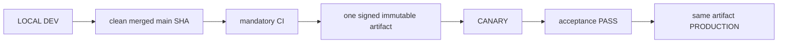

# 04. Environments, Release and Deployment

- Context Pack document: 04_ENVIRONMENTS_RELEASE_DEPLOYMENT.md
- Last verified UTC: 2026-10-03T00:20:00Z
- Verified against Git SHA: e7ecd2133c65f7ec6ce2bf8dc02eb797819ea885
- Scope: Environment isolation, immutable release, promotion and rollback
- Status: IN DEVELOPMENT
- Latest environment checkpoint: `main`
  `5e69165c8bc33dabdd9746059f3706ba8b92859b`, final-main CI
  `37074945281` PASS. One signed immutable beta.107 artifact
  `art_f1d36d6e639e49ea806b938d725af8a5`, build
  `sf-0.10.0-beta.107-5e69165c8bc3-20261002T235748Z`, archive SHA256
  `D3FD6210D9F76B2A27056E0534582E62A3CD47DD064EFED87A46AC931D54F8D9`,
  manifest/runtime SHA256
  `8C3B7B7C525C32002CC3E56578744AA766F86A8B349E480933245897858BE977`.
  Canary deployment `dep_62928d31139744219ad959e542a71200` applied
  schema 25 (pending 0) and public `/live` and `/ready` are 200. Canary
  current release is beta.107; prior beta.106 release remains its rollback
  slot. Verified pre-deploy backup
  `pre-beta107-canary-peer-20261003T001840Z` manifest SHA256
  `653E93C30950A79B2365445566CC22248930503B5F7D3B3E1BEDB134A02D4887`.
  Two earlier backup attempts failed only because Cloudflare returned 403/1010
  to the helper's Python-urllib User-Agent; their snapshots are retained but
  are not PASS. Only the ignored probe was corrected. Canary lifecycle QA
  remains pending. Production still runs beta.106 artifact
  `art_7aebf504ae354ce7981c58359a1ff546`, is the sole Telegram sender;
  no beta.107 Production promotion. Older bullets below are dated history.
- beta.107 is Development source only: migration 0025 and the relational
  erasure adapter passed initial disposable PostgreSQL/RLS tests. Its VERSION
  is `0.10.0-beta.107`; there is no clean final source SHA, PR CI, signed
  artifact, Canary or Production promotion yet. Do not apply this test schema
  or the erasure workflow to the live beta.106 databases. Current Canary and
  Production release identity, Telegram sender and rollback remain as below.
- Current operational checkpoint: both servers still run the exact beta.106
  artifact below. Guarded Canary API restart followed by guarded Production API
  restart restored public/backend `/live` and `/ready` to 200, with admission
  active slots returning to zero and no new rejections during observation.
  Worker/Telegram services, schema, config, source and artifact were unchanged.
  Production remains the sole Telegram sender, Canary non-sender, Local Vitek
  Disabled. The precise old stuck route is unknown; restart is recovery only.
  PR #313 merged after 5/5 checks as `main` `bfc26c962bf3456cb1f811c421156245240ad1ac`;
  beta.107 has no artifact or deployment yet. [Incident evidence](../NT-Analyzer/docs/changelog/2026-10-02-api-admission-recovery-and-beta107-erasure.md).
- New post-release second-account QA checkpoint: the Chrome identity uses
  different canonical users in Canary (`8798656225084765`) and Production
  (`8813453773725695`). Both PostgreSQL entitlement stores retain expired
  one-day Pro rows and exhausted trial usage; neither server was changed by
  this read-only diagnosis. Shipped account erasure is Local/Preview-only,
  not a safe server operation. PR #313 remains draft; no beta.106 artifact,
  schema, sender, scheduler or release identity changed.
- Historical pre-recovery health, not the current snapshot: a read-only probe
  on 2026-10-02T14:27–14:30Z returned 503 `api_admission_saturated` from
  both public Canary and Production live/ready, and from Production's
  host-local backend health, despite Supervisor RUNNING. Local health is
  200. This was recovered by API-only restarts as recorded above; no config,
  artifact or database was changed.
- Current task: Local configuration and documentation only. `main` at task
  start is `9483bac868d829f3891e5e09fe84c18d242cf9c6`, after the
  documentation-only PR #312. Canary/Production still run the single beta.106
  artifact below; neither was redeployed for the Local recovery. Canonical
  Development now uses the separate `local-current` worktree and original
  owner data root, while its old dirty root remains preserved as recovery
  evidence. Local Scheduled Task `StratForge Vitek` remains Disabled; the
  launcher pins Telegram ownership to Production and blocks a second Local
  process or a wrong source path/SHA. New visual parity is partial: owner
  AI Center/Social/Chat in all three environments and public registration
  first step on both servers loaded; the existing Chrome non-owner trial is
  expired, so a fresh chart/security check is not yet evidenced. This does
  not alter the previous beta.106 release acceptance.
- Latest checkpoint, superseding the beta.105 paragraph below (2026-10-01 UTC):
  PR #311 merged to exact `main`
  `e7ecd2133c65f7ec6ce2bf8dc02eb797819ea885`; final-main CI 36857075970 PASS.
  Candidate `rc_2243013e617841c3864dee1a09c77dc4` produced one signed immutable beta.106
  artifact `art_7aebf504ae354ce7981c58359a1ff546`, build
  `sf-0.10.0-beta.106-e7ecd2133c65-20261001T150927Z`, archive SHA256
  `6BD446E5ACB60D74425765550DDA09F2059481822586F24EB78579544128EA25` and
  manifest/runtime SHA256
  `0579C9C3FFD089EC91426D6F75B4E7ED257C612D9FBDD1F958561A50BEB0929C`.
  Canary deployment `dep_5e468f9b9cb04df68aec4e9184882dc4` and acceptance
  check `chk_8da170bf754e47f3aa03dd0e1e666642` PASS with non-sender preserved. The
  same artifact reached Production as `dep_bf86528c36c944d1a5906f0586126b93`;
  Release Center recorded `production_live` and `same_immutable_artifact=true`.
  Public Production `/live` and `/ready` match the exact identity and all
  readiness checks PASS. One owner-authenticated Weekly, Monthly and Quarterly
  request each produced a genuine owner-model result, durable usage/report,
  SF Chat message and one Telegram outbox delivery (`sent`, attempts 1).
  Daily and audit delivery were accepted on the unchanged route. Production is
  the only Telegram sender, Local `StratForge Vitek` is Disabled and Canary is
  non-sender. Product package 7/7 is Production PASS; PR #312 records the
  documentation closeout without changing the deployed artifact.
  [Detailed receipt](../NT-Analyzer/docs/changelog/2026-10-01-beta106-periodic-owner-model-route.md).

## Historical checkpoints (superseded by beta.106 PASS above)
- Current superseding checkpoint (2026-10-01 UTC): PR #309 merged into exact `main` `91d8a4c1ac25f988b643ff71e119502a1df3d3f7`; required CI 36790534580 PASS. One signed immutable `0.10.0-beta.105` artifact `art_dda57f0beab14b83a3375d6ecff1caa8`, build `sf-0.10.0-beta.105-91d8a4c1ac25-20261001T001822Z`, archive SHA256 `2D1DD117E550A5DAD9EB07951DE938AD60BCD44B0F1E4994C258CD9DBAFF482F`, manifest/runtime SHA256 `0BE1FDFD05880F589F8CA36EFEFDB24719A44E57379E825AD662D31614DBFDF9`, reached focused Canary PASS and was promoted unchanged to Production. Verified backups: `pre-beta105-canary-peer-20261001T001844Z` and `pre-beta105-production-peer-20261001T003341Z`. Both `canary-current` and Production `current` resolve to release directory `0.10.0-beta.105-91d8a4c1ac25`; Production `previous` is beta.104. Real Professional model POST/provider/SF Chat/share-off smoke PASS; schema 24, `/live` and `/ready` 200. Production alone owns operational Telegram; control audit and daily summary delivered, Local Scheduled Task disabled, Canary non-sender. All report flags were enabled after explicit owner acceptance of possible duplicate 30 September reports, but monthly/quarterly failed on the legacy Linux orchestrator-model route. Full periodic cutover PARTIAL; no artifact/runtime/schema changes were made. [Detailed receipt](../NT-Analyzer/docs/changelog/2026-09-30-beta105-production-model-completion.md). All older beta.103/beta.104 checkpoints below are historical.
- Last verified UTC: 2026-10-01T15:41:00Z
- Verified against Git SHA: e7ecd2133c65f7ec6ce2bf8dc02eb797819ea885
- Current deployed source SHA: Canary and Production `e7ecd2133c65f7ec6ce2bf8dc02eb797819ea885`
- Scope: Environment isolation, immutable release, promotion and rollback
- Historical checkpoint status: PARTIAL

Historical beta.103 checkpoint (superseded by beta.105 above): Canary focused acceptance of beta.103 is PASS;
the exact signed artifact `art_9d38fcd7bd33454786fdbfaf0e9cc25a` now also
runs in Production on schema 24 with `/live` and `/ready` 200 and Production
API/worker SecretStore read PASS. Production final product smoke is NOT PASS:
authenticated AI Center models/overview may reach Cloudflare 524, and no new
Production provider request has been dispatched for final acceptance. The
Production scheduler remains OFF and Local `StratForge Vitek` ON. beta.104 is
only a Development source correction of repeated read-only authority checks;
there is no beta.104 artifact or deployment yet. Preserve the verified
`pre-beta103-production-peer-20260930T043957Z` backup and beta.99 rollback
slot. See the [focused change record](../NT-Analyzer/docs/changelog/2026-09-30-beta104-ai-center-read-timeout.md).

Historical beta.103 Canary checkpoint: Canary runs signed
`0.10.0-beta.103` artifact `art_9d38fcd7bd33454786fdbfaf0e9cc25a`
from source `d695a8ddc5dccfc1252f0e94d59bb4e5325bc601`, build
`sf-0.10.0-beta.103-d695a8ddc5dc-20260930T013703Z`, archive SHA256
`7DB016ACD5E4CA96F02C8057778C1EDFD1E12702674E8642A71CBA764478A7EB`,
runtime/manifest SHA256
`0F440F977D0B3C55A7D546AA330DE42DCEBB7772CB56BE957A95D69E9FB05154`.
Required PR checks and final-main CI `36651073820`, signature, public `/live`
and `/ready` PASS; deployment `dep_d7084bd26b5341fabccfce5b41d750fe`
is `canary_checking`. Verified pre-change backup
`backups/pre-beta103-canary-peer-20260930T013728Z` (manifest SHA256
`107F25C19DE782A58724A1851207CA8300933FA1444423DA14B1AB26007CC190`)
contains DB/runtime/config and preserves beta.102 rollback. The initial
focused Canary check was PARTIAL: one non-owner task reached the interactive
PostgreSQL worker but failed before provider dispatch because that worker
lacked `STRATFORGE_SECRETS_DIR`. A separate backup of its original wrapper
(`backups/pre-beta103-canary-worker-secret-dir-20260930T025910Z/run-worker-canary.sh`,
SHA256 `C3C8FE0C875ABF6CF572813DDBDCB2325E0F28023F8F615D91774CB033555FD2`)
and a worker-only restart enabled the same Canary server secret directory as
the API. No application code or artifact changed. The restarted worker read
the owner secret, and exactly one new real non-owner Professional task
`854edfb0-cc97-5a5e-82a1-10f664e40566` succeeded with a non-synthetic
Gemini receipt, 57/33 tokens, $0.00 and matching owner/caller usage audit.
After owner share-off, exactly one new foreign request was denied before
job/provider dispatch with no new usage; history remained. The local Release
Center candidate `rc_58652a4181e3497ca53003bacace24da` is now
`canary_passed` with final PASS check `chk_0002fdbe50e44a9aa99823951f195369`
and verification result PASS; the protected ledger was backed up first.
Post-check `/live`
and `/ready` are HTTP 200, so focused Canary acceptance is **PASS**. The
earlier HTTP 524 overview is separate historical evidence, not a blocker of
this scoped path. Production remains beta.99, report scheduler OFF and Local
`StratForge Vitek` ON. Read-only Production comparison found its worker lacks
the equivalent secret-dir setting, while its API has it; backed-up Production
config correction and environment-specific secret import are prerequisites
after separate artifact-specific owner approval. [Release record](../NT-Analyzer/docs/changelog/2026-09-29-beta103-server-agent-world-queue.md).

Historical beta.101 checkpoint: Canary ran signed
`0.10.0-beta.101` artifact `art_ed57f7076b6b46b78cc3309c55470016`
from source `58fbb23d1551e267dd7fe622c2414580820f3f8c`, build
`sf-0.10.0-beta.101-58fbb23d1551-20260929T063217Z`, archive SHA256
`E493DCE15A7B59AD1E4412046003754F29CA1A8492C5B317813374DAC565AFFE`,
runtime/manifest SHA256
`99795E581E84C1CC4C2D42A233F8E337EA4ABB9267A15BF42353B1D963E87496`.
Final-main CI `36526068091`, signature, public `/live` and `/ready` PASS;
deployment `dep_45db3f6c48c549ad978b0f9a3e895501` is `canary_checking`.
Verified pre-change backup `backups/pre-beta101-canary-peer-20260929T063236Z`
(manifest SHA256 `C90F4A17F98F25BA386B04A1DF06B6E34B98C23BAE5549D7E4F4533586D659B3`)
contains DB/runtime/config/secrets; `canary-previous` is beta.100. Linux
`ServerSecrets` without DPAPI and protected import of the five existing Local
owner models passed; real provider/non-owner/share/restart/full-package
acceptance remains PENDING, so Canary is not `canary_passed`. Production is
still beta.99 and report scheduler OFF; Local `StratForge Vitek` stays ON.
[beta.101 release record](../NT-Analyzer/docs/changelog/2026-09-28-beta101-server-secret-migration.md).

Historical beta.100 PARTIAL checkpoint: Canary ran signed
`0.10.0-beta.100` artifact `art_de49135714cf48b6aace2a977fad334f`
from source `7b66bcb6abd486891870b0419afd93f8828dbb85`, build
`sf-0.10.0-beta.100-7b66bcb6abd4-20260928T210349Z`, archive SHA256
`2CCB46F376C4A6445295D7221BB753B959F08FBE1970065996AF7460C6CB4DB1`,
runtime/manifest SHA256
`5FFE722FD86DE9892E7C150287C63CC3C8D3388DADD61AF3BA756C0A446812FF`.
`/live`, `/ready` and migration 0024 passed; `canary-previous` is beta.99 and
verified pre-change backup is `backups/pre-beta100-canary-peer-20260928T210636Z`.
The separate Google user's owner-UI Pro grant is active, but shared owner models
are absent on Canary and no accepted secure Local DPAPI-to-server-vault migration
exists in this artifact. Canary acceptance remains PARTIAL, not `canary_passed`.
Production remains beta.99, artifact `art_3ae473a96bb24d439fd5cb6d3a1d1096`,
source `68ba3a95f804800195bb6e8dff556dd843b8eb6e`; no beta.100 promotion
or report-scheduler cutover occurred. See the
[beta.100 release record](../NT-Analyzer/docs/changelog/2026-09-28-beta100-server-parity-release.md).

Production incident 2026-09-27: beta.97 was promoted as immutable artifact
`art_8fec9cdd6ed14dd19cb762291a2a756f`, but final closeout is blocked by a
confirmed authenticated overview full-page reload loop when runtime accounts are
already offline/unconfirmed. beta.92 contains the same trigger and is not a
reliable rollback for this state. The minimal code correction is a new beta.98
cycle; no server hotfix or artifact mutation is allowed. beta.98 is now deployed
to Canary from its own final main SHA and signed artifact. beta.98 then exposed
issue #298 in real Professional registration. beta.99 is the separate narrow
storage-routing cycle and has now passed Canary and Production on its own final
main SHA and the same immutable artifact. Production periodic delivery stays
OFF and Local `StratForge Vitek` stays ON. See the
[incident record](../NT-Analyzer/docs/changelog/2026-09-27-beta98-production-reload-loop-hotfix.md).

Historical pre-deployment contract (2026-09-26): beta.97 consolidates periodic owner reports under
the Vitek/Deputy controller and makes Production the sole default operational
owner of the shared Telegram bot. Development and Canary remain passive for
topic creation, update consumption, chat mirroring and reports while retaining
login/access callbacks. That candidate later completed its immutable promotion,
but its final closeout is superseded by the live incident above. The required
sequence for beta.98 remains merge → final-main-SHA CI → one signed immutable
artifact → Canary acceptance → separate owner approval → same artifact in
Production. [Candidate record](../NT-Analyzer/docs/changelog/2026-09-26-beta97-telegram-report-cutover-release-candidate.md).

Development supervisor origin correction (2026-09-23): default identity is the actual `http://127.0.0.1:<port>` listener, never the Production hub hostname. An explicitly configured Development HTTPS origin is supported. This prevents false gateway self-loop isolation while preserving true self-loop rejection. [Incident and verification](../NT-Analyzer/docs/changelog/2026-09-23-local-chart-gateway.md). No server release is included.

Local-only Preview change (2026-09-22): the two shared-model QA profiles may call
one authenticated parent loopback service for catalog/invoke only. Other outbound
connections remain blocked. The bridge expires after 30 minutes and allows at
most 32 calls / USD 0.25 while preserving the model's own caps. Exit removes the
child's data/process/container; minimal owner usage accounting remains. No
Canary/Production deployment or release identity changed.
Local 8765 now runs clean `c9a9d7e6a3080988af1c90ff65f2520b0e74cc70`, build
`dev-0.10.0-beta.96-c9a9d7e6a308`, Development, Preview=false. The owner Preview
launch endpoint passed real-provider acceptance and cleanup; owner access settings
matched the before snapshot exactly. This is a Local code switch, not a release artifact.
[Canonical evidence](../NT-Analyzer/docs/changelog/2026-09-22-shared-models-local-continuation.md).

## Only supported release model

- Build once from the exact clean merged commit.
- Canary and Production receive identical code, UI/static assets, Documents and
  backend logic. Only environment DB, secrets, sessions, cookies, origins,
  queues and runtime state/configuration differ.
- Any application change after Canary acceptance starts a new cycle.
- Production promotion is a switch to the accepted artifact, never a rebuild,
  manual copy or server hotfix.

Every candidate snapshots one canonical `docs/changelog/` release/change
record. The owner sees its title, summary, PRs, source SHA, version/build,
artifact, current stage/status, checks, duration and the identity reported by
DEV/Canary/Production. Approval and promotion fail closed unless title, change
summary, source SHA and final verification PASS are present.

## Environment isolation

| Environment | Origin | Isolation |
| --- | --- | --- |
| Development | `http://127.0.0.1:8765/ui/` | Development data root, loopback session and local release initiator |
| Canary | `https://canary.stratforges.com` | separate Canary DB/storage/queues/sessions/cookies |
| Production | `https://app.stratforges.com` | separate Production DB/storage/queues/sessions/cookies |

The Environment Switcher opens the selected origin and never carries session
or browser storage between origins.

## Current environments: Canary beta.100 deployed / Production beta.99 unchanged / beta.96 product card PARTIAL

The owner-authorized PR #301 merge produced clean final-main SHA
`7b66bcb6abd486891870b0419afd93f8828dbb85`. Mandatory CI
[run 36471503031](https://github.com/OMNOM-111/NT-Analyzer/actions/runs/36471503031)
passed on attempt 2. The first attempt had one reproduced intermittent Windows
loopback-fixture connection abort, not an application-code change. Release
Center built exactly one signed immutable artifact and deployed it to Canary
only. The backup command's short post-restart readiness window expired, but
the unchanged beta.99 Canary returned to `/live` and `/ready` 200; separate
read-only verification passed the backup manifest, dump, `pg_restore --list`,
runtime/config checksums before deployment. Production was not promoted.

| Field | beta.100 Canary checkpoint |
| --- | --- |
| Version / source SHA | `0.10.0-beta.100` / `7b66bcb6abd486891870b0419afd93f8828dbb85` |
| Candidate / artifact | `rc_2aab86a85ef84ca7ad1e6733aebdbefb` / `art_de49135714cf48b6aace2a977fad334f` |
| Build ID | `sf-0.10.0-beta.100-7b66bcb6abd4-20260928T210349Z` |
| Archive / runtime manifest SHA256 | `2CCB46F376C4A6445295D7221BB753B959F08FBE1970065996AF7460C6CB4DB1` / `5FFE722FD86DE9892E7C150287C63CC3C8D3388DADD61AF3BA756C0A446812FF` |
| Release dir / previous slot | `releases/0.10.0-beta.100-7b66bcb6abd4` / `releases/0.10.0-beta.99-68ba3a95f804` |
| Pre-change backup / manifest SHA256 | `backups/pre-beta100-canary-peer-20260928T210636Z` / `7B8EB4C484A7BF6CD580B310460D52E752DE386C7450207697F3BEF82E7EEEDF` |
| Deployment / health / migration | `dep_7cb0afa2c3ee48d9b0c3956bc8dbb15f`; `/live` and `/ready` PASS; migration max 24 |
| Stage | `canary_checking`; full owner + non-owner parity **NOT YET PASS**; Production beta.99 |

The server Agent World workspace opt-in is now ON only for the confirmed owner
and real separate Google Professional workspaces. A new Canary-only
infrastructure encryption key is in the protected platform-secret store;
no provider BYOK key was copied from Local or included in the artifact. The
first configuration attempt was safely reverted because server-to-public-origin
readiness returned 403 while external and correctly headed loopback readiness
were 200; the operational check was corrected and the gate then applied without
changing the artifact. The real non-owner Chrome session is blocked by its
expired five-hour trial pending a legitimate Canary-only Professional grant.
No beta.100 owner or non-owner live model invocation has been claimed, and
full Canary acceptance remains PARTIAL. Production periodic delivery is OFF
and Local `StratForge Vitek` remains ON.

### Previous beta.99 technical runtime PASS

At the previous beta.99 checkpoint, Canary and Production pointed to the same signed beta.99 technical artifact
built from the exact final `main` SHA. Canary identity/readiness, verified
backup, real separate non-owner Professional registration, personal workspace,
entitlement, session, cache-disabled cold start and restart persistence PASS.
Production identity/readiness, owner login/API, existing non-owner Professional
session/workspace/entitlement and cache-disabled cold starts also PASS. These
checks prove the scoped beta.99 correction, not full beta.96 package parity:
live Canary reports Agent World and Preview sandbox disabled, so the open
product card remains `In progress` and final product closeout is paused.

| Field | beta.99 Canary and Production |
| --- | --- |
| Version / source SHA | `0.10.0-beta.99` / `68ba3a95f804800195bb6e8dff556dd843b8eb6e` |
| Candidate / artifact | `rc_dd6b884b2bfe4f7dace6c76bb6cbf12c` / `art_3ae473a96bb24d439fd5cb6d3a1d1096` |
| Build ID | `sf-0.10.0-beta.99-68ba3a95f804-20260928T021954Z` |
| Archive SHA256 | `BD6FDEC99112154E9B0B4FBA26A2F1E257399D9B8FC15BC4500E1BD65AEBDC43` |
| Manifest SHA256 | `081C9A99480C49BFBC13C29EA061E994B8310FB6A82EE431B31A38661952A2FB` |
| Release dir | server data-root relative `releases/0.10.0-beta.99-68ba3a95f804` |
| Backups | `backups/pre-beta99-canary-peer-20260928T022038Z`; `backups/pre-beta99-production-peer-20260928T024620Z` |
| Deployment IDs | Canary `dep_d4ebf1c42c3a450f99c530ed41cd62f8`; Production `dep_48d36d71b00e480eac201c3f3a71e0f1` |
| Stage | Historical beta.99 checkpoint: scoped Canary/Production PASS; full-package Canary was then PARTIAL. Current beta.103 Canary PASS is recorded above; Production product closeout remains paused. |

Immediate previous Production beta.97 identity remains preserved for rollback:

| Field | Value |
| --- | --- |
| Version / source SHA | `0.10.0-beta.97` / `4f6bb0b3a0d20712f249afdc9c93538567fd6a8d` |
| Artifact | `art_8fec9cdd6ed14dd19cb762291a2a756f` |
| Build ID | `sf-0.10.0-beta.97-4f6bb0b3a0d2-20260927T060203Z` |
| Archive SHA256 | `F7B522C845D4DEA93BFB15F09C37F5B25A95A0C474052FB70F27A2F6DA6F8FF3` |
| Manifest SHA256 | `B5FC667474ED38CD5AA3600F22E4DD97495958DCC906BCEAD1CA80CF2838F9D2` |
| Previous / rollback | beta.92 / `0.10.0-beta.92-9d800770d08e` (preserved; same latent reload trigger) |

## beta.99 technical iteration inside the open beta.96 product card

Issue #298 has a narrow correction: subscriptions now use the same
authoritative server-storage predicate as accounts/workspaces for explicit
Canary and Production, while Development retains DPAPI and its fail-closed
behavior. Source checkpoint `c68b19f9fa0c3161b31f42cb994db49f2f00faa3`
merged through PR #299 as `68ba3a95f804800195bb6e8dff556dd843b8eb6e`;
focused affected regression is 37 PASS and final-main CI run `36365092457`
passed. One signed immutable beta.99 artifact was accepted for the scoped fix on
Canary and then promoted unchanged to Production after exact artifact-specific
owner approval.
Production `/live`, `/ready`, owner auth/API and real non-owner Professional
cold-start smoke PASS. Report delivery switches remain OFF and Local
`StratForge Vitek` remains ON pending the separate model/orchestrator cutover.
The beta.95 → beta.96 product card remains open: source ancestry and 327 targeted
package tests PASS, while live Canary parity is PARTIAL because Agent World and
Preview sandbox are disabled. beta.97–beta.99 retain their exact identities as
technical iterations inside that card. See the
[product-card parity and status record](../NT-Analyzer/docs/changelog/2026-09-27-beta96-product-card-parity-and-status-contract.md).

Sources: [beta.98 incident record](../NT-Analyzer/docs/changelog/2026-09-27-beta98-production-reload-loop-hotfix.md),
[beta.97 candidate record](../NT-Analyzer/docs/changelog/2026-09-26-beta97-telegram-report-cutover-release-candidate.md).

### Historical beta.86 snapshot

| Field | Value |
| --- | --- |
| Candidate | rc_049d14ab6af640758a69b00432bb6e3d |
| Artifact | art_e627d14a2dbb49fdaf98a0cc9847e8c2 |
| Version / Git SHA | 0.10.0-beta.86 / 22ed7097b4ac9e863304197e118b1d3ce5109e8a |
| Build ID | sf-0.10.0-beta.86-22ed7097b4ac-20260901T005018Z |
| Archive SHA256 | 8052B7A5FC36E1519A7AFCD3B60E5A221F744DE768585D765145245911BABE7D |
| Manifest SHA256 | 0E95CF8B879AE6D66D11F70BAD566E2658180AE432CD8EAEEE12CC50B4CFBCA4 |
| Signature / worktree | verified / clean |

Canary accepted beta.86 and Production received the exact same artifact without
rebuild. live_trading_allowed stays false. Earlier cycles are in their
changelog entries.

The beta.86 release is named `Legacy Isolation + Telegram Bot Cleanup` and
contains merged PR #254 and PR #255 plus release-record PR #256. Its terminal
state is `production_live`; `/live` and `/ready` returned 404 before this
release and 200 after, which is what proves the new artifact is serving.

### Three gates stand between a candidate and Production

Approved main asks where the code came from: branch is main, worktree clean,
HEAD equal to origin/main, the commit an ancestor of origin/main, and that exact
SHA green in CI. A squash merge creates a new SHA, so a green pull request does
not make the commit that reached main green -- both beta.84 and beta.85 were
refused on the first attempt for exactly that, and published unchanged once the
merge commit finished CI.

Forward-only asks whether publishing would move Production forward. An old
commit on main is as approved as a new one, so provenance alone let a
superseded candidate sit one click from rolling Production back. Publication now
requires the candidate to be the deployed commit or a descendant of it.

Production identity is fail-closed. "Never deployed" permits a first
publication; "deployed but the commit cannot be read" refuses until identity is
restored. Conflating the two is how a rollback gets published by accident.

Rollback is untouched by all of this: going back has its own contract.

### The shipment has its own gate

python tools/pre_release_check.py assembles the exact production file set and
runs four checks inside it: the static scan as the signer runs it, runtime
reads, Python compilation and JavaScript syntax. The selection lives in
tools/release_bundle.py and is imported by the builder, so the check and the
signer cannot disagree. A public document that no release can carry is a
contradiction to resolve, not an exemption to record.

## Promotion authority

Development owns the release ledger and submits the action, but Canary or
Production must answer from authoritative environment state. Candidate,
artifact, signature, timestamp, nonce, decision TTL, running identity, CI,
migrations and acceptance all verify fail-closed. `canary_passed` is followed
by owner approval and server-authoritative promotion; it does not authorize a
different artifact.

## Verification

- beta.79 closeout through PR #230: mandatory CI GREEN;
- full regression `2327 passed`, `32 skipped`, `0 failed`;
- Canary and Production deployment evidence:
  `identity_verified`, `signature_verified`, `readiness_verified`,
  `same_immutable_artifact` all true;
- Canary and Production server surfaces display beta.79 from the same release
  directory;
- SERVER BACKTEST cancel, Connector state honesty, auth hotspot and secret
  containment closeout passed;
- no pending migration.

## Canonical evidence

- [beta.79 secret management and cancel closeout](../NT-Analyzer/docs/changelog/2026-08-29-beta79-secret-management-and-cancel-closeout.md)
- [environment and release identity ADR](../NT-Analyzer/docs/adr/0001-environments-and-release-identity.md)
- `app/runtime_env.py`
- `app/release_control.py`
- `app/release_center.py`
- `tools/stage9_remote_release.sh`
