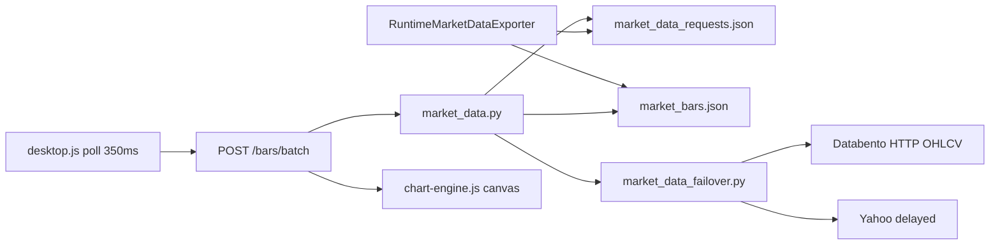

# Market-data baseline — 2026-07-16 (America/Los_Angeles)

**Branch:** `codex/stratforge-release-20260716`  
**Status:** Phase 0 complete (code-path audit + synthetic I/O + IPC microbench).  
**Live MNQ+MGC 5–15 min session:** not captured in this report — `market_bars.json` had 0 active series at measurement time; CME session / Desktop subscriptions were idle. Re-run with active Desktop MNQ+MGC to fill browser-paint stages.

## Data flow (before event-stream cutover)

## Measured stages (this host, 2026-07-16 evening PT)

| Stage | Samples | p50 (ms) | p95 (ms) | p99 (ms) | Notes |
|---|---:|---:|---:|---:|---|
| `baseline.file_write_ms` | 30 | 2.08 | 2.39 | 2.60 | atomic write of ~37 KB synthetic 8×60-bar snapshot |
| `baseline.file_read_ms` | 30 | 15.81 | 17.24 | 17.42 | JSON parse of same snapshot |
| IPC TCP ingest | 200–300 | — | — | — | **~6400–6500 events/s** length-prefixed JSON localhost |

Raw JSON: `data/runtime/market_data_baseline.json`, `data/runtime/market_data_ipc_benchmark.json`.

### Not yet measured (need active Desktop + market)

| Stage | Blocker |
|---|---|
| NT callback → queue | requires Bridge deploy + subscribed contract with ticks |
| queue → IPC write | same |
| backend → browser | Desktop open with auth |
| browser paint (`ChartEngine`) | same |

Instrumentation hooks are in place: `app/market_data_baseline.py`, `server._market_bars_payload` timers, Bridge queue metrics file.

## Code-audit bottlenecks (pre-change / remaining)

1. Desktop `LIVE_POLL_MS=350` full `/bars/batch` re-fetch (still current until Phase 7).
2. **Was:** `CaptureMarketData` mutated last bar + scheduled snapshot on every Last tick. **Phase 2 change:** callback now only enqueues; bar mutation for `market_bars.json` remains on timer poll path only.
3. Bridge `WriteSnapshot` still serializes all series to `market_bars.json` (kept as fallback).
4. Backend re-reads/parses snapshot (signature cache mitigates).
5. No UI WebSocket incremental path yet (Phase 7).
6. No CanonicalBarEngine yet (Phase 6).
7. External live Databento key **absent** → Yahoo delayed is development fallback only.

## IPC transport selection (Phase 1)

| Transport | Result |
|---|---|
| localhost TCP + length-prefixed JSON | **default** — measured ~6.4k ev/s; stdlib server |
| Named Pipe | implemented on Bridge; same app frames |
| WebSocket | implemented on Bridge; higher overhead |

Unauthenticated connects are rejected. Token: `data/runtime/market_data_ipc_token.json` (runtime gitignore).

## Environment notes

- NinjaTrader process was running; Bridge snapshot had **0 series** at audit time.
- Backend HTTP `:8765` was listening (auth required).
- Databento API key: not configured → Production Failover blocked for external live path.

## Next phases after this artifact

Phases 1–3 (IPC abstraction, slim NT callback, secured server) landed in the same engineering slice as this baseline. Continue Phase 4+ without treating Yahoo/Recorded as production failover.
