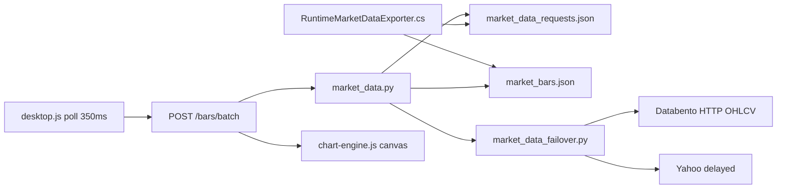

  - id: phase12-tests
    content: "Phase 12: unit/replay/fault/restart tests → ENGINEERING COMPLETE"
    status: pending
  - id: phase13-16-gates
    content: "Phases 13–16: load, licensing, live provider parity, production acceptance"
    status: pending
isProject: false
---

# Отказоустойчивый market-data контур StratForge (исправленный план)

> **Каноническая схема провайдеров (по фактическому HEAD, обновлено 2026-08-11):**
> **TopstepX — основной независимый источник графиков** (credentialed read-only realtime +
> history) и работает при выключенном NinjaTrader. Фактический runtime-порядок:
> **TopstepX → свежий NinjaTrader Connector → другой разрешённый credentialed provider →
> OFFLINE/cache**. NinjaTrader — единственный путь исполнения и источник истины по
> сделкам/runtime; исправный TopstepX chart feed не вытесняется запуском терминала.
> Databento — credentialed historical; Yahoo — delayed/history display и никогда не live.
> Синтетические свечи не создаются; внешние bars не авторизуют ордера. План фаз ниже —
> историческая инженерная декомпозиция; этот current-блок имеет приоритет.

## Статус завершения (обязательное разделение)

### Текущий рабочий статус (2026-07-16)

```text
IMPLEMENTATION PARTIAL (AUTOMATED GATES PASS)
DEPLOYMENT, VISUAL VERIFICATION, CACHE ARCHITECTURE,
100-USER LOAD TEST AND ACCEPTANCE TESTING PENDING
PRODUCTION FAILOVER BLOCKED
```

Не использовать ярлык **ENGINEERING COMPLETE** до DEPLOYED + ACCEPTANCE PASSED.

### A. CORE / IMPLEMENTATION (код + автотесты)

Достигается без live external key. Включает NT event Bridge, secured IPC,
canonical events, InstrumentRegistry, CanonicalBarEngine, same-origin browser WS,
Router, GapRecovery, Recorded/FaultInjection, Databento adapter (код),
diagnostics, unit/replay/fault tests, data-platform interfaces.

### B. PRODUCTION FAILOVER COMPLETE

Только после лицензированного live provider, shadow parity, NT stop test,
MNQ+MGC live continuity, gap recovery, manual + load acceptance.

Yahoo / Recorded **не** production failover.


---

## Data planes (разделение источников)

| Plane | Назначение | Автоматический failover в execution? |
|---|---|---|
| `display` | графики Desktop/Practice | да (chart-only) |
| `analytics` | исследования, AI, отчёты | да (non-trading) |
| `strategy` | сигналы / backtest inputs | нет без явного policy |
| `execution` | ордера / risk / live | **нет** из chart source |
| `history_replay` | Recorded / historical | только тесты/replay |

Правило: **источник графика нельзя автоматически использовать для торговых решений.**

В UI показывать отдельно:

- Chart source
- Strategy source
- Execution source

---

## Исходное состояние (принято как предварительный аудит)



Сохраняемые fallback до прохождения новых тестов: `market_bars.json`, `/bars/batch`, snapshots, Telegram PNG, draw/open/clear, LTTB, cache, workspace isolation, Practice, Desktop, owner authorization.

---

## Фазы (нумерация и таблицы)

### Phase 0 — Baseline audit

| Поле | Содержание |
|---|---|
| Номер | 0 |
| Изменяемые компоненты | `app/market_data_baseline.py`, hooks в Bridge/market_data/server/desktop diagnostics; `docs/MARKET_DATA_BASELINE_*.md` |
| Результат | Измеренная схема до рефакторинга: polling, JSON snapshots, full re-send, sync file I/O, тяжёлые операции в MD callback |
| Автотесты | `tests/test_market_data_baseline.py` |
| Ручная проверка | 5–15 мин MNQ+MGC при активном рынке (если сессия закрыта — зафиксировать synthetic + code-path audit) |
| Артефакт | `docs/archive/MARKET_DATA_BASELINE_2026-07-16.md` + data-flow схема |
| Блокирующие зависимости | нет |
| Критерий завершения | p50/p95/p99 по доступным стадиям + список bottleneck зафиксированы |

### Phase 1 — IPC transport benchmark + abstraction

| Поле | Содержание |
|---|---|
| Номер | 1 |
| Изменяемые компоненты | C# `Ipc/*`, Python `app/market_data_ipc.py`, `tools/ipc_transport_benchmark.py` |
| Результат | Сравнение WebSocket / Named Pipe / localhost TCP; транспортная абстракция; localhost-only |
| Автотесты | benchmark + unit на framing/auth handshake |
| Ручная проверка | прогон benchmark на машине владельца |
| Артефакт | benchmark table в baseline/plan docs |
| Блокирующие зависимости | Phase 0 |
| Критерий завершения | абстракция + выбранный default transport + отчёт latency/throughput |

### Phase 2 — NT event Bridge (slim callback)

| Поле | Содержание |
|---|---|
| Номер | 2 |
| Изменяемые компоненты | `RuntimeMarketDataExporter.cs`, `MarketDataEventQueue.cs`, writer thread |
| Результат | В MD callback только Last/Bid/Ask/Volume + normalize + ts + non-blocking enqueue + return. File snapshot остаётся на timer/writer path (≥125ms) |
| Автотесты | queue drop/backpressure unit (C# или Python protocol twin) |
| Ручная проверка | NT UI не блокируется при burst тиков |
| Артефакт | metrics: queue depth, dropped, reconnect |
| Блокирующие зависимости | Phase 1 |
| Критерий завершения | callback path без file/HTTP/сериализации больших структур/построения свечей |

### Phase 3 — Secured localhost IPC backend

| Поле | Содержание |
|---|---|
| Номер | 3 |
| Изменяемые компоненты | backend IPC server, token store, audit log |
| Результат | Auth token, `protocol_version`, `connection_id`, `subscription_id`, heartbeat, reconnect, bounded queue, queue depth, dropped, backpressure, clean shutdown, audit. **Нет** неаутентифицированного endpoint |
| Автотесты | reject without token; heartbeat timeout; reconnect; clean shutdown |
| Ручная проверка | Bridge connect → events in ring |
| Артефакт | `docs/architecture/MARKET_DATA_IPC.md` |
| Блокирующие зависимости | Phase 1–2 |
| Критерий завершения | unauthenticated connect всегда rejected |

### Phase 4 — Canonical event model

| Поле | Содержание |
|---|---|
| Номер | 4 |
| Изменяемые компоненты | `app/canonical_event.py` (+ C# serializer fields) |
| Результат | Поля: `exchange_sequence`, `provider_sequence`, `connection_sequence`, `generated_sequence`, `ts_event`, `ts_provider`, `ts_receive`, raw/canonical symbol, exact contract, provider, `source_epoch`, quality flags. Generated ≠ exchange |
| Автотесты | dedupe / sequence identity |
| Ручная проверка | sample dump MNQ/MGC |
| Артефакт | schema JSON |
| Блокирующие зависимости | Phase 3 |
| Критерий завершения | нельзя спутать generated и exchange sequence |

### Phase 5 — InstrumentRegistry

| Поле | Содержание |
|---|---|
| Номер | 5 |
| Изменяемые компоненты | `app/instrument_registry.py` |
| Результат | MNQ/MGC + roots; exact ≠ continuous; rollover; NT/Databento maps; запрет скрытой подмены continuous |
| Автотесты | root→contract, no silent continuous swap |
| Ручная проверка | Desktop request MNQ → exact contract |
| Артефакт | registry snapshot |
| Блокирующие зависимости | Phase 4 |
| Критерий завершения | continuous никогда не подменяет exact без явного флага |

### Phase 6 — CanonicalBarEngine

| Поле | Содержание |
|---|---|
| Номер | 6 |
| Изменяемые компоненты | `app/canonical_bar_engine.py`, storage ring/SQLite |
| Результат | event-time aggregation; session templates; UTC; Pacific display-only; DST; holidays; late events; close grace; corrections; volume rules; zero-volume intervals; exact contract; rollover; provisional/final/corrected. Одна subscription → много TF |
| Автотесты | replay fixtures MNQ/MGC |
| Ручная проверка | 1s/1m/5m совпадают на fixture |
| Артефакт | parity fixtures |
| Блокирующие зависимости | Phase 4–5 |
| Критерий завершения | vendor bars только history/gap/parity |

### Phase 7 — WebSocket incremental UI

| Поле | Содержание |
|---|---|
| Номер | 7 |
| Изменяемые компоненты | `server.py` WS routes, `desktop.js`, `chart-engine.js` |
| Результат | HTTP series initial only; live via WS; fan-in workspace+exact contract+channel; statuses LIVE/DEGRADED/RECOVERING/STALE/OFFLINE; all-charts harness. Batch poll = fallback |
| Автотесты | HTTP/WS contract tests (без in-app browser) |
| Ручная проверка | Desktop: нет «зелёного LIVE» без свежих данных |
| Артефакт | harness diagnostics log |
| Блокирующие зависимости | Phase 6 |
| Критерий завершения | полный re-send серии на тик запрещён |

### Phase 8 — Provider facade

| Поле | Содержание |
|---|---|
| Номер | 8 |
| Изменяемые компоненты | refactor `market_data_failover.py` → facade; NT/Databento/Recorded/FaultInjection |
| Результат | Одна raw subscription на `workspace + exact contract + channel`. Databento adapter всегда в коде; live при key |
| Автотесты | Recorded + FaultInjection |
| Ручная проверка | provider health API |
| Артефакт | capabilities matrix |
| Блокирующие зависимости | Phase 5–6 |
| Критерий завершения | нет отдельной external sub на каждый TF/график |

### Phase 9 — MarketDataRouter + shadow mode

| Поле | Содержание |
|---|---|
| Номер | 9 |
| Изменяемые компоненты | `app/market_data_router.py`, shadow comparator |
| Результат | health per provider/instrument/channel; transport+provider heartbeat; session state; Bid/Ask/Last age; sequence gaps; latency; anomaly; hysteresis; cooldown; source_epoch; no naive mix. **Shadow mode обязателен** до auto-failover. Failover ≤2s только на активном рынке; closed/low-liquidity — отдельные rules |
| Автотесты | shadow parity fixtures; switch audit |
| Ручная проверка | shadow параллельно без управления основным графиком |
| Артефакт | parity report template |
| Блокирующие зависимости | Phase 8 |
| Критерий завершения | auto-failover запрещён без documented parity pass |

Shadow comparison: Last, Bid/Ask, 1s/1m/5m bars, OHLCV, session boundaries, exact contract, rollover, latency, missing events.

### Phase 10 — GapRecovery

| Поле | Содержание |
|---|---|
| Номер | 10 |
| Изменяемые компоненты | durable GapRecovery worker |
| Результат | recovery вне HTTP path; audit log |
| Автотесты | gap inject → recover |
| Ручная проверка | stop provider mid-session → gap filled |
| Артефакт | gap-recovery log |
| Блокирующие зависимости | Phase 9 |
| Критерий завершения | worker переживает restart |

### Phase 11 — UI diagnostics + data-plane labels

| Поле | Содержание |
|---|---|
| Номер | 11 |
| Изменяемые компоненты | Desktop/Practice UI |
| Результат | Chart / Strategy / Execution source раздельно; age/latency/gap/last switch |
| Автотесты | DOM/API contract |
| Ручная проверка | screenshots статусов |
| Артефакт | screenshots + status API dump |
| Блокирующие зависимости | Phase 7, 9 |
| Критерий завершения | нет скрытой подмены execution source chart source |

### Phase 12 — Chaos / unit / replay suite → Engineering Complete

| Поле | Содержание |
|---|---|
| Номер | 12 |
| Изменяемые компоненты | tests/, docs evidence |
| Результат | NT off, heartbeat без quotes, delays 0.5/2/10s, dupes, OOO, gaps, bad price, restart, tenant isolation |
| Автотесты | полный targeted + regression |
| Ручная проверка | checklist Engineering Complete |
| Артефакт | test results matrix |
| Блокирующие зависимости | Phase 0–11 |
| Критерий завершения | **ENGINEERING COMPLETE**; при отсутствии live key — **PRODUCTION FAILOVER BLOCKED** |

### Phase 13 — Load / chaos (gate)

| Поле | Содержание |
|---|---|
| Номер | 13 |
| Изменяемые компоненты | load harness |
| Результат | 10 users / 30 charts / 60 min |
| Автотесты | load script |
| Ручная проверка | owner observe |
| Артефакт | load report |
| Блокирующие зависимости | Phase 12 + active market preferred |
| Критерий завершения | no crash / bounded memory / fail rate threshold |

### Phase 14 — Licensing / entitlements (gate)

| Поле | Содержание |
|---|---|
| Номер | 14 |
| Изменяемые компоненты | secure store, entitlement matrix |
| Результат | display/non-display; secrets DPAPI; audit; no keys in frontend/logs |
| Автотесты | entitlement stubs |
| Ручная проверка | owner key install |
| Артефакт | licensing runbook |
| Блокирующие зависимости | external license/key |
| Критерий завершения | keys never in repo/UI/logs |

### Phase 15 — Live external provider + shadow parity (gate)

| Поле | Содержание |
|---|---|
| Номер | 15 |
| Изменяемые компоненты | Databento live (или approved CME-class) |
| Результат | shadow pass → allow automatic failover |
| Автотесты | live shadow harness |
| Ручная проверка | ≥ documented sessions MNQ/MGC |
| Артефакт | parity report |
| Блокирующие зависимости | Phase 14 + live entitlement + active session |
| Критерий завершения | documented parity pass |

### Phase 16 — Production acceptance + rollout (gate)

| Поле | Содержание |
|---|---|
| Номер | 16 |
| Изменяемые компоненты | runbook, rollback |
| Результат | NT stop test; gap recovery; load; screenshots; final report §19 |
| Автотесты | smoke |
| Ручная проверка | owner: stop NT and each source in turn |
| Артефакт | production runbook + rollback + final evidence pack |
| Блокирующие зависимости | Phase 13–15 + second independent source |
| Критерий завершения | **PRODUCTION FAILOVER COMPLETE** |

---

## IPC требования (Phase 1–3)

- Benchmark: WebSocket, Named Pipe, localhost TCP.
- Сохранить транспортную абстракцию.
- Localhost only (`127.0.0.1` / named pipe local).
- Обязательно: authentication token, `protocol_version`, `connection_id`, `subscription_id`, heartbeat, reconnect, bounded queue, queue depth, dropped events, backpressure, clean shutdown, audit.
- **Не открывать неаутентифицированный локальный endpoint.**

---

## Designated owner market-data gateway

Одно назначенное соединение с provider на всю топологию. Количество открытых
Aurora-графиков, браузеров, устройств и копий разработчиков **не** увеличивает
число provider connections: подписка на instrument/timeframe дедуплицируется и
раздаётся через StratForge cache/router/WebSocket.

| Роль | `NTA_OWNER_MARKET_DATA_GATEWAY_ROLE` | Поведение |
|---|---|---|
| Hub | `hub` | Единственный процесс, который открывает ProjectX loginKey + Market SignalR. Требует lease. |
| Consumer | `consumer` (или `auto` на Canary при заданном `STRATFORGE_PRODUCTION_INTERNAL_ORIGIN`) | Ходит на chart-эндпоинты hub'а с `NTA_OWNER_MARKET_DATA_GATEWAY_TOKEN`; loginKey никогда не вызывает. |
| Isolated | `auto` без назначения (по умолчанию) | Fail-closed: provider не открывается даже при наличии owner credentials; графики идут из cache/replay/runtime. |

- Fail-closed — это значение по умолчанию для DEV, Canary, Production и любой
  локальной копии разработчика. Owner credentials в окружении, которое не
  назначено hub'ом, игнорируются, а observability поднимает предупреждение
  `owner_credentials_present_but_direct_hub_forbidden`.
- Дубли на одном хосте блокирует lease-файл
  (`NTA_OWNER_MARKET_DATA_GATEWAY_LEASE_PATH`, TTL 45 с, продление каждые 15 с
  фоновым потоком). Второй процесс с `ROLE=hub` получает
  `duplicate_owner_market_data_hub_blocked` и не аутентифицируется.
- Токен авторизует **только** chart-пути (`/api/ops/runtime/bars`,
  `/api/ops/runtime/bars/status`, `/ws/market-data`). Он никогда не даёт Admin,
  Documents или Release Center. Consumer отклоняет входящий `consume`-запрос,
  чтобы цепочка consumer→consumer не зациклилась.
- Наблюдаемость (`/api/integrations/topstep`, market-data status):
  `direct_provider_connections`, `authentication_sessions`,
  `signalr_connections_open`, `browser_websockets`, `logical_subscriptions`
  против `wire_subscriptions`, владелец lease (environment/instance/pid/host).

**Известное ограничение:** lease файловый и защищает от дублей в пределах
одного хоста. Кросс-хостовый дубль (например, локальная копия разработчика с
`ROLE=hub` при уже назначенном hub'е на сервере) не блокируется механически —
поэтому локальные копии должны консьюмить назначенный hub, а не назначать себя.

---

## Обязательные доказательства завершения

baseline до изменений; схема после; p50/p95/p99; callback→backend; backend→browser; browser paint; queue metrics; source-switch log; gap-recovery log; parity report; restart test; NT stop test; UI status screenshots; список тестов и результаты; production runbook; rollback plan.

---

## Порядок исполнения (текущий)

1. Исправление плана (этот документ) ✓
2. Baseline instrumentation + report
3. Phase 1–3: Bridge events + secured IPC + tests
4. Далее Phase 4→12 без остановки на «новый общий план»
5. Финальный engineering отчёт только после проверки доступной инженерной части

После каждой фазы: targeted tests → regression → git diff review → docs → без несвязанных изменений → старые fallback не удалять до зелёных новых тестов.
