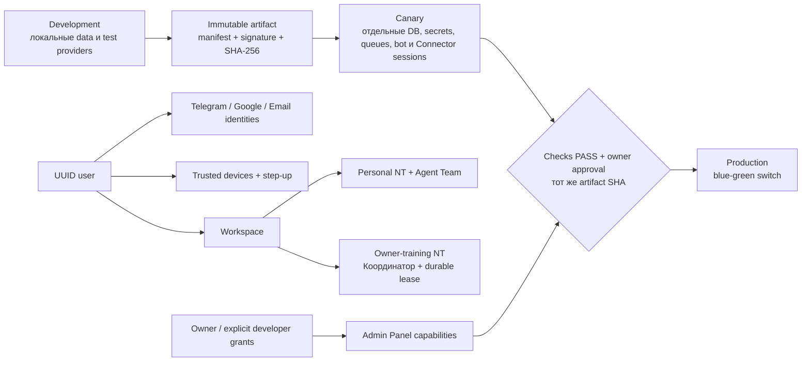

# Next Architecture: границы системы

Подробные решения находятся в [ADR index](../adr/README.md), план выполнения — в [NEXT_ARCHITECTURE_PROGRAM_STATUS.md](../current/NEXT_ARCHITECTURE_PROGRAM_STATUS.md).

## Непересекаемые границы

| Граница | Инвариант |
|---|---|
| Environment | Нет общей writable state, secrets, cookies, Telegram updates или Connector sessions |
| Identity | Внешний provider subject не является внутренним user ID |
| Device | IP/User-Agent не являются device identity; критические действия требуют step-up |
| Authorization | UI visibility повторяет, но не заменяет server-side capability check |
| Release | Canary и Production получают тот же immutable artifact без rebuild |
| NinjaTrader | Personal runtime не падает обратно на общий owner-training runtime |
| Documents | Workspace/strategy revision не меняет global governance и safety limits |

Phase 0 документирует решения и не меняет Production behavior.
