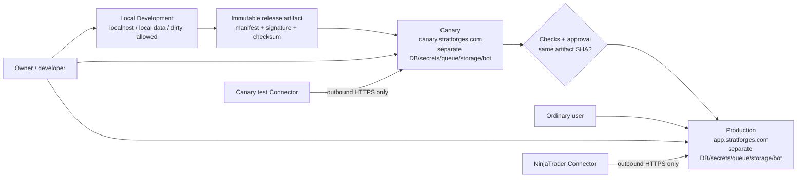
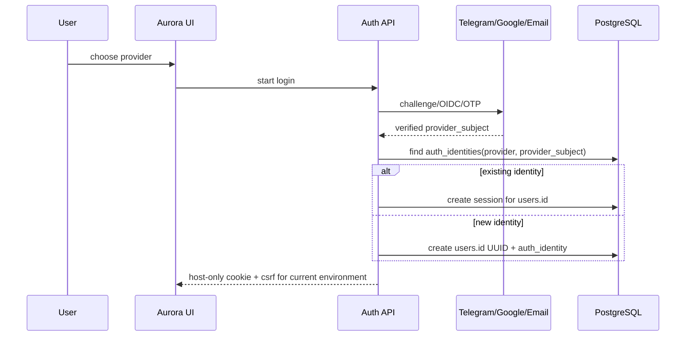
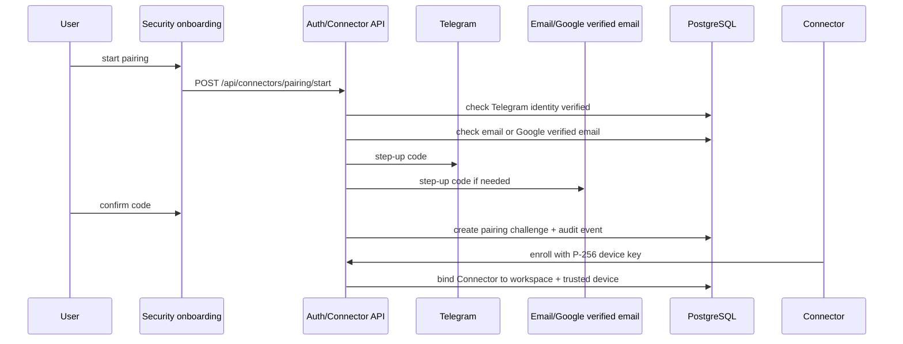
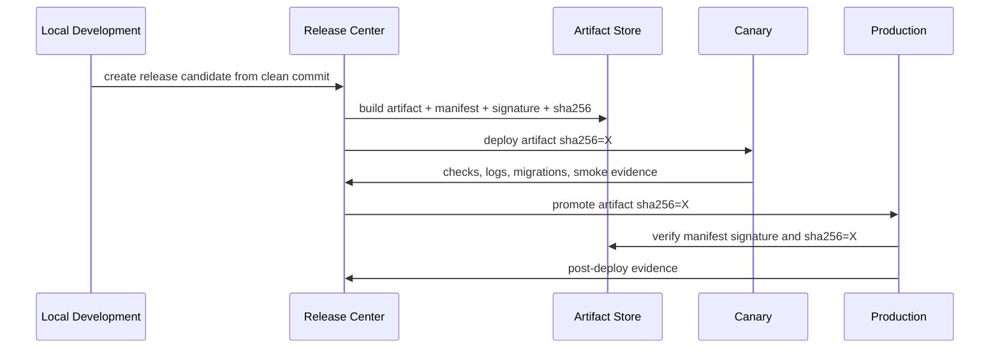
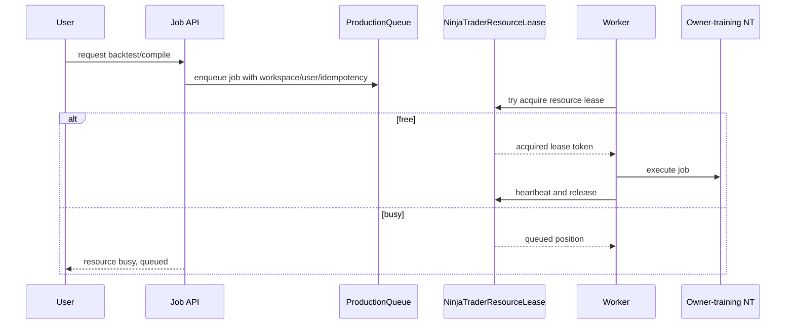

# StratForge next architecture - аудит и план реализации

История поправки: 2026-08-01T23:47:37Z; внёс `GPT-5.5 через Codex по запросу owner`; scope: repository copy of Phase 0 audit and implementation plan during Stage 10 Repository Hygiene Closeout.

Дата: 2026-08-01

Исходное поручение: `C:\Users\dimon\Desktop\ARCHITECTURE_PLAN_TASK_1\STRATFORGE_NEXT_ARCHITECTURE_PLAN_TASK.md`

Аудируемый checkout: `C:\Users\dimon\Documents\Анализатор стратегий NinjaTrader\NT-Analyzer`

Режим работы: Phase 0, read-only audit. Код приложения, production-конфигурация, схемы БД, docs внутри repo и файлы значков не изменялись. Создан только этот отчёт вне git-репозитория.

Проверка без браузера: workspace `AGENTS.md` запрещает запуск встроенного браузера для локальных страниц без прямого поручения пользователя. Использованы статический аудит, `rg`, прямое чтение файлов и pytest.

Верификация: `python -B -m pytest -q -p no:cacheprovider tests/test_deployment_config.py tests/test_permissions.py tests/test_phase_a_auth.py tests/test_nt_dual_auth.py tests/test_production_preflight.py tests/test_stage8_operations.py tests/test_stage8_postgresql.py tests/test_production_workers.py tests/test_aurora_contracts.py` - `154 passed, 20 skipped in 24.33s`.

Git-состояние на момент аудита: branch `antigravity/stage10-partitioned`; до работы уже были dirty/untracked файлы в `NT-Analyzer/data/ai_lab/registry/*`, `NT-Analyzer/data/governance-rendered/*`, `NT-Analyzer/docs/governance/*`, `NT-Analyzer/dev10-reconstructed-rollback.bundle`, `NT-Analyzer/docs.zip`. Эти файлы не трогались.

## 1. Краткий итог аудита

Текущий код уже содержит сильные заготовки для Production: явное fail-closed окружение, PostgreSQL/RLS слой, production worker queue, production Telegram queue/outbox, Connector Protocol v1 с device-owned P-256 ключом, owner operations dashboard и production release build scripts. Доказательства: `app/runtime_env.py:36-47`, `app/production_storage/migrations/0001_authoritative_storage.sql:20-371`, `app/production_workers.py:172-211`, `app/production_telegram.py:77-157`, `app/connector_protocol.py:3-5`, `app/server.py:3514-3521`, `tools/build_server_release.py:171-257`.

Целевая архитектура из поручения ещё не реализована как единая система. Главные пробелы: нет deployment environment `canary` как равного окружения; release channel сейчас `development/canary/stable`, а не `dev/beta/stable`; серверный release artifact содержит `environment: production|development`, а не отдельный `DEPLOYMENT_ENV` + `RELEASE_CHANNEL`; UI всё ещё показывает `STABLE` badge; нет Release Center; нет Admin Panel как отдельной навигационной оболочки; Telegram ID всё ещё является внутренним `user_id`; email OTP/magic-link и `auth_identities` отсутствуют; trusted-device registry отсутствует; общий owner-training NinjaTrader не защищён отдельным durable resource lease. Доказательства: `app/runtime_env.py:47`, `app/runtime_env.py:227-232`, `tools/build_server_release.py:224-232`, `app/static/aurora/assets/ui.js:71-75`, `app/static/aurora/assets/ui.js:3312-3334`, `app/production_storage/migrations/0001_authoritative_storage.sql:21`, `app/account_auth.py:668-704`.

Production можно считать основной пользовательской версией продукта без live trading, но не нужно выдавать за готовую целевую архитектуру следующего этапа. Live trading уже закрыт release/auth gates: `app/runtime_env.py:291`, `app/account_auth.py:463-535`, `docs/CONNECTOR_PROTOCOL_V1.md:51-52`.

Mapping обязательных результатов из поручения:

| Результат | Где закрыт в отчёте |
|---|---|
| `CURRENT_STATE_AUDIT` | Sections 1-3, 7.1, 8.1, 9.1 |
| `TARGET_ARCHITECTURE` | Section 4 |
| `DATA_MODEL_AND_MIGRATIONS` | Section 5 |
| `API_AND_UI_CONTRACTS` | Section 6 |
| `RELEASE_AND_DEPLOYMENT_DESIGN` | Section 7 |
| `DOCUMENTATION_REORGANIZATION_MAP` | Section 9 |
| `PHASED_IMPLEMENTATION_PLAN` | Section 10 |
| `TEST_AND_ACCEPTANCE_MATRIX` | Section 10.11 |
| `OPEN_DECISIONS` | Section 12 |

Классификация текущего состояния:

| Status | Items |
|---|---|
| Реализовано | Fail-closed runtime env, PostgreSQL/RLS base storage, production queues, production Telegram queue/outbox, Connector v1 trust boundary, Google factor for NT, owner operations dashboard, signed release scripts. |
| Частично | Environment/release marking, production deployment assets, operations dashboard, device/session history, Telegram environment separation, Connector release catalog. |
| Отсутствует | Canary deployment environment, Release Center, Admin Panel shell, UUID identity model, multi-provider `auth_identities`, email OTP/magic-link login, trusted-device lifecycle, exact-artifact promotion ledger, shared owner-training NT resource lease, docs reorg workflow. |

## 2. Что уже можно переиспользовать

| Контур | Что есть сейчас | Как переиспользовать |
|---|---|---|
| Runtime safety | `runtime_env.assert_startup_safe()` требует явный env; production проверяет host/origin/data/secrets. Доказательство: `app/runtime_env.py:558-705`, `app/runtime_env.py:753-768`. | Расширить до `development/canary/production`, не ломая fail-closed поведение. |
| PostgreSQL storage | Таблицы users/workspaces/sessions/connectors/jobs/audit/artifacts с RLS. Доказательство: `app/production_storage/migrations/0001_authoritative_storage.sql:20-371`, `0002_worker_scaling.sql:127-158`, `0003_operations_observability.sql:317-379`. | Использовать как базу для UUID identity, release records, trusted devices и resource leases. |
| Queue/locks | Production job queue, worker leases, service leases. Доказательство: `app/production_workers.py:172`, `app/production_workers.py:211`, `app/production_workers.py:371`, `app/production_workers.py:1067-1110`. | Не заменять, а добавить отдельный `NinjaTraderResourceLease` поверх текущей очереди для конфликтующих NT operations. |
| Telegram | Production queue/outbox разделяет bot identity hash и update dedupe. Доказательство: `app/production_telegram.py:55`, `app/production_telegram.py:132-157`, `app/production_telegram.py:241-275`, `app/production_telegram.py:451-465`. | Сделать отдельные bot configs, webhook endpoints и storage namespaces для DEV/CANARY/PRODUCTION. |
| Connector | Protocol v1 имеет P-256 device key, nonce signature, workspace binding, idempotency. Доказательство: `app/connector_protocol.py:300-315`, `app/connector_protocol.py:521-565`, `app/connector_protocol.py:703-922`, `app/connector_protocol.py:1363-1468`. | Сохранить как trust boundary, добавить trusted-device связь и canary/test contour. |
| Release build | Server and Connector artifacts already produce manifest/signature/checksums. Доказательство: `tools/build_server_release.py:224-257`, `tools/build_connector_release.py:260-321`. | Добавить Release Center records, immutable artifact promotion, approvals, SBOM/evidence and exact checksum gates. |
| Owner operations | Owner dashboard читает queues/services/Telegram/Connector status. Доказательство: `app/server.py:3514-3521`, `app/static/aurora/assets/ui.js:2574-2577`, `app/static/aurora/assets/api.js:306`. | Перенести в Admin Panel, разделить permissions. |
| Docs governance | Governance docs имеют canonical source/change log model. Доказательство: `docs/governance/README.md:3-18`, `docs/governance/OVERVIEW.md:29-41`, `docs/governance/CHARTER.md:17-27`. | Использовать как основу для docs permission/amendment workflow. |

## 3. Критические архитектурные исправления

1. Разделить `deployment environment` и `release channel`. Сейчас `app/runtime_env.py:47` смешивает `development/canary/stable` как release channels, а `deployment_environment()` возвращает только production/development (`app/runtime_env.py:227-232`). Цель: `DEPLOYMENT_ENV=development|canary|production`, `RELEASE_CHANNEL=dev|beta|stable`.
2. Прекратить использовать Telegram ID как внутренний user id. Сейчас `sf_users.user_id BIGINT PRIMARY KEY` (`app/production_storage/migrations/0001_authoritative_storage.sql:20-21`) и `register_via_telegram()` пишет пользователя по Telegram id (`app/account_auth.py:1440-1503`). Цель: `users.id UUID`, `auth_identities(provider, provider_subject)`.
3. Ввести email OTP/magic link. Сейчас Google есть (`app/google_auth.py`, `app/account_auth.py:2104-2140`), Telegram есть (`app/account_auth.py:1440-1503`), но email как самостоятельный login provider отсутствует; email сейчас профильное поле и Google email (`app/account_auth.py:623-627`, `app/account_auth.py:2131-2137`).
4. Ввести `TrustedDevice`. Сейчас `_device_id()` строится из user-agent/machine/browser hash (`app/account_auth.py:668-704`), а sessions хранят `device_id` (`app/account_auth.py:1801`, `app/account_auth.py:2204`). Это не pending/trusted/revoked lifecycle и не UUID device registry.
5. Перенести системное меню в Admin Panel. Сейчас системные пункты живут в three-dot menu (`app/static/aurora/assets/ui.js:3312-3334`), а operations в cabinet tab (`app/static/aurora/assets/ui.js:2513-2538`).
6. Добавить Release Center как state machine и evidence ledger. Сейчас есть build scripts и `deploy/production/connector-releases.example.json`, но нет UI/API records для create/deploy/promote/rollback approvals. Доказательства: `tools/build_server_release.py:171-299`, `deploy/production/connector-releases.example.json:3-29`.
7. Добавить exact-artifact promotion Canary to Production. Сейчас server manifest содержит `environment: production if --production else development` (`tools/build_server_release.py:224-232`), а задача требует один и тот же artifact/checksum/build ID между Canary и Production.
8. Добавить dedicated shared NinjaTrader lease. Сейчас есть generic jobs/service leases (`app/production_workers.py:172-371`, `app/production_storage/migrations/0003_operations_observability.sql:4-15`), но нет сущности `NinjaTraderResourceLease` и user-visible busy queue для owner-training NT.
9. Развести Telegram conversations by environment. Текущая docs-логика диалога использует `user_id + workspace_id + conversation_id` (`docs/TELEGRAM_MINI_APP.md:96-101`, `docs/VITEK.md:43-50`), production queue dedupe по `bot_identity_hash/update_id` (`app/production_telegram.py:153-157`). Нужно отдельное env namespace/bot per env.

## 4. Целевая архитектура

### 4.1 Принципы

- Одна кодовая база.
- Один immutable release artifact на путь Canary -> Production.
- Окружения разделяются доменами, БД, secrets, queues, storage namespaces, Telegram bot configs, Connector sessions, cookies, CSRF keys and local-storage namespaces.
- Production на `https://app.stratforges.com` является основной пользовательской версией.
- Canary на `https://canary.stratforges.com` доступен только owner/developer/admin с `environment.switch` и нужными release permissions.
- `BETA` и `stable` являются зрелостью публичного релиза, а не отдельными серверами.
- Stable Production не показывает пользователю надпись `STABLE`, только чистый значок и версию.

### 4.2 Trust boundaries



### 4.3 Environment boundary table

| Boundary | Development | Canary | Production |
|---|---|---|---|
| Origin | `http://127.0.0.1:*` or owner local URL | `https://canary.stratforges.com` | `https://app.stratforges.com` |
| `DEPLOYMENT_ENV` | `development` | `canary` | `production` |
| Dirty checkout | Allowed and visibly marked | Forbidden | Forbidden |
| PostgreSQL | Local/dev only | Canary DB only | Production DB only |
| Queue/storage | Dev namespace | Canary namespace | Production namespace |
| Telegram | Dev/test bot or local disabled bot | Canary bot/webhook | Production bot/webhook |
| Connector | Local/test sessions | Canary test contour | Production sessions |
| Cookies | `sf_dev_*`, host-only | `sf_canary_*`, host-only | `sf_prod_*`, host-only |
| UI badge | DEV orange | CANARY yellow | BETA purple-orange or no stable label |

### 4.4 Core models

- Identity: `users(id UUID)`, `auth_identities(provider, provider_subject)`, no Telegram ID as internal id.
- Device: `trusted_devices(id UUID, user_id UUID, status pending|trusted|revoked|expired)`.
- Workspace: existing workspace model remains, but all memberships/entitlements/connectors move to UUID FK.
- Agent allocation: personal NT workspace gets isolated Agent Team; owner-training workspace gets limited coordinator below Viktor.
- Release: `release_artifacts`, `release_candidates`, `release_deployments`, `release_checks`, `release_approvals`, `release_rollbacks`.
- Documents: `documents`, `document_revisions`, `document_approvals`, `document_publications`, with global/governance/workspace/strategy scopes.

### 4.5 Key sequences

#### Login/link identity



#### Personal NinjaTrader pairing



#### Exact artifact promotion



#### Shared owner-training NinjaTrader lease



## 5. Модель данных

### 5.1 Current schema facts

- `sf_users.user_id` is `BIGINT PRIMARY KEY`, so internal identity is not UUID yet. Evidence: `app/production_storage/migrations/0001_authoritative_storage.sql:20-21`.
- `sf_auth_sessions.user_id`, `sf_workspaces.owner_user_id`, `sf_workspace_memberships.user_id`, `sf_connector_installations.user_id`, `sf_jobs.user_id` all reference the BIGINT user id. Evidence: `app/production_storage/migrations/0001_authoritative_storage.sql:42`, `:56`, `:66`, `:124`, `:150`.
- RLS is enabled/forced on core tables. Evidence: `app/production_storage/migrations/0001_authoritative_storage.sql:274-371`, `0002_worker_scaling.sql:127-158`, `0003_operations_observability.sql:317-379`, `0004_audit_events.sql:99-100`.
- No `auth_identities` or `trusted_devices` table exists in current migrations. Evidence: `rg` over `app/production_storage/migrations` found none for `auth_identities` or `trusted_devices`.

### 5.2 Proposed identity tables

```sql
CREATE TABLE sf_users_v2 (
  id UUID PRIMARY KEY,
  display_name TEXT NOT NULL DEFAULT '',
  status TEXT NOT NULL CHECK (status IN ('pending','active','blocked','deleted')),
  is_owner BOOLEAN NOT NULL DEFAULT FALSE,
  created_at_utc TIMESTAMPTZ NOT NULL DEFAULT now(),
  updated_at_utc TIMESTAMPTZ NOT NULL DEFAULT now(),
  migrated_from_telegram_user_id BIGINT UNIQUE,
  document JSONB NOT NULL DEFAULT '{}'::jsonb
);

CREATE TABLE sf_auth_identities (
  id UUID PRIMARY KEY,
  user_id UUID NOT NULL REFERENCES sf_users_v2(id) ON DELETE CASCADE,
  provider TEXT NOT NULL CHECK (provider IN ('telegram','google','email')),
  provider_subject TEXT NOT NULL,
  normalized_email TEXT,
  verified_at_utc TIMESTAMPTZ,
  created_at_utc TIMESTAMPTZ NOT NULL DEFAULT now(),
  last_used_at_utc TIMESTAMPTZ,
  revoked_at_utc TIMESTAMPTZ,
  document JSONB NOT NULL DEFAULT '{}'::jsonb,
  UNIQUE(provider, provider_subject)
);

CREATE UNIQUE INDEX sf_auth_identities_verified_email_uidx
  ON sf_auth_identities(normalized_email)
  WHERE provider='email' AND revoked_at_utc IS NULL;
```

Migration strategy:

1. Expand: add UUID columns beside existing BIGINT columns: `sf_users.uuid`, `sf_auth_sessions.user_uuid`, `sf_workspaces.owner_user_uuid`, memberships, entitlements, connectors, jobs, commands, audit, telegram rows, artifacts.
2. Backfill: for each `sf_users.user_id BIGINT`, generate stable UUID and create `sf_auth_identities(provider='telegram', provider_subject=<telegram_id>)`.
3. Dual-read/write: new code writes UUID and legacy BIGINT for one compatibility window; all APIs return public `user.id` UUID and optional masked legacy id only owner-side.
4. Cut read path: switch application joins/scope to UUID. Keep legacy bigint for audit correlation only.
5. Contract: drop or archive bigint FKs only after backup, restore test, and release checkpoint. Destructive drop is not rollback-safe.

Rollback limitation: after new Google/email identities are linked, rolling back to Telegram-only code loses the ability to authenticate those accounts. Rollback must preserve read-only mapping tables and disable new login methods, not delete rows.

### 5.3 Proposed trusted devices

```sql
CREATE TABLE sf_trusted_devices (
  device_id UUID PRIMARY KEY,
  user_id UUID NOT NULL REFERENCES sf_users_v2(id) ON DELETE CASCADE,
  device_type TEXT NOT NULL CHECK (device_type IN ('phone','tablet','desktop','browser','connector')),
  display_name TEXT NOT NULL,
  os_family TEXT NOT NULL DEFAULT '',
  os_major_version TEXT NOT NULL DEFAULT '',
  app_kind TEXT NOT NULL DEFAULT '',
  app_version TEXT NOT NULL DEFAULT '',
  connector_installation_id TEXT,
  first_seen_at_utc TIMESTAMPTZ NOT NULL DEFAULT now(),
  last_seen_at_utc TIMESTAMPTZ,
  last_successful_auth_at_utc TIMESTAMPTZ,
  status TEXT NOT NULL CHECK (status IN ('pending','trusted','revoked','expired')),
  confirmed_by_provider TEXT CHECK (confirmed_by_provider IN ('telegram','email','google')),
  confirmed_at_utc TIMESTAMPTZ,
  revoked_at_utc TIMESTAMPTZ,
  expires_at_utc TIMESTAMPTZ,
  audit_metadata JSONB NOT NULL DEFAULT '{}'::jsonb
);

CREATE INDEX sf_trusted_devices_user_status_idx
  ON sf_trusted_devices(user_id, status, last_seen_at_utc DESC);
```

IP/region may be stored only in `audit_metadata` with masking and retention. IP must never be identity.

### 5.4 Proposed release tables

```sql
CREATE TABLE sf_release_artifacts (
  artifact_id UUID PRIMARY KEY,
  app_version TEXT NOT NULL,
  release_channel TEXT NOT NULL CHECK (release_channel IN ('dev','beta','stable')),
  build_id TEXT NOT NULL UNIQUE,
  git_commit_sha TEXT NOT NULL,
  artifact_sha256 TEXT NOT NULL UNIQUE,
  manifest_sha256 TEXT NOT NULL,
  signature_algorithm TEXT NOT NULL,
  built_at_utc TIMESTAMPTZ NOT NULL,
  dirty BOOLEAN NOT NULL DEFAULT FALSE,
  storage_uri TEXT NOT NULL,
  document JSONB NOT NULL DEFAULT '{}'::jsonb
);

CREATE TABLE sf_release_deployments (
  deployment_id UUID PRIMARY KEY,
  artifact_id UUID NOT NULL REFERENCES sf_release_artifacts(artifact_id),
  deployment_env TEXT NOT NULL CHECK (deployment_env IN ('canary','production')),
  state TEXT NOT NULL CHECK (state IN ('planned','deploying','deployed','checking','approved','promoted','failed','rolled_back')),
  deployed_at_utc TIMESTAMPTZ,
  approved_by_user_id UUID REFERENCES sf_users_v2(id),
  evidence JSONB NOT NULL DEFAULT '{}'::jsonb,
  UNIQUE(artifact_id, deployment_env)
);
```

Required checks: manifest signature, exact SHA match, clean Git, tests, migration preflight, smoke, rollback rehearsal for Canary, owner approval for Production.

### 5.5 Proposed shared NinjaTrader lease

```sql
CREATE TABLE sf_ninjatrader_resource_leases (
  resource_id TEXT NOT NULL,
  workspace_id TEXT NOT NULL,
  job_id UUID NOT NULL,
  requested_by_user_id UUID NOT NULL REFERENCES sf_users_v2(id),
  lease_token_hash TEXT,
  state TEXT NOT NULL CHECK (state IN ('queued','active','released','expired','cancelled','failed')),
  operation_kind TEXT NOT NULL,
  parallel_group TEXT NOT NULL DEFAULT 'exclusive',
  acquired_at_utc TIMESTAMPTZ,
  heartbeat_at_utc TIMESTAMPTZ,
  expires_at_utc TIMESTAMPTZ,
  released_at_utc TIMESTAMPTZ,
  created_at_utc TIMESTAMPTZ NOT NULL DEFAULT now(),
  document JSONB NOT NULL DEFAULT '{}'::jsonb,
  PRIMARY KEY(resource_id, job_id)
);

CREATE UNIQUE INDEX sf_nt_resource_one_active_exclusive_idx
  ON sf_ninjatrader_resource_leases(resource_id)
  WHERE state='active' AND parallel_group='exclusive';
```

Read-only operations may use `parallel_group='readonly'` and separate rules.

### 5.6 Proposed documentation tables

```sql
CREATE TABLE sf_documents (
  document_id UUID PRIMARY KEY,
  scope_type TEXT NOT NULL CHECK (scope_type IN ('global','governance','workspace','strategy','changelog')),
  workspace_id TEXT,
  slug TEXT NOT NULL,
  owner_user_id UUID REFERENCES sf_users_v2(id),
  current_revision_id UUID,
  UNIQUE(scope_type, workspace_id, slug)
);

CREATE TABLE sf_document_revisions (
  revision_id UUID PRIMARY KEY,
  document_id UUID NOT NULL REFERENCES sf_documents(document_id) ON DELETE CASCADE,
  revision INTEGER NOT NULL,
  author_user_id UUID NOT NULL REFERENCES sf_users_v2(id),
  status TEXT NOT NULL CHECK (status IN ('draft','review','approved','published','superseded')),
  diff JSONB NOT NULL,
  reason TEXT NOT NULL DEFAULT '',
  created_at_utc TIMESTAMPTZ NOT NULL DEFAULT now(),
  approved_at_utc TIMESTAMPTZ,
  published_at_utc TIMESTAMPTZ,
  release_build_id TEXT,
  UNIQUE(document_id, revision)
);
```

## 6. UI/API

### 6.1 Existing API facts

- HTTP server is stdlib handler with `/api/*` and `/ui/*`. Evidence: `app/server.py` module header and route methods.
- Auth status endpoint exists: `GET /api/auth/status` in `app/server.py:2681`.
- Runtime env endpoint exists: `GET /api/runtime/env` in `app/server.py:2700`.
- Telegram webhook endpoint exists: `POST /api/telegram/webhook` in `app/server.py:5973`.
- Connector v1 endpoints exist: `app/server.py:1647-1653`, `app/server.py:6000`.
- Owner operations endpoint exists: `GET /api/owner/operations` in `app/server.py:3514-3521`.
- Mini App auth header is enforced in `_authorize_api()`. Evidence: `app/server.py:1485-1618`.

### 6.2 New/changed API contracts

| Method | Endpoint | Permission | Step-up | Purpose |
|---|---|---|---|---|
| GET | `/api/admin/env/targets` | `environment.switch` | no | List local/canary/production origins, health, version, commit/build. |
| POST | `/api/admin/env/compare` | `environment.switch` | no | Return signed compare-launch URLs, never tokens. |
| GET | `/api/admin/releases` | `releases.view` | no | Release history, artifacts, deployments, checks. |
| POST | `/api/admin/releases/candidates` | `releases.create` | yes | Create release candidate from clean commit. |
| POST | `/api/admin/releases/{id}/deploy-canary` | `releases.deploy_canary` | yes | Deploy signed artifact to Canary. |
| POST | `/api/admin/releases/{id}/promote-production` | `releases.promote_production` | yes plus approval | Promote same artifact SHA to Production. |
| POST | `/api/admin/releases/{id}/rollback-production` | `releases.rollback_production` | yes plus approval | Rollback to previous compatible artifact. |
| GET | `/api/account/security` | authenticated | no | Linked identities, devices, step-up state. |
| POST | `/api/account/identities/{provider}/start` | authenticated | yes | Start linking Telegram/Google/email. |
| POST | `/api/account/identities/{id}/unlink` | authenticated | yes | Unlink provider if not last method and policy allows. |
| POST | `/api/auth/email/start` | public/authenticated | no | Start email OTP/magic-link login or link. |
| POST | `/api/auth/email/verify` | public/authenticated | no | Verify code/link and create session/link identity. |
| GET | `/api/account/devices` | authenticated | no | User device history and trust status. |
| POST | `/api/account/devices/{id}/approve` | authenticated | yes | Approve pending device. |
| POST | `/api/account/devices/{id}/revoke` | authenticated | yes | Revoke device and invalidate sessions. |
| GET | `/api/admin/security/events` | `operations.view` or `users.manage` | no | Security/audit events with redaction. |
| GET | `/api/ninjatrader/resources/{id}/queue` | workspace access | no | Busy/queue state for shared NT. |
| POST | `/api/ninjatrader/resources/{id}/jobs/{job_id}/cancel` | workspace writer | optional | Cancel own queued job; admin can cancel all. |
| GET | `/api/admin/docs/map` | `docs.manage_global` | no | Docs migration map and broken link risk. |
| POST | `/api/docs/{id}/revisions` | scope-specific docs permission | maybe | Create workspace/global/governance revision. |

### 6.3 UI pages/components

Admin Panel shell:

- Navigation: Overview, Users, Workspaces, Permissions, Connectors, Telegram, Operations, Security, Release Center, Environment, Documentation, Incidents.
- Entry point: ordinary users see only `Кабинет`, UI settings, future language switch, logout. Admin Panel appears only by capability.
- System actions currently in `systemItems` must move from `app/static/aurora/assets/ui.js:3312-3334` into Admin Panel modules.

Environment Switcher:

- Compact top button visible only with `environment.switch`.
- Shows current env/version/build/commit/health.
- Does not proxy or hot-swap backend inside current page.
- Opens target origin in new tab or explicit navigation with warning.
- Does not transfer cookies, CSRF or tokens.
- `Local DEV` active only if local endpoint responds.
- Compare Versions opens Canary and Production side-by-side in separate origins.

Release Center:

- Candidate list, artifact details, manifest SHA, artifact SHA, build ID, commit SHA, signature status, SBOM/evidence.
- State machine: draft -> built -> signed -> canary_deployed -> canary_checking -> canary_passed -> approved_for_production -> production_deploying -> production_live -> rolled_back/failed.
- No "promote" button unless Canary deployment references exact same artifact SHA and checks passed.

Account Security:

- Linked providers: Telegram, Google, email; linked_at and last_used_at.
- Devices: pending/trusted/revoked/expired, device type icon, OS, browser/app, last auth, revoke action.
- Personal NinjaTrader onboarding: requires Telegram verified and verified email. Google verified email can satisfy email factor but not Telegram factor.

Shared NT queue:

- User message: `Общий NinjaTrader сейчас выполняет бэктестирование. Ваша задача может быть поставлена в очередь.`
- Optional upsell: `Подключите личный NinjaTrader, чтобы запускать собственные задания независимо от общей очереди.`
- Ordinary user sees anonymized busy state; owner/admin sees full resource/job metadata.

## 7. Релизы и окружения

### 7.1 Current release facts

- `VERSION.json` currently has `channel: development` and `status: in_development`. Evidence: `VERSION.json:4-5`.
- Server release script rejects dirty worktree and signs manifest. Evidence: `tools/build_server_release.py:187-189`, `tools/build_server_release.py:244-254`.
- Server production release accepts channels `canary|stable`; non-production must be `development`. Evidence: `tools/build_server_release.py:179-182`.
- Connector production release requires clean git, production signing key, Authenticode thumbprint and `signtool`. Evidence: `tools/build_connector_release.py:82-95`, `tools/build_connector_release.py:155-157`.
- Production deploy assets use `STRATFORGE_ENV=production`, `STRATFORGE_RELEASE_CHANNEL=stable`, PostgreSQL storage, Cloudflare tunnel to `127.0.0.1:18765`. Evidence: `deploy/production/production.env.example:3`, `:9`, `:37`, `deploy/production/README.md:17-23`, `deploy/production/cloudflared.yml.example:12`.

### 7.2 Target build identity

Every running instance must expose:

- `APP_VERSION`
- `DEPLOYMENT_ENV`
- `RELEASE_CHANNEL`
- `BUILD_ID`
- `GIT_COMMIT_SHA`
- `ARTIFACT_SHA256`
- `BUILD_TIMESTAMP_UTC`
- `dirty`, allowed only in local Development

Endpoint: extend `/api/runtime/env` and server-side `runtime_env.public_status()` (`app/runtime_env.py:728`) to return these fields.

### 7.3 Artifact lifecycle

1. Local clean commit.
2. Release Center invokes build from clean checkout.
3. Build writes manifest with identity, file list, migrations, rollback requirements, SBOM if available.
4. Manifest signed by release key.
5. Artifact uploaded to release artifact store.
6. Canary deployment verifies signature and SHA, applies expand migrations, starts services, runs checks.
7. Production promotion verifies same `artifact_sha256`, same `manifest_sha256`, same `build_id`, same `git_commit_sha`.
8. Production uses blue-green/symlink deployment and post-deploy evidence.

### 7.4 Blue-green and maintenance

Default: no full maintenance mode.

Flow:

- Prepare green release directory.
- Verify config/secrets/readiness against Production.
- Apply backward-compatible expand migrations.
- Start green API/worker/telegram services with readiness probes.
- Drain old worker leases and avoid taking new incompatible jobs.
- Switch Cloudflare tunnel/symlink/systemd target.
- Run post-deploy smoke.
- Keep blue release and DB compatibility window for rollback.
- Contract migrations only after stable observation window.

Maintenance mode only for destructive schema migration, auth/session format break, Connector protocol break, critical infrastructure work, or a change that cannot be made backward-compatible.

### 7.5 User notification timing

Release Center should support: now, in 5 minutes, in 15 minutes, specific time, after market close. Current code has market/economic calendars but no release scheduler/trading-calendar release gate; this is a new component. Evidence for existing non-release calendars: `app/market_events.py` and UI market phase code in `app/static/aurora/assets/domain.js`.

## 8. Безопасность

### 8.1 Current security facts

- Auth is required by default unless test bypass is set. Evidence: `app/account_auth.py:327-339`.
- NT dual auth defaults to enforced. Evidence: `app/account_auth.py:365-380`.
- Personal NT gate requires Google-linked state and Telegram step-up for non-owner. Evidence: `app/account_auth.py:463-535`, UI state at `app/static/aurora/assets/ui.js:1692-1761`.
- Google linking stores `google_sub` and `google_email`. Evidence: `app/account_auth.py:2104-2140`.
- Raw `google_sub` is hidden from non-owner public user output. Evidence: `app/account_auth.py:850-851`.
- Owner can revoke sessions by session/device/all sessions. Evidence: `app/account_auth.py:1222-1265`.

### 8.2 Threat model and controls

| Threat | Required controls |
|---|---|
| Account linking hijack | Re-auth with existing trusted provider, provider_subject uniqueness, audit event, notification, no auto-merge by email. |
| Duplicate accounts | Identity lookup by `provider+subject`; email match only suggests manual verified merge, never automatic. |
| Email/Telegram takeover | Step-up for critical actions; device approval; recovery workflow with owner/security audit. |
| Stolen session | Host-only cookies, CSRF per env, device trust, session revocation, suspicious login event. |
| Environment token leakage | Separate cookie names, CSRF keys, secrets, local-storage namespaces, domains. |
| Canary to Production data crossing | Separate DB/queues/storage/bot/Connector sessions; runtime guard refuses cross-env IDs. |
| Developer over-permission | Capability grants with expiry; no default owner-equivalent developer role. |
| Malicious release/rollback | Signed artifact, clean commit, approvals, exact SHA promotion, rollback evidence. |
| Connector re-pairing | Telegram + email factors, device trust, pairing audit, old Connector revoke. |
| Trusted-device spoofing | Device UUID + approval challenge; IP is audit metadata only. |
| Shared NT queue abuse | Resource lease, quotas, idempotency, cancel/recovery, anonymized user UI. |
| Telegram replay/deduplication | `bot_identity_hash/update_id` dedupe per env; webhook secret; separate bot tokens. |
| Document permission escalation | Scope-specific permissions and amendment workflow for governance. |

### 8.3 Critical action policy

| Action | Permission | Step-up | Idempotency | Audit | Notification | Recovery |
|---|---|---|---|---|---|---|
| Link auth provider | authenticated | yes | provider challenge id | `identity.linked` | user | revoke identity if not last method |
| Unlink provider | authenticated | yes | request id | `identity.unlinked` | user | restore from audit if safe |
| Pair personal Connector | workspace writer | Telegram + email | pairing id | `connector.pairing` | user/admin | revoke installation |
| Approve new device | authenticated | yes | device challenge id | `device.trusted` | user | revoke device/sessions |
| Promote Production | `releases.promote_production` | yes + approval | artifact id | `release.promoted` | owner/admin/users | rollback artifact |
| Rollback Production | `releases.rollback_production` | yes + approval | rollback id | `release.rollback` | owner/admin/users | redeploy previous known good |
| Change permissions | `users.manage` or `permissions.manage` | yes | grant id | `permission.changed` | target + owner | revoke grant |
| Publish governance doc | `docs.manage_global` + amendment approval | yes | revision id | `docs.published` | readers by scope | supersede/revert |

## 9. Документация

### 9.1 Current docs facts and mismatches

| Document | Current statement/evidence | Conflict or required update |
|---|---|---|
| `docs/PRODUCTION_DEPLOYMENT_RUNBOOK.md` | Says current target has only private Windows Development and shared Linux Production; MacBook/public staging/admin/www not included. Evidence: `docs/PRODUCTION_DEPLOYMENT_RUNBOOK.md:1-5`. | New target requires Local Development, Canary, Production and canary origin. |
| `docs/UI_OPERATIONS.md` | Three-dot menu contains environment start/status, diagnostics, backend restart, memory, catalog/margins, classic UI. Evidence: `docs/UI_OPERATIONS.md:17-18`. | New target moves these into Admin Panel. |
| `docs/MULTI_USER_ACCOUNT_ARCHITECTURE.md` | Current identity layer is Telegram user id and roles; workspaces/memberships exist. Evidence: `docs/MULTI_USER_ACCOUNT_ARCHITECTURE.md:8-21`. | New target requires internal UUID and multi-provider identities. |
| `docs/TELEGRAM_MINI_APP.md` | Canonical message key is `user_id + workspace_id + conversation_id`; Telegram user id is resolved on incoming message. Evidence: `docs/TELEGRAM_MINI_APP.md:96-101`. | New target must keep canonical dialogue but resolve through `auth_identities`, not internal Telegram id. |
| `docs/CONNECTOR_PROTOCOL_V1.md` | Connector trust boundary says outbound HTTPS, device P-256 key, no workspace from JSON/IP trust. Evidence: `docs/CONNECTOR_PROTOCOL_V1.md:6-15`. | Reuse, but add environment-specific Connector contour and trusted device link. |
| `docs/PRODUCT_MODES_AND_CONTOURS_AUDIT_2026-07-18.md` | Notes staging/visual checks and Production acceptance blockers. Evidence: `docs/PRODUCT_MODES_AND_CONTOURS_AUDIT_2026-07-18.md:68-125`. | Archive or move to changelog/audit; do not treat as current architecture. |
| `docs/governance/*` | Governance docs define laws, roles, canonical JSON, change log. Evidence: `docs/governance/README.md:3-18`, `docs/governance/ROLES.md:5-51`. | Need permissions and amendment workflow in app data model. |

### 9.2 Documentation reorganization map

Do not move files automatically before link audit.

| Current file/path | Destination | Decision |
|---|---|---|
| `README.md` | `docs/current/README.md` plus root short intro | Update for Production-as-user-version and three-env release model. |
| `docs/PRODUCTION_DEPLOYMENT_RUNBOOK.md` | `docs/operations/production-deployment-runbook.md` | Rewrite: keep Cloudflare/systemd/PostgreSQL pieces, add Canary and exact artifact promotion. |
| `docs/PRODUCTION_OPERATIONS_RUNBOOK.md` | `docs/operations/production-operations-runbook.md` | Keep/update retention, operations dashboard, incidents. |
| `docs/MULTI_USER_ACCOUNT_ARCHITECTURE.md` | `docs/architecture/identity-workspace-architecture.md` | Merge with UUID identity ADR; mark Telegram-ID sections as legacy current state. |
| `docs/TELEGRAM_MINI_APP.md` | `docs/architecture/telegram-mini-app.md` and `docs/operations/telegram-runbook.md` | Split product/security from bot/webhook operations. |
| `docs/CONNECTOR_PROTOCOL_V1.md` | `docs/architecture/connector-protocol-v1.md` | Keep protocol, add env-specific connector contour and device trust. |
| `docs/UI_ARCHITECTURE.md` | `docs/architecture/aurora-ui-architecture.md` | Update Admin Panel, Release Center, Env Switcher. |
| `docs/UI_OPERATIONS.md` | `docs/current/ui-operations-current.md` then `docs/operations/ui-operator-guide.md` | Mark three-dot menu as current/legacy; target moves system actions. |
| `docs/PRODUCT_MODES_AND_CONTOURS_AUDIT_2026-07-18.md` | `docs/archive/audits/2026-07-18-product-contours.md` | Archive after extracting still-current product boundary. |
| `docs/AGENTS.md`, `docs/AGENT_PERSONAS.md`, `docs/CHIEF_AI_AGENT.md`, `docs/VITEK.md` | `docs/agents/` | Keep/update agent hierarchy, add personal/team allocation rules. |
| `docs/governance/*` | `docs/governance/` | Keep canonical folder; add amendment workflow ADR and permissions. |
| Strategy rule docs outside canonical docs | `docs/strategies/` | Create migration map, do not let workspace overrides mutate global law. |
| New ADRs | `docs/adr/` | Add ADRs for env model, identity UUID, trusted devices, release center, docs governance. |

### 9.3 Language and permissions

Russian should be canonical source for user and governance text now. Technical identifiers remain English. Future English localization should be generated/tracked as a localization layer, not manual divergent copies.

Docs permissions:

- `docs.manage_global`: global system docs.
- `docs.manage_governance`: governance amendment workflow only.
- `docs.manage_workspace`: workspace-scoped docs.
- `strategy.spec.manage`: user/workspace strategy forks and overrides.
- `docs.read_changelog`: published changelog.

## 10. Поэтапный план с acceptance criteria

### Phase 0 - Audit and ADR

Goal: freeze facts and decisions before implementation.

Files/modules: this report, `docs/adr/*`, `docs/current/*`, `docs/architecture/*`.

Changes: no Production behavior changes.

Tests: static link audit, docs references, targeted pytest already run.

Rollback: no runtime rollback needed.

Acceptance: owner approves ADRs for env model, identity UUID, release promotion, trusted devices, Admin Panel boundary.

Recommended model: сильная reasoning-модель.

### Phase 1 - Environment metadata and visual marking

Goal: implement `DEPLOYMENT_ENV`, `RELEASE_CHANNEL`, full build identity, UI badges and icon mapping.

Files/modules: `app/runtime_env.py`, `VERSION.json`, `tools/build_server_release.py`, `app/server.py`, `app/static/aurora/assets/ui.js`, `app/static/aurora/assets/pages/mode-entry.js`, `app/static/aurora/assets/theme.css`, packaging/static assets.

Schema/API/UI: extend `/api/runtime/env`; add `BUILD_ID`, `GIT_COMMIT_SHA`, `ARTIFACT_SHA256`, `dirty`; replace `development/canary/stable` channel with `dev/beta/stable`; keep `canary` as env.

Dependencies: owner approval of naming and icon assets. Source images found at `C:\Users\dimon\Desktop\CEO\DEV.png`, `CANARY.png`, `BETA.png`; all are PNG 1254x1254, `Format24bppRgb`, no alpha channel observed in `System.Drawing`.

Risks: stale tests expecting `stable` badge; mismatch with production env example.

Tests: runtime env unit tests, UI contract tests for badge text, production preflight, icon asset checks.

Rollback: revert metadata fields/badges; no schema dependency.

Acceptance: examples render correctly: `DEV · v... · dirty`, `CANARY · v...`, `BETA · v...`, stable Production without `STABLE` label.

Recommended model: средняя reasoning-модель.

### Phase 2 - Admin Panel shell and capability permissions

Goal: remove system operations from three-dot menu and cabinet tabs; introduce Admin Panel gated by capabilities.

Files/modules: `app/permissions.py`, `app/account_auth.py`, `app/server.py`, `app/static/aurora/assets/ui.js`, `app/static/aurora/assets/api.js`, tests.

Schema/API/UI: permissions such as `admin.view`, `users.manage`, `operations.view`, `operations.execute`, `releases.view`, `environment.switch`.

Dependencies: Phase 1 env metadata.

Risks: owner loses access if capability migration wrong.

Tests: owner/developer/ordinary user UI contracts; server-side authz tests for all admin endpoints.

Rollback: keep old endpoints, hide old UI only after Admin Panel tests pass.

Acceptance: ordinary user sees no Admin Panel or system actions; owner sees Admin Panel; developer sees only explicit grants.

Recommended model: средняя reasoning-модель.

### Phase 3 - Unified Identity

Goal: migrate from Telegram BIGINT internal id to UUID user plus auth identities.

Files/modules: `app/account_auth.py`, `app/google_auth.py`, `app/server.py`, `app/production_storage/migrations/0005_identity_uuid.sql`, repositories, tests.

Schema/API/UI: `sf_users_v2` or expanded `sf_users`, `sf_auth_identities`, session UUID fields, public profile contract.

Dependencies: backup/restore process, owner approval of migration strategy.

Risks: account lockout, duplicate users, audit history break, Connector/workspace FK mismatch.

Tests: migration idempotency, rollback rehearsal, Telegram login, Google login/link, email OTP login, existing sessions, owner approval flows.

Rollback: disable new providers and keep UUID mapping read-only; destructive FK contract delayed.

Acceptance: existing Telegram users keep profiles, memberships, workspaces, conversations, entitlements, Connector pairings and audit history; new login can be Telegram, Google or email.

Recommended model: сильная reasoning-модель.

### Phase 4 - Trusted devices and step-up auth

Goal: implement device registry, pending/trusted/revoked lifecycle, step-up approvals.

Files/modules: `app/account_auth.py`, new `app/security_devices.py`, migrations, UI security page, Telegram/email challenge senders.

Schema/API/UI: `sf_trusted_devices`, `sf_security_challenges`, `/api/account/security`, `/api/account/devices`.

Dependencies: Phase 3 identities and email provider.

Risks: false device blocks, privacy overcollection, session invalidation bugs.

Tests: new device login, approve/reject, revoke session, connector device, masked metadata.

Rollback: allow previously active sessions but stop approving new devices; keep audit.

Acceptance: new device starts pending, trusted confirmation via Telegram/email, revoke invalidates sessions immediately.

Recommended model: сильная reasoning-модель.

### Phase 5 - Personal NinjaTrader security

Goal: require confirmed Telegram plus verified email for personal NT and critical actions.

Files/modules: `app/account_auth.py`, `app/connector_protocol.py`, `app/workspaces.py`, UI personal NT onboarding, tests.

Schema/API/UI: step-up challenge records linked to pairing/revoke/default account/trading capability changes.

Dependencies: Phases 3-4.

Risks: blocking legitimate owner/developer tests; Google email factor interpretation.

Tests: missing Telegram, missing email, Google verified email, email OTP, pairing code, Connector revoke, default account change.

Rollback: revert enforcement flag by config only for non-production; production rollback requires owner decision.

Acceptance: personal Connector pairing cannot start with Telegram-only account; Google verified email satisfies email factor; no fake SMS wording.

Recommended model: средняя to сильная reasoning-модель.

### Phase 6 - Agent allocation and shared NinjaTrader queue

Goal: allocate agents by workspace/entitlement/NT connection and protect owner-training NT with durable resource lease.

Files/modules: AI Lab/orchestrator modules, `app/production_workers.py`, new `app/ninjatrader_resources.py`, migrations, UI queue state.

Schema/API/UI: `sf_ninjatrader_resource_leases`, agent team/workspace mappings, busy queue status endpoint.

Dependencies: workspace identity stable enough from Phase 3.

Risks: blocking read-only telemetry, leaking other user identity, dead leases.

Tests: exclusive lease, TTL/heartbeat recovery, cancellation, read-only parallelism, anonymized user UI, owner admin detail.

Rollback: stop scheduling new shared NT jobs; release expired leases.

Acceptance: one active conflicting owner-training job at a time; users see queued/busy state; personal NT never falls back to owner runtime.

Recommended model: сильная reasoning-модель.

### Phase 7 - Canary environment

Goal: deploy real server-side Canary with separate DB/secrets/queues/storage/Telegram/Connector contour.

Files/modules: `app/runtime_env.py`, `deploy/canary/*`, `deploy/production/*`, `tools/production_preflight.py`, Cloudflare/DNS docs, Telegram config.

Schema/API/UI: `DEPLOYMENT_ENV=canary`; Admin Panel environment targets.

Dependencies: Phase 1 metadata, Phase 2 permissions.

Risks: accidental Production data access, bot token mix, Connector sessions crossing envs.

Tests: negative cross-env tests, cookie namespace tests, Telegram bot separation, Connector canary session, readiness/preflight.

Rollback: remove canary DNS/tunnel, keep canary DB isolated, no Production rollback.

Acceptance: Canary cannot read/write Production DB, queue, storage, Telegram updates or Connector sessions.

Recommended model: сильная reasoning-модель.

### Phase 8 - Release Center

Goal: UI/API for release candidate creation, artifact evidence, canary deploy, production promotion and rollback.

Files/modules: new `app/releases.py`, `app/server.py`, build tools, artifact storage, Admin Panel UI, tests.

Schema/API/UI: `sf_release_artifacts`, `sf_release_deployments`, checks, approvals, rollback records.

Dependencies: Phase 7 Canary.

Risks: building from dirty state, accidentally rebuilding between Canary and Production, approval bypass.

Tests: exact artifact SHA promotion, signature validation, dirty rejection, approval matrix, rollback.

Rollback: keep command-line release scripts as fallback; disable Release Center actions by permission flag.

Acceptance: Production promote button only deploys the same artifact that passed Canary.

Recommended model: сильная reasoning-модель.

### Phase 9 - Blue-green Production deployment

Goal: zero/minimal downtime deployment with graceful drain, compatible migrations and evidence.

Files/modules: deploy scripts, systemd units, release tools, `service_readiness`, worker drain logic, runbooks.

Schema/API/UI: Release Center deployment steps and maintenance mode records.

Dependencies: Phase 8 Release Center.

Risks: schema incompatibility, long-running jobs, Telegram webhook/outbox duplication, Connector protocol drift.

Tests: blue-green rehearsal, worker drain, webhook replay, DB expand/migrate/contract, rollback traffic switch.

Rollback: switch to previous compatible artifact and preserve persistent data.

Acceptance: deployment evidence shows readiness, no data loss, rollback path tested.

Recommended model: сильная reasoning-модель.

### Phase 10 - Documentation reorganization

Goal: canonical docs tree, Russian normalization, archive old audits, workspace strategy specs and governance amendments.

Files/modules: `docs/current`, `docs/architecture`, `docs/operations`, `docs/security`, `docs/product`, `docs/agents`, `docs/strategies`, `docs/governance`, `docs/changelog`, `docs/adr`, `docs/archive`.

Schema/API/UI: docs revision model if UI editing is in scope.

Dependencies: owner-approved migration map.

Risks: broken links, stale English/Russian divergence, user edits to global laws.

Tests: markdown link audit, docs permission tests, amendment workflow tests, strategy override scope tests.

Rollback: docs moves happen through PR/commit; keep archive path and redirect map.

Acceptance: current vs target docs separated; global governance cannot be modified by workspace strategy override.

Recommended model: средняя reasoning-модель for file moves, сильная for governance workflow.

### 10.11 TEST_AND_ACCEPTANCE_MATRIX

| Area | Minimum tests | Acceptance |
|---|---|---|
| Unit | `runtime_env`, permissions, auth identity helpers, trusted devices, release state machine, resource lease helpers. | Deterministic pass in local CI without Production secrets. |
| Migration | UUID backfill, dual-write compatibility, FK migration, RLS policies, restore from backup into isolated DB. | Existing Telegram users retain sessions/profile/workspaces/dialogs/entitlements/connectors/audit mapping. |
| Auth/account linking | Telegram first login, Google first login, email OTP first login, linking/unlinking, duplicate provider subject, email collision. | No auto-merge by email; unlink cannot remove last login method; every link has audit and notification. |
| Multi-device | New pending device, approval, rejection, revoke, session invalidation, connector device. | Pending device cannot become trusted without step-up; revoked device sessions die immediately. |
| Permissions | Owner, developer with explicit grants, ordinary user, beginner/professional product modes, Mini App restrictions. | Admin and release endpoints are server-denied without capability, not only hidden in UI. |
| Environment isolation | Cookie names, CSRF keys, local-storage namespaces, DB IDs, queue IDs, storage IDs, host/origin checks. | Canary cannot read/write Production data and cannot reuse Production session/token/CSRF. |
| Telegram separation | Separate bot token/config per env, webhook secret, update dedupe, outbox dedupe, conversation key migration. | DEV/CANARY messages are marked and never enter Production bot queues/conversations. |
| Connector pairing | P-256 enrollment, signed challenge/hello, workspace mismatch, capability mismatch, idempotency conflict, canary contour. | Connector sessions are environment-bound; personal pairing requires Telegram + verified email. |
| Shared NinjaTrader locking | Exclusive active lease, queued position, read-only parallel operations, TTL/heartbeat recovery, cancellation. | No two conflicting owner-training jobs run at once; ordinary user sees anonymized busy state. |
| Release promotion | Clean commit, manifest signature, artifact SHA, manifest SHA, build ID, Canary checks, Production promotion. | Production can only deploy the same artifact that passed Canary; rebuild between envs is rejected. |
| Blue-green/rollback | Green readiness, worker drain, webhook/outbox replay, expand/migrate/contract compatibility, rollback switch. | Rollback preserves persistent data and restores previous compatible artifact with evidence. |
| Documentation permissions | Global docs, governance amendment, workspace docs, strategy profile override, changelog read. | User strategy override cannot mutate global governance or safety limits. |
| E2E owner/developer/user | Owner Admin Panel, developer limited Admin Panel, ordinary user cabinet, personal NT onboarding, owner-training queue. | Visible UI matches server permissions and product contour for each persona. |

## 11. Таблица рисков

| Risk | Severity | Where | Mitigation |
|---|---:|---|---|
| User lockout during UUID migration | Critical | Phase 3 | Dual-write, owner break-glass, restore test, no destructive contract until proven. |
| Canary/Production data crossing | Critical | Phases 1, 7, 8 | Separate env config, DB IDs, queue IDs, storage namespaces, bot IDs, runtime fail-closed checks. |
| Rebuilt artifact between Canary and Production | Critical | Phase 8 | Store artifact SHA and manifest SHA; Production accepts only same artifact id. |
| Developer gets owner powers by default | High | Phase 2 | Capability grants with expiry; tests for each route. |
| Trusted-device false positives | High | Phase 4 | Device approval UX, recovery path, conservative metadata. |
| Shared NT deadlock | High | Phase 6 | TTL, heartbeat, recovery worker, cancel, idempotency. |
| Telegram bot contamination | High | Phase 7 | Separate tokens/webhooks/bot_identity_hash and DB namespace. |
| Connector re-pair hijack | High | Phase 5 | Telegram + email factor, device trust, audit, notification. |
| Docs link breakage | Medium | Phase 10 | Migration map and link checker before file moves. |
| UI hiding admin functions from owner | Medium | Phase 2 | Owner end-to-end tests and feature flag fallback. |

## 12. Открытые решения владельца

1. Canary domain and hosting
   - Options: `canary.stratforges.com` on same Linux host with separate services; separate Linux VM; temporary private tunnel.
   - Recommendation: same Linux host only if DB/secrets/queues/storage/systemd units are fully separated; separate VM is cleaner later.
   - Consequence: same host is faster, separate VM is safer.

2. Release channel names in SemVer
   - Options: `1.0.0-beta.2` for beta; `1.0.0` stable; keep `0.9.0-dev.N` local only.
   - Recommendation: use SemVer prerelease for beta, no `stable` suffix.
   - Consequence: clean public versioning and exact artifact promotion.

3. Email provider for OTP/magic link
   - Options: transactional email provider; Google Workspace SMTP/OAuth; temporary owner-approved local provider for dev only.
   - Recommendation: choose a real transactional provider before Production email login.
   - Consequence: without provider, Phase 3 can implement schema/API but Production email login remains blocked.

4. Auth account merge policy
   - Options: never auto-merge; manual owner-assisted merge; self-service merge requiring proof of both accounts.
   - Recommendation: no auto-merge, self-service only with proof of both providers, owner-assisted recovery for edge cases.
   - Consequence: safer against account takeover, more support work.

5. Trusted device retention
   - Options: 90 days audit metadata; 180 days; owner-configurable per environment.
   - Recommendation: 180 days for security events, shorter masked IP retention unless legally needed.
   - Consequence: balances investigation and privacy.

6. Canary Telegram strategy
   - Options: separate bot token per env; one bot with env-prefixed commands and separate DB namespace; disable Telegram in Canary initially.
   - Recommendation: separate bot tokens for Development, Canary, Production.
   - Consequence: strongest isolation; requires BotFather/config work.

7. Blue-green mechanism
   - Options: systemd symlink switch; Cloudflare tunnel route switch; containerized deployment later.
   - Recommendation: symlink/current-release switch first, because current deploy assets are systemd/rootless oriented.
   - Consequence: less migration work now; containerization can be separate ADR.

8. Agent persona for owner-training user coordinator
   - Options: neutral training coordinator; junior assistant below Viktor; separate named persona.
   - Recommendation: decide persona separately before implementation, as requested.
   - Consequence: avoids leaking owner agent team semantics to ordinary users.

9. Documentation amendment workflow strictness
   - Options: owner-only approve; owner plus developer review; governance-specific quorum later.
   - Recommendation: owner-only approve now, with audit trail and future extensibility.
   - Consequence: simple first implementation, governance history preserved.

## 13. Точный перечень создаваемых/изменяемых документов

Created in this work:

- `C:\Users\dimon\Desktop\ARCHITECTURE_PLAN_TASK_1\STRATFORGE_NEXT_ARCHITECTURE_AUDIT_AND_IMPLEMENTATION_PLAN.md`

Existing input documents inspected but not changed:

- `C:\Users\dimon\Desktop\ARCHITECTURE_PLAN_TASK_1\STRATFORGE_NEXT_ARCHITECTURE_PLAN_TASK.md`
- `docs/MULTI_USER_ACCOUNT_ARCHITECTURE.md`
- `docs/TELEGRAM_MINI_APP.md`
- `docs/UI_OPERATIONS.md`
- `docs/UI_ARCHITECTURE.md`
- `docs/PRODUCTION_DEPLOYMENT_RUNBOOK.md`
- `docs/PRODUCTION_OPERATIONS_RUNBOOK.md`
- `docs/CONNECTOR_PROTOCOL_V1.md`
- `docs/PRODUCT_MODES_AND_CONTOURS_AUDIT_2026-07-18.md`
- `docs/AGENTS.md`
- `docs/AGENT_PERSONAS.md`
- `docs/CHIEF_AI_AGENT.md`
- `docs/VITEK.md`
- `docs/governance/*`

Documents recommended for the next implementation stage:

- `docs/adr/0001-environment-release-model.md`
- `docs/adr/0002-internal-uuid-identity.md`
- `docs/adr/0003-trusted-devices-and-step-up.md`
- `docs/adr/0004-release-center-exact-artifact-promotion.md`
- `docs/adr/0005-admin-panel-capability-rbac.md`
- `docs/adr/0006-shared-ninjatrader-resource-lease.md`
- `docs/adr/0007-documentation-governance-and-scopes.md`
- `docs/current/current-state-audit-2026-08-01.md`
- `docs/architecture/target-architecture-next-stage.md`
- `docs/operations/canary-production-release-runbook.md`
- `docs/security/auth-device-threat-model.md`
- `docs/product/ninjatrader-access-and-agent-allocation.md`
- `docs/archive/audits/2026-07-18-product-contours.md`

## 14. GitHub, Git hygiene и процедура закрытия задач

Дата Git-аудита: 2026-08-01. Режим: read-only audit. Не выполнялись `git add`, `git commit`, `git push`, `git rm`, cleanup, удаление файлов, merge, release или deployment.

### 14.1 Evidence snapshot

| Evidence | Result |
|---|---|
| Branch | `antigravity/stage10-partitioned` |
| HEAD | `56f6da0272f6d51d59605884060044f2b419d55e` |
| Remote | `origin https://github.com/OMNOM-111/NT-Analyzer.git` |
| Merge-base with `origin/main` | `d0fa6e1469f7dab5389bac9dd63e4be653b73057` |
| Dirty tracked files | 12 modified |
| Untracked files | 8 untracked |
| `git diff --numstat` | 1498 insertions, 100 deletions across tracked dirty files |
| `git diff --check` | no whitespace errors; Git warned about LF/CRLF normalization on JSONL/Markdown files |
| `.gitignore` relevant evidence | `.gitignore:115-124` ignores `/NT-Analyzer/ai_lab/registry/`, but not `/NT-Analyzer/data/ai_lab/registry/`; `.gitignore:35-72` ignores several runtime data folders, but not current dirty registry path; no check-ignore match for `docs.zip`, `.bundle`, or new chief reports |

Important delta since the previous architecture report: `NT-Analyzer/data/ai_lab/registry/chief_reports/workspaces/ws_owner_training_c1fe3f2f8a52/daily-2026-08-01.json` is now also untracked. It was created at `2026-08-01T16:20:17` and is runtime report data, not part of the architecture plan.

### 14.2 Current dirty file classification

Recommended action meanings:

- `commit`: include in a normal source/docs PR.
- `ignore`: add ignore rule after owner approval; for tracked runtime files also plan `git rm --cached`, not deletion from disk.
- `artifact`: move to GitHub Releases or artifact storage, not normal Git history.
- `archive`: move into an approved archive location after checksum/content review.
- `delete`: safe deletion only after owner approval and backup decision.
- `local`: keep outside Git.

| Path | Git status | Evidence | Classification | Risk/content finding | Recommended action |
|---|---|---|---|---|---|
| `NT-Analyzer/data/ai_lab/registry/agent_usage/2026-07.jsonl` | tracked, modified | `git diff --numstat`: `11 0`; last Git commit `049affc4 Restore pre-existing untracked user files`; current file 160457 bytes, last write `2026-07-31T16:26:27`. Diff appends provider/model usage, cost, request ids, workspace/user metadata. | runtime data / AI usage ledger | No high-confidence secret match. Contains provider account names, token/cost telemetry, `user_id 1647145559`, workspace id and operational usage history. | Do not commit in ordinary PR. Keep local or move to production-safe telemetry storage. Add ignore/retention policy for `data/ai_lab/registry/agent_usage/*.jsonl`; consider removing tracked runtime ledgers from Git with owner-approved `git rm --cached`. |
| `NT-Analyzer/data/ai_lab/registry/chief_agent.json` | tracked, modified | `git diff`: `daily_audit_key` moved `2026-07-27 -> 2026-08-01`, owner runtime heartbeat changed `true -> false`, weekly/monthly report keys changed; last Git commit `049affc4`; 408 bytes, last write `2026-08-01T16:20:17`. | runtime state | Contains operational state, not code. | Do not commit. Keep local; ignore runtime state; if fixtures are needed, create sanitized fixture separately. |
| `NT-Analyzer/data/ai_lab/registry/chief_reports/workspaces/ws_owner_training_c1fe3f2f8a52/daily-2026-07-28.json` | tracked, modified | `git diff`: only `generated_at_utc` `2026-07-29T05:22:52Z -> 2026-07-29T05:23:24Z`; last Git commit `7a45cc9f`; 176 bytes. | generated runtime report | Timestamp-only generated diff. | Do not commit alone. Keep local or ignore future reports. If historical reports are product evidence, export to artifact storage with metadata. |
| `NT-Analyzer/data/ai_lab/registry/news_agent.json` | tracked, modified | `git diff --numstat`: `1465 87`; top-level keys `schema_version, initialized, seen_ids, analyses, updated_at_utc`; last Git commit `049affc4`; 345374 bytes. Diff changes `seen_ids`, appends `analyses`, updates timestamp. | runtime cache / news analysis state | No credential evidence. Contains external URLs, model/provider analysis records and generated market/news state. | Do not commit in normal history. Keep local/cache; add ignore/retention. For deterministic tests, create small sanitized fixture under tests, not this live cache. |
| `NT-Analyzer/data/ai_lab/registry/orchestrator_conversation.jsonl` | tracked, modified | `git diff --numstat`: `7 0`; appended messages include Vitek prompts, incident/news notices and rating event ids; last Git commit `049affc4`; 233643 bytes. | runtime conversation log | Contains conversation content and operational notices; privacy-sensitive even without secrets. | Do not commit. Keep local or move to secure conversation storage. Add ignore; plan tracked-file cleanup. |
| `NT-Analyzer/data/ai_lab/registry/orchestrator_conversations.json` | tracked, modified | `git diff`: `default_work_state` changed `in_progress -> awaiting_owner`, detail asks owner for daily/weekly focus; last Git commit `049affc4`; 287 bytes. | runtime state | Contains current assistant work state, not source. | Do not commit. Keep local; ignore. |
| `NT-Analyzer/data/governance-rendered/LAWS.md` | tracked, modified | `git diff`: line 3 date `2026-07-27 -> 2026-08-01`; last Git commit `049affc4`; 6703 bytes. | generated output / rendered governance mirror | No secret evidence. Generated date-only diff without dirty source-of-truth JSON. | Do not commit alone. Regenerate from canonical source in an explicit governance/docs task, or restore/re-render consistently after approval. |
| `NT-Analyzer/data/governance-rendered/LOCAL_AI_LAWS.md` | tracked, modified | `git diff`: line 3 date `2026-07-27 -> 2026-08-01`; secret scan hit only text reference to `app/local_secrets.py`; last Git commit `049affc4`; 15136 bytes. | generated output / rendered governance mirror | No actual credential found in text scan; contains documentation reference to local secrets module. | Do not commit alone. Same as above. |
| `NT-Analyzer/data/governance-rendered/SYNC_MAP.md` | tracked, modified | `git diff`: line 3 date `2026-07-27 -> 2026-08-01`; secret scan hit only text reference to `app/local_secrets.py`; last Git commit `049affc4`; 11875 bytes. | generated output / rendered governance mirror | No actual credential found in text scan. | Do not commit alone. Same as above. |
| `NT-Analyzer/docs/governance/LAWS.md` | tracked, modified | `git diff`: line 3 date `2026-07-25 -> 2026-08-01`; last Git commit `7a45cc9f`; 6703 bytes. | canonical documentation or generated docs copy; currently ambiguous | Date-only docs change; no source governance JSON diff in `git status`. | Do not commit until source-of-truth and generation path are confirmed. If docs are canonical, commit only with matching changelog/amendment evidence. |
| `NT-Analyzer/docs/governance/LOCAL_AI_LAWS.md` | tracked, modified | `git diff`: line 3 date `2026-07-25 -> 2026-08-01`; secret scan hit only text reference to `app/local_secrets.py`; last Git commit `7a45cc9f`; 15136 bytes. | canonical documentation or generated docs copy; currently ambiguous | No actual credential found; date-only change. | Do not commit until governance source/update is validated. |
| `NT-Analyzer/docs/governance/SYNC_MAP.md` | tracked, modified | `git diff`: line 3 date `2026-07-25 -> 2026-08-01`; secret scan hit only text reference to `app/local_secrets.py`; last Git commit `7a45cc9f`; 11875 bytes. | canonical documentation or generated docs copy; currently ambiguous | No actual credential found; date-only change. | Do not commit until governance source/update is validated. |
| `NT-Analyzer/data/ai_lab/registry/chief_reports/workspaces/ws_owner_training_c1fe3f2f8a52/daily-2026-07-29.json` | untracked | 176 bytes; created and last written `2026-07-29T16:20:11`; top-level keys `generated_at_utc, period, experiments_checked, findings, advisory_only, model_review`. | generated runtime report | No secret evidence from text scan. | Keep local or external artifact; do not commit; ignore future generated chief reports. |
| `NT-Analyzer/data/ai_lab/registry/chief_reports/workspaces/ws_owner_training_c1fe3f2f8a52/daily-2026-07-30.json` | untracked | 176 bytes; created and last written `2026-07-30T16:20:20`; same report schema. | generated runtime report | No secret evidence. | Same as above. |
| `NT-Analyzer/data/ai_lab/registry/chief_reports/workspaces/ws_owner_training_c1fe3f2f8a52/daily-2026-07-31.json` | untracked | 176 bytes; created and last written `2026-07-31T16:20:23`; same report schema. | generated runtime report | No secret evidence. | Same as above. |
| `NT-Analyzer/data/ai_lab/registry/chief_reports/workspaces/ws_owner_training_c1fe3f2f8a52/daily-2026-08-01.json` | untracked | 176 bytes; created and last written `2026-08-01T16:20:17`; same report schema. | generated runtime report | No secret evidence. | Same as above. |
| `NT-Analyzer/data/ai_lab/registry/chief_reports/workspaces/ws_owner_training_c1fe3f2f8a52/week-2026-07-31.json` | untracked | 2917 bytes; created `2026-07-31T16:25:33`; top-level keys include `content, model, provider, input_tokens, output_tokens, cost_usd`. | generated runtime report / AI report | Contains model output content and usage telemetry. | Keep local or artifact storage; do not commit. |
| `NT-Analyzer/data/ai_lab/registry/chief_reports/workspaces/ws_owner_training_c1fe3f2f8a52/month-2026-07-31.json` | untracked | 7033 bytes; created `2026-07-31T16:26:27`; top-level keys include `content, model, provider, input_tokens, output_tokens, cost_usd`. | generated runtime report / AI report | Contains model output content and usage telemetry. | Keep local or artifact storage; do not commit. |
| `NT-Analyzer/dev10-reconstructed-rollback.bundle` | untracked | 11788600 bytes; created `2026-07-28T22:50:45`; SHA256 `75511284F64B9C59C54B3078B1C8E5D641B526D1A95EC714151CEBA76457F283`; `git bundle verify` says valid complete history with 32 refs; HEAD `ca4dcf0c refs/heads/antigravity/dev10-reconstructed`. | rollback artifact / large binary Git bundle | Binary file. It contains full Git history refs, so secret/privacy risk cannot be ruled out without isolated clone/unbundle scan. | Do not commit. Store in GitHub Releases or secure artifact storage only after isolated secret scan; add ignore for `*.bundle` or this exact file; delete local copy only after archived and owner approves. |
| `NT-Analyzer/docs.zip` | untracked | 277516 bytes; created `2026-08-01T15:47:16`; SHA256 `0231575D1E8573AA19863FD138EEE20724148854563DEC6E115BCA2F3417ED83`; zip has 77 entries under `docs/`, 673523 uncompressed bytes. | temporary documentation archive / duplicate docs snapshot | Internal scan found words such as secret/token/credentials in docs entries, mostly documentation references; not proof of live credentials, but not clean enough for blind sharing. Duplicates repo docs. | Do not commit. Archive externally only if needed; otherwise delete after owner approval. Add ignore for `NT-Analyzer/docs.zip` or generated zip artifacts. |

### 14.3 Secret/PII/local path scan summary

Read-only scans performed against the dirty/untracked set:

- Refined secret regex found only documentation references to `app/local_secrets.py` in governance docs/mirrors; no high-confidence plaintext API key, bearer token, private key, OpenAI-style `sk-...`, GitHub token, Telegram bot token, password or credential value was printed by the scan.
- `orchestrator_conversation.jsonl` contains conversation text and operational notices; treat as sensitive runtime/user data even without secrets.
- `agent_usage/2026-07.jsonl` contains provider account labels, model usage, costs, user/workspace IDs and request IDs; treat as operational telemetry and possible personal/tenant metadata.
- `docs.zip` internal scan found many documentation entries with secret/token/credential terminology. Those look like docs references, but this is still a reason not to commit/share the zip without explicit archive review.
- `.bundle` is a binary Git history artifact. Because it can contain historical blobs, its secret status is not proven by simple text scan. Required before external publication: clone/unbundle in isolated temp, run repository secret scan, record SHA256 and refs.

### 14.4 Stage 10 versus dirty Git

This audit explains the apparent contradiction:

- A stage can be functionally implemented and still leave Git dirty.
- `IMPLEMENTATION COMPLETE` means code/docs behavior for the scoped work is implemented and relevant tests pass.
- `GIT CLOSEOUT COMPLETE` means Git status is classified, intentional changes are committed to a task branch, the branch is pushed, PR is created/updated, CI is checked, and every remaining local dirty/untracked file is explicitly documented.
- `STAGE CLOSED` may be declared only when both are true:
  - `IMPLEMENTATION COMPLETE`
  - `GIT CLOSEOUT COMPLETE`

Allowed exceptions must be explicit. Examples:

- Production/manual acceptance remains `BLOCKED`, but implementation branch can still be merged if the release notes say external acceptance is pending.
- Local runtime data may remain dirty only if listed in a closeout report with path, reason, owner decision and cleanup plan.
- External artifact backup may remain local only until it is uploaded to approved artifact storage and checksum is recorded.

No future Stage should be marked `CLOSED` when `git status --short` is unknown or dirty files are unclassified.

### 14.5 Permanent Git Closeout Protocol

After every completed feature, fix, stage, audit document or docs change, Codex must:

1. Run `git status --short --branch --untracked-files=all`.
2. Capture `git diff --name-status`, `git diff --numstat`, and relevant full diffs.
3. Enumerate untracked files with sizes and timestamps.
4. Run secret/PII/local-path checks appropriate to changed file types.
5. Classify every changed/untracked file as source, canonical docs, generated output, runtime data, artifact, backup, cache, local-only or unknown.
6. Run relevant tests and record exact commands/results.
7. Update related docs/changelog/status files when the task scope requires it.
8. Create a logically scoped commit; never use `git add -A` until classification is complete.
9. Push the task branch to GitHub.
10. Create or update a pull request.
11. Check CI status.
12. Report the closeout summary to the owner.
13. Ask only one final question before merge into the main branch.

Pushing a task/feature branch does not require separate owner confirmation when it does not modify the main branch, does not create a Production release, does not deploy, does not change Production secrets, does not delete data, and does not run irreversible migrations.

### 14.6 Owner final question format

After a successful closeout:

```text
Задача завершена. Изменения проверены, сохранены в commit <SHA>, отправлены в ветку <branch>, pull request создан, проверки <PASS/FAIL>. Объединить изменения с основной веткой? Да / Нет.
```

If merge triggers Canary:

```text
Объединение запустит развёртывание в Canary. Продолжить? Да / Нет.
```

Production deployment always requires a separate explicit confirmation. It must never be bundled into the ordinary merge question.

### 14.7 Behavior after owner answer

If the owner answers `Да`:

1. Re-check CI.
2. Verify the PR is not stale.
3. Merge using the permitted method.
4. Record the final merge commit SHA.
5. Verify main branch state.
6. Verify the working tree is clean or every remaining dirty file is documented.
7. Delete the merged task branch only if branch deletion is allowed and merge is complete.
8. Update changelog and stage status.
9. Provide final closeout report.

If the owner answers `Нет`:

- Keep changes saved in the task branch.
- Do not merge.
- Do not deploy.
- Report branch, commit and PR.
- Preserve the ability to continue later.

### 14.8 Prohibited Git/GitHub actions

Codex must not:

- commit `.env`, API keys, private keys, tokens or credentials;
- commit local DBs, runtime state, caches or logs;
- commit large `.zip`, `.bundle`, backup or build artifacts to ordinary Git history without explicit artifact decision;
- mix unrelated tasks in one commit;
- use `git add -A` before classification;
- force push to shared branches;
- delete remote branches before merge;
- bypass branch protection;
- mark a task/stage closed while dirty state is unknown;
- merge, release, promote Canary or deploy Production without required approval gates.

### 14.9 Documentation updates required by the plan

These are planned documentation changes, not performed by this read-only Git audit:

- Create/update `docs/operations/git-workflow.md`.
- Create/update `docs/operations/task-closeout-protocol.md`.
- Create/update `docs/operations/repository-hygiene.md`.
- Update root or nearest applicable `AGENTS.md` with the mandatory closeout rule.
- Add/update pull request template.
- Update `.gitignore` after owner approval.

Mandatory AGENTS rule to add:

```text
После завершения законченной задачи агент обязан выполнить Git closeout, сохранить работу в отдельной remote branch и создать pull request. Merge в основную ветку, release, Canary promotion и Production deployment выполняются только согласно соответствующим approval gates.
```

### 14.10 Safe cleanup plan for the current dirty state

No cleanup should be performed until the owner approves the category decisions.

1. Preserve evidence first:
   - Save current `git status`, `git diff --name-status`, `git diff --numstat`, artifact hashes and bundle refs in a closeout/audit note.
2. Runtime registry:
   - Add an owner-approved ignore rule for `/NT-Analyzer/data/ai_lab/registry/` or narrower generated subpaths.
   - Decide whether existing tracked runtime registry files should be removed from Git tracking with `git rm --cached` in a separate cleanup PR.
   - Keep sanitized test fixtures separately if tests need sample registry data.
3. Governance date-only diffs:
   - Do not commit current date-only changes until the canonical source is identified.
   - Re-run the approved governance render command and commit source plus rendered output together, or restore the generated date-only noise in a cleanup PR after approval.
4. `dev10-reconstructed-rollback.bundle`:
   - Keep local for now.
   - Run isolated bundle clone/secret scan before external storage.
   - Upload to GitHub Releases or artifact storage if it is still needed.
   - Add exact or pattern ignore.
   - Delete local copy only after archive proof and owner approval.
5. `docs.zip`:
   - Compare with current `docs/` if needed.
   - If it is only a duplicate snapshot, delete after owner approval.
   - If it must be preserved, move to artifact storage/archive and record SHA256.
   - Add exact ignore for `NT-Analyzer/docs.zip` or generated docs zips.
6. Do not commit any of the current dirty runtime files as part of architecture implementation.
7. Create a future cleanup branch only for hygiene work; do not mix it with Phase 1 architecture changes.

### 14.11 Current closeout readiness

Current state is not ready for automatic commit/push/PR:

- The only new planning artifact from this audit is outside the repo: `C:\Users\dimon\Desktop\ARCHITECTURE_PLAN_TASK_1\STRATFORGE_NEXT_ARCHITECTURE_AUDIT_AND_IMPLEMENTATION_PLAN.md`.
- The repo has 20 dirty/untracked paths, many of which are runtime data, generated output, or binary artifacts.
- The current dirty set should not be saved with `git add -A`.
- No merge question should be asked now because the current changes are not yet safe to commit and push without owner decisions on cleanup.

### 14.12 Git closeout report template

Each future final closeout report must include:

| Field | Required content |
|---|---|
| Task | Human-readable task name |
| Branch | Task branch name |
| Base commit | Commit SHA before work started |
| Final commit | Commit SHA containing the work |
| Added files | Paths |
| Modified files | Paths |
| Deleted files | Paths |
| Excluded files | Paths and reason |
| Tests | Commands and results |
| CI status | PASS/FAIL/BLOCKED with details URL |
| Pull request | URL |
| Remaining dirty/untracked count | Count and classification |
| Merge readiness | Ready/blocked and why |
| Canary impact | None/manual/automatic trigger |
| Production impact | None/requires explicit approval |

### 14.13 Git hygiene acceptance criteria

The process is accepted when:

1. Completed work does not remain only on the local computer.
2. Useful work is saved to a GitHub task branch promptly.
3. The owner does not need to know Git commands.
4. The owner receives one clear merge question.
5. Production never changes without separate explicit confirmation.
6. Secrets, runtime data and temporary archives do not enter normal Git history.
7. Every `STAGE CLOSED` has commit SHA, branch or tag, and test results.
8. After complete closeout, `git status --short` is empty or every remaining change is documented.
9. Documentation matches the real repository state.
10. It is unambiguous which commit corresponds to each completed version.
