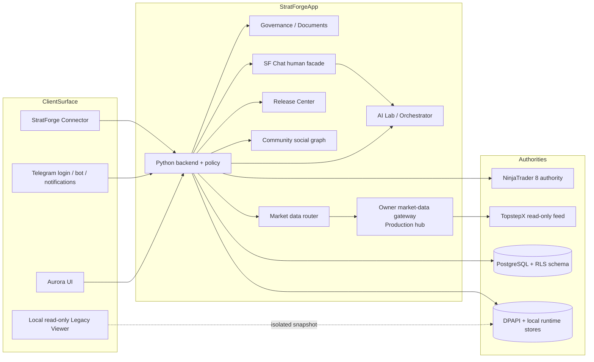

# 03. Architecture and Data Model

- Context Pack document: 03_ARCHITECTURE_AND_DATA_MODEL.md
- Last verified UTC: 2026-09-04T21:50:16Z
- Verified against Git SHA: 8f42158661e8247832c90bea8fc4d9f0071e647b
- Local source verified SHA: 4ae766ea0c3258a8bb049644ac2afbba6cb89330
- Unified Local accepted base: beta.96, open PR #280; Agent World foundation is a separate branch
- Scope: Current components, trust boundaries, entities and key flows
- Status: DONE

## System shape

## Components and authorities

| Component | Role | Current authority |
| --- | --- | --- |
| Aurora UI | user-facing shell for runtime, strategies, AI, docs and admin surfaces | presentation only; authorization stays server-side |
| Legacy Viewer | temporary localhost-only classic report viewer over an isolated snapshot | read-only reference surface; no current API, workers, Telegram, trading or release authority |
| Python backend | API routing, permissions, orchestration, jobs, docs, release logic | main control plane |
| NinjaTrader 8 | compile/backtest/trade/runtime execution | authoritative for fills, trades, metrics and runtime state |
| StratForge Connector | signed device bridge between backend and NinjaTrader machine | authoritative only for authenticated Connector telemetry and bounded commands |
| TopstepX | independent read-only chart/history/realtime source | authoritative for chart feed when selected; never for order execution |
| Owner market-data gateway | one authorized Production hub plus authenticated Canary/Development consumers and same-origin browser fan-out | owns the only direct owner loginKey/SignalR lifecycle; never grants unrelated-user redistribution rights |
| Local runtime stores | local-first queues, DPAPI secrets, runtime snapshots | current dev/desktop data path |
| PostgreSQL + RLS schema | authoritative server-side model for users, workspaces, jobs, commands, budgets, releases and documents | existing server authority; new Agent World repository implementations are deferred |
| Governance store | `data/governance/*` editable source, `docs/governance/*` rendered layer | authoritative for governance texts and laws |
| Community | network-wide safe profiles, privacy/social graph, feed/search/interactions, Channels and moderation | `app/community.py`; no human DM authority |
| SF Chat | one human conversation/read/unread/attachment state plus a facade over unchanged AI conversations | `app/sf_chat.py` for human state; existing AI Orchestrator remains authoritative for AI state |

## Trust boundaries

- Browser and Telegram clients are untrusted presentation surfaces; hiding UI is
  not authorization.
- Telegram Mini App and mirrored classic UI are retired current-product surfaces;
  the server rejects them before normal routing with HTTP 410.
- Connector trust comes from device-owned P-256 key material, nonce signing,
  workspace binding and short-lived sessions, not from IP or JSON claims.
- Market-data display and order execution are intentionally separate boundaries.
- Browser clients receive only same-origin StratForge bars/WebSocket payloads;
  provider credentials stay server-side. Canary/Development are consumers and
  cannot silently become a second direct hub.
- Workspace/strategy document revisions are separate from global governance; a
  workspace document cannot mutate global laws.

## Key entities

| Entity | Purpose | Main source |
| --- | --- | --- |
| `sf_users` + `user_uuid` | internal user identity backbone | `0001_authoritative_storage.sql`, `0005_identity_uuid.sql` |
| `sf_auth_identities` | external providers mapped to internal UUID identity | `0005_identity_uuid.sql`, `app/auth_identity.py` |
| `sf_auth_sessions` | authenticated sessions per environment | `0001_authoritative_storage.sql`, `app/account_auth.py` |
| `sf_workspaces` / memberships | owner-training and personal/team isolation | `0001_authoritative_storage.sql`, `app/workspaces.py` |
| `sf_trusted_devices` | pending/trusted/revoked device lifecycle | `0006_trusted_devices.sql`, `app/security_devices.py` |
| `sf_security_challenges` | one-time device confirm / step-up / revoke proofs | `0006_trusted_devices.sql`, `0007_step_up_actions.sql` |
| Connector installations / commands | workspace-bound Connector sessions and command envelopes | `0001_authoritative_storage.sql`, `app/connector_protocol.py` |
| `sf_release_*` tables | immutable artifact, deployment, approval and rollback ledger | `0009_release_center.sql`, `0010_blue_green_deploy_steps.sql` |
| `sf_documents` / revisions | global/workspace/strategy/changelog document revisions | `0011_document_specifications.sql` |
| Worker / service / NT resource leases | bounded background execution and shared resource ownership | `app/production_workers.py`, `0008_ninjatrader_resource_leases.sql` |
| Community / SF Chat mirrors | profiles/posts/edges/moderation and conversations/participants/messages/reads | `0020_community_sf_chat_repositories.sql`, `0021_community_sf_chat_relational_mirrors.sql` |

## Authoritative storage model

- Development remains local-first: DPAPI, local files and runtime directories are
  still active for desktop/operator workflows.
- The server-side authoritative model is additive, not destructive: migrations
  `0001` through `0022` retain compatibility documents while adding UUID
  identities, devices, release/doc records and constrained Community/SF Chat
  mirrors. Explicit Canary/Production never fall back to local Community JSON.
- Governance laws are not stored in workspace docs; they live in the dedicated
  governance store and rendered docs pipeline.

## Agent World stages 0–1

The separate `app/ai_control_center/` foundation defines Persona, Agent Role,
Provider Account, Model, Intent, Task, Contribution, Decision, Execution,
Outcome and Memory contracts. It contains no persistence or application route.
Explicit scope, immutable references, lifecycle validation and pure legacy
projections prepare the next slice without changing legacy writes or statuses.
Repository protocols reuse existing PostgreSQL/SQLite, jobs, commands, budgets,
idempotency and audit. Stage 2 selects concrete storage after contract review.
All Agent World flags default OFF and require environment plus workspace opt-in.
See [ADR-0009](../adr/0009-agent-world-foundation.md) and
[the implementation status](../current/AGENT_WORLD_IMPLEMENTATION_STATUS.md).

## Key data flows

1. **Identity login / link**: provider proof -> internal UUID user -> session ->
   active workspace.
2. **Personal NinjaTrader pairing**: user starts pair flow -> step-up if needed
   -> Connector enrolls -> signed hello -> workspace-bound session.
3. **Chart delivery**: browser requests same-origin bars and
   `/ws/market-data` -> environment edge/router deduplicates subscriptions ->
   Production owner gateway uses one TopstepX session or selects a fresh
   Connector fallback -> provenance and freshness return to each client.
4. **Release promotion**: clean commit -> signed immutable artifact -> Release
   Center candidate -> Canary checks -> same artifact promoted to Production.
5. **Document revision**: owner/global service edits governance docs through
   controlled workflow; workspace/strategy docs stay in separate scope.
6. **Community message**: Community profile action -> deterministic human
   conversation in SF Chat -> participant ACL/block check -> shared unread/read
   state and deep link. AI conversations traverse the existing Orchestrator
   authority through the same shell, not through the human store.

## Current caveats

- The architecture clearly points toward PostgreSQL/RLS authority, but local
  development and some operator flows still rely on local files by design.
- Multi-user identity and trusted-device pieces exist in schema and code, but
  the full user-facing lifecycle is still partial.

## Canonical evidence

- [../adr/0001-environments-and-release-identity.md](../adr/0001-environments-and-release-identity.md)
- [../adr/0002-unified-identity.md](../adr/0002-unified-identity.md)
- [../adr/0003-trusted-devices-and-step-up.md](../adr/0003-trusted-devices-and-step-up.md)
- [../architecture/CONNECTOR_PROTOCOL_V1.md](../architecture/CONNECTOR_PROTOCOL_V1.md)
- [../architecture/MULTI_USER_ACCOUNT_ARCHITECTURE.md](../architecture/MULTI_USER_ACCOUNT_ARCHITECTURE.md)
- [12_API_AND_SCHEMA_REFERENCE.md](12_API_AND_SCHEMA_REFERENCE.md)
