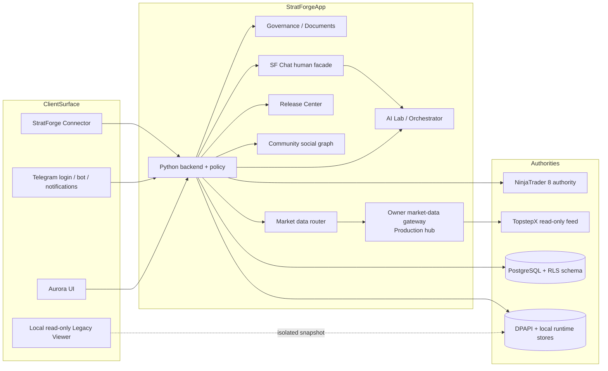

# 03. Architecture and Data Model

- Context Pack document: 03_ARCHITECTURE_AND_DATA_MODEL.md
- Last verified UTC: 2026-09-05T12:45:49Z
- Verified against Git SHA: 8f42158661e8247832c90bea8fc4d9f0071e647b
- Local source verified SHA: 95912cbff8152905966e6bb7bfc2a45d3db15f80 (clean beta.96 runtime; SF Chat in-app dialogs browser-verified; prior provider evidence is separately recorded on aa54c294)
- Current UI correction: [SF Chat dialog receipt](../changelog/2026-09-05-sf-chat-app-dialogs.md); existing backend/data/flags unchanged, no release
- Active scope: verified integrated Local, result presentation, same-input Consensus and three-model Court; full program and owner-dependent acceptance remain open
- Unified Local base: beta.96, open PR #280; owner-review branch is stacked above foundation PR #281; no merge or Canary/Production promotion
- Scope: Current components, trust boundaries, entities and key flows
- Status: IN DEVELOPMENT

## Current server-model delta (2026-09-28; supersedes the older Local snapshot below)

The unified owner-approved Local beta.96 package is still one open product
card. beta.100 deployed the existing Agent World PostgreSQL/FORCE-RLS repository
and encrypted server BYOK/share tables on Canary, but owner-model transfer and
real shared invocation are PARTIAL. beta.101 is Development-only source for
`SecretStore`: Windows CurrentUser DPAPI locally; a separate Canary/Production
AEAD backend whose master key is outside PostgreSQL and whose ciphertext is
owner/workspace/environment-bound. A one-shot SSH/stdin trusted-process import
will preserve Local model identities and re-encrypt directly under each target
environment key. It has not run on Canary or Production. The older Local-only
architecture and pending-adapter statements below are historical, not the
current deployed-server assessment. [Current evidence](../changelog/2026-09-28-beta101-server-secret-migration.md).

## Previous verified model/domain checkpoint — aa54c294

At that previous checkpoint, clean Local 8765 ran `aa54c2940150e540d8b594dbf1d6254e172adbfd`, beta.96,
build `dev-0.10.0-beta.96-aa54c2940150`, original owner data, Preview=false,
live orders=false. The code is committed/pushed to draft PR #282; #280/#281
remain unmerged. Operational documentation may be newer than active runtime code.

Final full **3977 passed / 44 skipped**, 954.04 s; final focused **319 PASS**,
presentation focused **610 PASS**, legacy **13/13 suites**, root/static/context/
diff and exact staged/runtime **533-file bundles PASS**.
[Exact-code CI 33965039490](https://github.com/OMNOM-111/NT-Analyzer/actions/runs/33965039490)
passed Windows, Ubuntu and static, 3/3. No main-target or release PASS is inferred.

Actual browser acceptance on this SHA: stored application Outcome and original
report links in Inspector/SF Chat; same 64-trade NT report; genuine Desktop PNG
140/800 historical bars; preserved chats (5/13 messages); three Personas and
n=3 arithmetic observations for Tolik/Ivan, NEW for Anna. Consensus proposal
cf1464ab uses two accepted same-input contributions. Fresh Court ae0e5e45
received three real valid isolated votes (DeepSeek/Gemini/Azure) and approve;
old case 86a650ab retains its one vote and invalid Gemini response. No validator
was weakened and a verdict does not execute actions.
SF Social read-only preview e4853566… has net -969.7 and PF 0.7252 explicitly
after commission; no post or permanent confirmation was created.

`LOCAL VISUAL REVIEW AVAILABLE: YES`; the full program stays IN DEVELOPMENT.
Ordinary registration/device/key, real multi-user sharing/revocation, permanent
Social publication and owner design acceptance remain separate. New Router,
Execution V2, autonomous routines and an Agent World PG adapter are not implemented.
All ten flags default OFF; exact admitted Local workspace has eight paths ON,
Router/Execution V2 OFF. Preview has separate synthetic flags, no real side effects.
The earlier 93bb1298/other-SHA test and provider history is preserved in the
[canonical status](../current/AGENT_WORLD_IMPLEMENTATION_STATUS.md) and
[integrated changelog](../changelog/2026-09-05-agent-world-integrated-local.md).

## System shape

## Components and authorities

| Component | Role | Current authority |
| --- | --- | --- |
| Aurora UI | user-facing shell for runtime, strategies, AI, docs and admin surfaces | presentation only; authorization stays server-side |
| Legacy Viewer | temporary localhost-only classic report viewer over an isolated snapshot | read-only reference surface; no current API, workers, Telegram, trading or release authority |
| Python backend | API routing, permissions, orchestration, jobs, docs, release logic | main control plane |
| NinjaTrader 8 | compile/backtest/trade/runtime execution | authoritative for fills, trades, metrics and runtime state |
| StratForge Connector | signed device bridge between backend and NinjaTrader machine | authoritative only for authenticated Connector telemetry and bounded commands |
| TopstepX | independent read-only chart/history/realtime source | authoritative for chart feed when selected; never for order execution |
| Owner market-data gateway | one authorized Production hub plus authenticated Canary/Development consumers and same-origin browser fan-out | owns the only direct owner loginKey/SignalR lifecycle; never grants unrelated-user redistribution rights |
| Local runtime stores | local-first queues, DPAPI secrets, runtime snapshots | current dev/desktop data path |
| PostgreSQL + RLS schema | authoritative server-side model for users, workspaces, jobs, commands, budgets, releases and documents | existing server authority; no Agent World PostgreSQL domain adapter exists, so that domain remains Development-only/fail-closed |
| Governance store | `data/governance/*` editable source, `docs/governance/*` rendered layer | authoritative for governance texts and laws |
| Community | network-wide safe profiles, privacy/social graph, feed/search/interactions, Channels and moderation | `app/community.py`; no human DM authority |
| SF Chat | one human conversation/read/unread/attachment state plus a facade over unchanged AI conversations | `app/sf_chat.py` for human state; existing AI Orchestrator remains authoritative for AI state |

## Trust boundaries

- Browser and Telegram clients are untrusted presentation surfaces; hiding UI is
  not authorization.
- Telegram Mini App and mirrored classic UI are retired current-product surfaces;
  the server rejects them before normal routing with HTTP 410.
- Connector trust comes from device-owned P-256 key material, nonce signing,
  workspace binding and short-lived sessions, not from IP or JSON claims.
- Market-data display and order execution are intentionally separate boundaries.
- Browser clients receive only same-origin StratForge bars/WebSocket payloads;
  provider credentials stay server-side. Canary/Development are consumers and
  cannot silently become a second direct hub.
- Workspace/strategy document revisions are separate from global governance; a
  workspace document cannot mutate global laws.

## Key entities

| Entity | Purpose | Main source |
| --- | --- | --- |
| `sf_users` + `user_uuid` | internal user identity backbone | `0001_authoritative_storage.sql`, `0005_identity_uuid.sql` |
| `sf_auth_identities` | external providers mapped to internal UUID identity | `0005_identity_uuid.sql`, `app/auth_identity.py` |
| `sf_auth_sessions` | authenticated sessions per environment | `0001_authoritative_storage.sql`, `app/account_auth.py` |
| `sf_workspaces` / memberships | owner-training and personal/team isolation | `0001_authoritative_storage.sql`, `app/workspaces.py` |
| `sf_trusted_devices` | pending/trusted/revoked device lifecycle | `0006_trusted_devices.sql`, `app/security_devices.py` |
| `sf_security_challenges` | one-time device confirm / step-up / revoke proofs | `0006_trusted_devices.sql`, `0007_step_up_actions.sql` |
| Connector installations / commands | workspace-bound Connector sessions and command envelopes | `0001_authoritative_storage.sql`, `app/connector_protocol.py` |
| `sf_release_*` tables | immutable artifact, deployment, approval and rollback ledger | `0009_release_center.sql`, `0010_blue_green_deploy_steps.sql` |
| `sf_documents` / revisions | global/workspace/strategy/changelog document revisions | `0011_document_specifications.sql` |
| Worker / service / NT resource leases | bounded background execution and shared resource ownership | `app/production_workers.py`, `0008_ninjatrader_resource_leases.sql` |
| Community / SF Chat mirrors | profiles/posts/edges/moderation and conversations/participants/messages/reads | `0020_community_sf_chat_repositories.sql`, `0021_community_sf_chat_relational_mirrors.sql` |
| Agent World domain records | Persona, Role, Provider Account, Model, Intent, Task, Contribution, Decision, Execution, Outcome, Evaluation, Memory, StrategyProject, Routine, CalendarItem, CourtCase and CourtVote | `app/ai_control_center/{contracts,domain_contracts,model_contracts}.py`; Development SQLite revision/event/outbox repository only |

## Authoritative storage model

- Development remains local-first: DPAPI, local files and runtime directories are
  still active for desktop/operator workflows.
- The server-side authoritative model is additive, not destructive: migrations
  `0001` through `0022` retain compatibility documents while adding UUID
  identities, devices, release/doc records and constrained Community/SF Chat
  mirrors. Explicit Canary/Production never fall back to local Community JSON.
- Governance laws are not stored in workspace docs; they live in the dedicated
  governance store and rendered docs pipeline.

## Agent World integrated Local delta

Runtime and implementation are different checkpoints. Local `8765` now serves
clean `95912cbff8152905966e6bb7bfc2a45d3db15f80`, beta.96, from a separate clean
runtime worktree with the original owner data/settings. Integrated model/domain/
social code and claimed delivery/explicit roles/private containers are active.
Sealed rejected-response delivery, active-binding ratings and local-time display
are active and browser-verified. The active native compatibility fix admits only
Azure's canonical HTTPS api-version selector on a server-resolved owner binding;
the original registry/client remains the execution and budget authority.
Real SF Chat/model/NT report passed and survived restart; remaining provider,
browser and owner acceptance is pending. The previous `fc78677dfa258fb56042866a6764e8c8a45c42e6` snapshot described
the earlier owner-review adapters; it is history, not the current implementation
claim. The deployed anchor `8f42158661e8247832c90bea8fc4d9f0071e647b` is unchanged;
Production was not inspected or modified in this work.

Foundation contracts distinguish Persona, Role, Provider Account, Model, Intent,
Task, Contribution, Decision, Execution, Outcome and Memory. Explicit scope and
pure legacy projections remain; legacy statuses are not mass-rewritten.

Application roles are explicit immutable Persona profile associations to the
existing NT/Desktop adapters, never inferred from display names or treated as
permission grants. The existing SQLite transaction enforces one active/suspended
assignment per user/workspace/role. Exact source task/job/conversation links fold
one model/application workflow in the read model; original evidence is retained.
Legacy ratings remain separately labelled history. Delivery-only jobs use the
existing worker's live lease/attempt and inbox; no second final publisher/queue.

The local SQLite adapter implements CAS/history/events/idempotency/outbox and
private immutable artifacts. Read-only construction never creates an absent DB,
migrates a schema or changes persisted data; existing WAL contents remain visible.
Operational SQLite WAL/SHM sidecars are distinct from domain mutations. Inbox
receipt lookup reuses the existing delivery ledger. The separate Preview facade reuses existing
auth, device, role, capability, CSRF and zero-cost budget admission. Four scoped
flags enable UI/read model/task graph/shadow evaluation only for a controlled
synthetic workspace. No new permissions catalog, queue or paid-budget ledger.

Three fixed fixtures run four actual offline calculations each. Checked task
results and explicit browser PNGs project into the existing AI conversation
authority in SF Chat. No second conversation store or external delivery. Reset
coordinates child-local database operations before deleting synthetic state.

The separate Local-owner adapter projects existing `jobqueue` records, not a
second Task/job database. Exact opted-in Development owner workspaces may submit
registered historical strategies through SF Chat. The existing chief monitor
verifies report/job identity, actual bars/trades/hash and publishes an idempotent
result. Manual/unmarked and Preview jobs are excluded from these statistics.
Desktop uses its existing command queue; server-validated command/scope, a bounded
real canvas PNG and a receipt are projected into the existing AI chat history.
There is no alternate chart renderer, market-data source or Connector refactor.

The integrated domain service adds owned Persona profiles, controlled private/
task/working/verified-lesson Memory, explicit shared-Memory grants, versioned
Strategy Projects, manual routine/calendar follow-ups and Consensus proposals.
Memory publication is a separate active workspace record: source revoke/TTL or
publication revoke removes its read grant without exposing private artifact APIs.
Read admission may expose a same-workspace published note to a current member;
mutations of another owner's records remain forbidden.

Private ModelService uses separate Provider Account/Model/Persona IDs, existing
DPAPI and the guarded existing model client. Actual provider receipts, independent
bounded evaluations and application evidence attach to the same revision graph.
Selected model requests reuse the existing worker queue and Chief/SF Chat
conversation authority. No second jobs, permissions, budgets or chat store is
introduced. An ambiguous in-flight provider response is not silently retried.

Court is now implemented in this dirty Local delta: one immutable packet,
three isolated judge contexts, immutable real-model contribution-bound votes and
unweighted 2-of-3 quorum; critical cases need failure-domain diversity. Approval
is advisory, not execution authority. It does not rename the legacy committee.
SF Social prepares a sanitized verified snapshot and publishes only after the
human approves its exact hash/revision and permanence. Existing Community
storage/idempotency is reused; private Memory, prompts and judge reasoning stay
private. Routine/calendar acceptance creates an existing-queue manual reminder,
not an autonomous scheduler.

All registry defaults remain OFF. Exact opted-in Development workspaces enable
eight gates for read/UI/tasks/evaluation/memory/consensus/Court/social in the new
composition; Router shadow and Execution V2 remain OFF. Preview retains its
separate four-flag synthetic configuration. The 41 actual isolated PostgreSQL
tests concern existing RLS/migrations `0001`–`0022`, not an Agent World PG adapter.
No Agent World PG migration or non-DEV storage fallback is delivered here.
See [ADR-0010](../adr/0010-agent-world-owner-review.md),
[ADR-0011](../adr/0011-agent-world-real-local-jobs.md) and
[the implementation status](../current/AGENT_WORLD_IMPLEMENTATION_STATUS.md).

## Key data flows

1. **Identity login / link**: provider proof -> internal UUID user -> session ->
   active workspace.
2. **Personal NinjaTrader pairing**: user starts pair flow -> step-up if needed
   -> Connector enrolls -> signed hello -> workspace-bound session.
3. **Chart delivery**: browser requests same-origin bars and
   `/ws/market-data` -> environment edge/router deduplicates subscriptions ->
   Production owner gateway uses one TopstepX session or selects a fresh
   Connector fallback -> provenance and freshness return to each client.
4. **Release promotion**: clean commit -> signed immutable artifact -> Release
   Center candidate -> Canary checks -> same artifact promoted to Production.
5. **Document revision**: owner/global service edits governance docs through
   controlled workflow; workspace/strategy docs stay in separate scope.
6. **Community message**: Community profile action -> deterministic human
   conversation in SF Chat -> participant ACL/block check -> shared unread/read
   state and deep link. AI conversations traverse the existing Orchestrator
   authority through the same shell, not through the human store.

## Current caveats

- The architecture clearly points toward PostgreSQL/RLS authority, but local
  development and some operator flows still rely on local files by design.
- Auth, registration, Device Confirmation permanent/current-session, SF Social
  and SF Chat remain the preserved beta.96 base, not new competing Agent World
  subsystems. The new integrated delta is `IN DEVELOPMENT`; Local readiness,
  Git/CI closeout, owner acceptance and program stages 0–13 are separate gates.

## Canonical evidence

- [../adr/0001-environments-and-release-identity.md](../adr/0001-environments-and-release-identity.md)
- [../adr/0002-unified-identity.md](../adr/0002-unified-identity.md)
- [../adr/0003-trusted-devices-and-step-up.md](../adr/0003-trusted-devices-and-step-up.md)
- [../architecture/CONNECTOR_PROTOCOL_V1.md](../architecture/CONNECTOR_PROTOCOL_V1.md)
- [../architecture/MULTI_USER_ACCOUNT_ARCHITECTURE.md](../architecture/MULTI_USER_ACCOUNT_ARCHITECTURE.md)
- [12_API_AND_SCHEMA_REFERENCE.md](12_API_AND_SCHEMA_REFERENCE.md)
