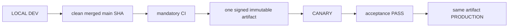

# 04. Environments, Release and Deployment

- Context Pack document: 04_ENVIRONMENTS_RELEASE_DEPLOYMENT.md
- Last verified UTC: 2026-08-30T02:05:00Z
- Verified against Git SHA: 1279645e48e32000978364b38fb20d3dcd303843
- Verified deployed artifact Git SHA: `1a1d54aa728d487203bb8342ecf142752610f4cd`
- Scope: Environment isolation, immutable release, promotion and rollback
- Status: DONE

## Only supported release model

- Build once from the exact clean merged commit.
- Canary and Production receive identical code, UI/static assets, Documents and
  backend logic. Only environment DB, secrets, sessions, cookies, origins,
  queues and runtime state/configuration differ.
- Any application change after Canary acceptance starts a new cycle.
- Production promotion is a switch to the accepted artifact, never a rebuild,
  manual copy or server hotfix.

## Environment isolation

| Environment | Origin | Isolation |
| --- | --- | --- |
| Development | `http://127.0.0.1:8765/ui/` | Development data root, loopback session and local release initiator |
| Canary | `https://canary.stratforges.com` | separate Canary DB/storage/queues/sessions/cookies |
| Production | `https://app.stratforges.com` | separate Production DB/storage/queues/sessions/cookies |

The Environment Switcher opens the selected origin and never carries session
or browser storage between origins.

## Current beta.84 release

| Field | Value |
| --- | --- |
| Candidate | rc_9853e8e082594431b12af589211a6afc |
| Artifact | art_edbfc143e7494527bca83d81fff6a488 |
| Version / Git SHA | 0.10.0-beta.84 / 2438459dcd0dccbad7afa38363828a333b6df532 |
| Build ID | sf-0.10.0-beta.84-2438459dcd0d-20260831T160722Z |
| Archive SHA256 | 1088E359462AA217DF3806133F2052E05DDF625B34C256EAA83267C0B5E34219 |
| Signature / worktree | verified / clean |

Canary accepted beta.84 and Production received the exact same artifact without
rebuild. live_trading_allowed stays false. Earlier cycles are recorded in their
changelog entries.

### The shipment has a gate of its own

`python tools/pre_release_check.py` assembles the exact production file set and
runs four gates inside it: the static scan as the signer runs it, the runtime
reads (every public registry document and the changelog the release summary
resolves), Python compilation and JavaScript syntax. The selection lives in
tools/release_bundle.py and is imported by the builder, so the check and the
signer cannot disagree about what a release contains.

A public document that no release can carry is a contradiction, not an
exemption: the check fails on it. Four legacy-* documents that were advertised
to users while living outside the product tree are no longer public.

### CI is checked on the commit that reached main

Promotion asks for green CI on the candidate's exact SHA. A squash merge
creates a new commit, so a PR that was green does not make the merge commit
green: beta.84's first promotion attempt was refused for exactly that reason and
succeeded once CI on the merge commit finished. The five-check set runs on pull
requests; a push to main runs the two checks in ci.yml, and the gate requires
every check run that exists for the SHA to have succeeded.

### Provenance answers where code came from, not whether it is current

A candidate at canary_passed built from an old but legitimate main commit passes
provenance. One such candidate (0.10.0-beta.27) was found during the audit,
one click from rolling Production back, and was cancelled. Candidates left in
canary_checking cannot be promoted, because publication requires canary_passed.

## Promotion authority

Development owns the release ledger and submits the action, but Canary or
Production must answer from authoritative environment state. Candidate,
artifact, signature, timestamp, nonce, decision TTL, running identity, CI,
migrations and acceptance all verify fail-closed. `canary_passed` is followed
by owner approval and server-authoritative promotion; it does not authorize a
different artifact.

## Verification

- beta.79 closeout through PR #230: mandatory CI GREEN;
- full regression `2327 passed`, `32 skipped`, `0 failed`;
- Canary and Production deployment evidence:
  `identity_verified`, `signature_verified`, `readiness_verified`,
  `same_immutable_artifact` all true;
- Canary and Production server surfaces display beta.79 from the same release
  directory;
- SERVER BACKTEST cancel, Connector state honesty, auth hotspot and secret
  containment closeout passed;
- no pending migration.

## Canonical evidence

- [beta.79 secret management and cancel closeout](../changelog/2026-08-29-beta79-secret-management-and-cancel-closeout.md)
- [environment and release identity ADR](../adr/0001-environments-and-release-identity.md)
- `app/runtime_env.py`
- `app/release_control.py`
- `app/release_center.py`
- `tools/stage9_remote_release.sh`
