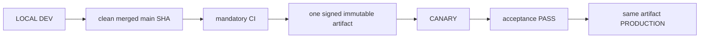

# 04. Environments, Release and Deployment

- Context Pack document: 04_ENVIRONMENTS_RELEASE_DEPLOYMENT.md
- Last verified UTC: 2026-08-30T02:05:00Z
- Verified against Git SHA: dd0bdd0164713a88c3e87b4514637e848b831a8b
- Verified deployed artifact Git SHA: `b923e7b2b4e034c4f890e89b33992d469c84b779`
- Scope: Environment isolation, immutable release, promotion and rollback
- Status: DONE

## Only supported release model

- Build once from the exact clean merged commit.
- Canary and Production receive identical code, UI/static assets, Documents and
  backend logic. Only environment DB, secrets, sessions, cookies, origins,
  queues and runtime state/configuration differ.
- Any application change after Canary acceptance starts a new cycle.
- Production promotion is a switch to the accepted artifact, never a rebuild,
  manual copy or server hotfix.

Every candidate snapshots one canonical `docs/changelog/` release/change
record. The owner sees its title, summary, PRs, source SHA, version/build,
artifact, current stage/status, checks, duration and the identity reported by
DEV/Canary/Production. Approval and promotion fail closed unless title, change
summary, source SHA and final verification PASS are present.

## Environment isolation

| Environment | Origin | Isolation |
| --- | --- | --- |
| Development | `http://127.0.0.1:8765/ui/` | Development data root, loopback session and local release initiator |
| Canary | `https://canary.stratforges.com` | separate Canary DB/storage/queues/sessions/cookies |
| Production | `https://app.stratforges.com` | separate Production DB/storage/queues/sessions/cookies |

The Environment Switcher opens the selected origin and never carries session
or browser storage between origins.

## Current Production: beta.85; next candidate: beta.86

| Field | Value |
| --- | --- |
| Candidate | rc_f71db0e286b6447bb13dc6b265c06682 |
| Artifact | art_7df5c53560f746c688262d86e46d0694 |
| Version / Git SHA | 0.10.0-beta.85 / b923e7b2b4e034c4f890e89b33992d469c84b779 |
| Build ID | sf-0.10.0-beta.85-b923e7b2b4e0-20260831T173711Z |
| Archive SHA256 | F488506AFD7DBEBC2ECF6EA3C34C27E1AD09E1F5CBE88B52C2FC5DF2933DF572 |
| Signature / worktree | verified / clean |

Canary accepted beta.85 and Production received the exact same artifact without
rebuild. live_trading_allowed stays false. Earlier cycles are in their
changelog entries.

The beta.86 candidate is named `Legacy Isolation + Telegram Bot Cleanup` and
contains merged PR #254 and PR #255 plus the mandatory release/change-record
contract. Its final candidate/build/artifact identity is not recorded as live
until final-main CI, immutable build and Canary acceptance complete.

### Three gates stand between a candidate and Production

Approved main asks where the code came from: branch is main, worktree clean,
HEAD equal to origin/main, the commit an ancestor of origin/main, and that exact
SHA green in CI. A squash merge creates a new SHA, so a green pull request does
not make the commit that reached main green -- both beta.84 and beta.85 were
refused on the first attempt for exactly that, and published unchanged once the
merge commit finished CI.

Forward-only asks whether publishing would move Production forward. An old
commit on main is as approved as a new one, so provenance alone let a
superseded candidate sit one click from rolling Production back. Publication now
requires the candidate to be the deployed commit or a descendant of it.

Production identity is fail-closed. "Never deployed" permits a first
publication; "deployed but the commit cannot be read" refuses until identity is
restored. Conflating the two is how a rollback gets published by accident.

Rollback is untouched by all of this: going back has its own contract.

### The shipment has its own gate

python tools/pre_release_check.py assembles the exact production file set and
runs four checks inside it: the static scan as the signer runs it, runtime
reads, Python compilation and JavaScript syntax. The selection lives in
tools/release_bundle.py and is imported by the builder, so the check and the
signer cannot disagree. A public document that no release can carry is a
contradiction to resolve, not an exemption to record.

## Promotion authority

Development owns the release ledger and submits the action, but Canary or
Production must answer from authoritative environment state. Candidate,
artifact, signature, timestamp, nonce, decision TTL, running identity, CI,
migrations and acceptance all verify fail-closed. `canary_passed` is followed
by owner approval and server-authoritative promotion; it does not authorize a
different artifact.

## Verification

- beta.79 closeout through PR #230: mandatory CI GREEN;
- full regression `2327 passed`, `32 skipped`, `0 failed`;
- Canary and Production deployment evidence:
  `identity_verified`, `signature_verified`, `readiness_verified`,
  `same_immutable_artifact` all true;
- Canary and Production server surfaces display beta.79 from the same release
  directory;
- SERVER BACKTEST cancel, Connector state honesty, auth hotspot and secret
  containment closeout passed;
- no pending migration.

## Canonical evidence

- [beta.79 secret management and cancel closeout](../changelog/2026-08-29-beta79-secret-management-and-cancel-closeout.md)
- [environment and release identity ADR](../adr/0001-environments-and-release-identity.md)
- `app/runtime_env.py`
- `app/release_control.py`
- `app/release_center.py`
- `tools/stage9_remote_release.sh`
