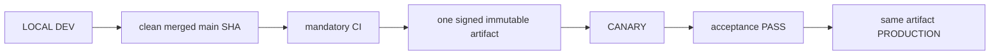

# 04. Environments, Release and Deployment

- Context Pack document: 04_ENVIRONMENTS_RELEASE_DEPLOYMENT.md
- Last verified UTC: 2026-08-27T22:33:11Z
- Verified against Git SHA: 7ebda6faf2e7c64d4a707a41062b29857882181a
- Verified deployed artifact Git SHA: `60d922b2600d1d31e611c7a670cbddebc889beef`
- Scope: Environment isolation, immutable release, promotion and rollback
- Status: DONE

## Only supported release model

- Build once from the exact clean merged commit.
- Canary and Production receive identical code, UI/static assets, Documents and
  backend logic. Only environment DB, secrets, sessions, cookies, origins,
  queues and runtime state/configuration differ.
- Any application change after Canary acceptance starts a new cycle.
- Production promotion is a switch to the accepted artifact, never a rebuild,
  manual copy or server hotfix.

## Environment isolation

| Environment | Origin | Isolation |
| --- | --- | --- |
| Development | `http://127.0.0.1:8765/ui/` | Development data root, loopback session and local release initiator |
| Canary | `https://canary.stratforges.com` | separate Canary DB/storage/queues/sessions/cookies |
| Production | `https://app.stratforges.com` | separate Production DB/storage/queues/sessions/cookies |

The Environment Switcher opens the selected origin and never carries session
or browser storage between origins.

## Current beta.61 release

| Field | Value |
| --- | --- |
| Candidate | `rc_8016843875644befbbd681c5cc2bde0e` |
| Artifact | `art_77d98a4ed8aa4473bb241addf19c45b3` |
| Version / Git SHA | `0.10.0-beta.61` / `60d922b2600d1d31e611c7a670cbddebc889beef` |
| Build ID | `sf-0.10.0-beta.61-60d922b2600d-20260827T175814Z` |
| Archive SHA256 | `E61B8C9293308D522AE3017EEBCF09B73A01CABA689EA8636A0C2BDA12236534` |
| Runtime/manifest SHA256 | `E9195140BDB22C53EB83405FCF5655E76FD60068637FED1A0CAE35B1A769AF53` |
| Signature / migrations | verified production trust / pending `0` |

Canary deployment `dep_9f5c8b6e10d64a299b2c9a9e41738486` completed all
blue-green stages and final acceptance
`chk_63c486896c474479a8c8b765b2d30b10`. Production deployment
`dep_9a552fc7bbb54297ad8da764adae3659` then promoted the exact same artifact
without rebuild.

| Environment | Release directory | Previous / rollback | Ready |
| --- | --- | --- | --- |
| Canary | `production_data/releases/0.10.0-beta.61-60d922b2600d` | `0.10.0-beta.60-101d7c447e2d` | PASS |
| Production | same | `0.10.0-beta.60-101d7c447e2d` | PASS |

Both live endpoints report the same Git SHA, build ID and runtime artifact
SHA256. Production readiness includes config, data root, signing key, object
storage, database, connector control, Telegram consumer and queue.

## Promotion authority

Development owns the release ledger and submits the action, but Canary or
Production must answer from authoritative environment state. Candidate,
artifact, signature, timestamp, nonce, decision TTL, running identity, CI,
migrations and acceptance all verify fail-closed. `canary_passed` is followed
by owner approval and server-authoritative promotion; it does not authorize a
different artifact.

## Verification

- PR #198: mandatory CI `5/5` GREEN;
- full regression `2134 passed`, `32 skipped`, `0 failed`;
- Canary and Production deployment evidence:
  `identity_verified`, `signature_verified`, `readiness_verified`,
  `same_immutable_artifact` all true;
- Canary and Production browser surfaces displayed beta.61 with no console errors;
- equal-window live worker scheduling measurements and functional queue probes
  passed in both server environments;
- no pending migration and no secret rotation.

## Canonical evidence

- [beta.61 worker idle performance closeout](../changelog/2026-08-27-beta61-worker-idle-performance.md)
- [environment and release identity ADR](../adr/0001-environments-and-release-identity.md)
- `app/runtime_env.py`
- `app/release_control.py`
- `app/release_center.py`
- `tools/stage9_remote_release.sh`

<!-- STRATFORGE_INTERNAL_AMENDMENT
2026-08-26T18:22:14Z | GPT-5.5 через Codex по запросу owner | Replaced historical non-accepted beta.30/beta.31 body with the current accepted beta.48 one-artifact Canary-to-Production release identity.
2026-08-27T22:33:11Z | GPT-5.5 через Codex по запросу owner | Replaced the prior live identity with exact beta.61 candidate, artifact, hashes, deployments, rollback slot and same-artifact performance acceptance evidence.
-->
