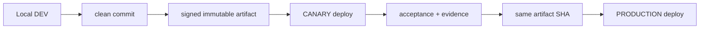

# 04. Environments, Release and Deployment

- Context Pack document: 04_ENVIRONMENTS_RELEASE_DEPLOYMENT.md
- Last verified UTC: 2026-08-14T17:12:00Z
- Verified against Git SHA: 77e8645f1725d20545992efdeabafdf2f3d0e684
- Scope: Deployment environments, release channels, immutable promotion and rollback boundaries
- Status: DONE

## Evidence modes

- **Repository evidence** in this document describes what the repo implements:
  env/channel split, fail-closed startup, build scripts, Release Center schema
  and deploy templates.
- **Operational evidence** is environment-specific. Live identity (2026-08-14)
  is `77e8645f` on LOCAL/CANARY/PRODUCTION:
  [../changelog/2026-08-14-live-release-77e8645f-documents-charts.md](../changelog/2026-08-14-live-release-77e8645f-documents-charts.md).
  Historical `1fae1f39`, Canary `7ebda6fa` and hang-fix Production `6b6dc458`
  remain in changelog.
- Do not answer a “what is live right now” question from repository templates
  alone when operational closeout evidence exists.

## Canonical promotion model

This is a hard release contract, not a preference. Every update must follow
`DEV -> CANARY -> PRODUCTION` with one exact immutable artifact:

- DEV is the source of the release. If the local working tree has meaningful
  changes, they must be committed and tested before the artifact is built.
- The artifact is built once from the exact clean commit and carries Git SHA,
  build id, archive SHA256 and manifest/runtime artifact SHA256.
- CANARY receives that artifact first and must be functionally identical to DEV
  in code, UI/static assets, backend logic, Documents, Charts and behavior.
  Only environment-specific DB, secrets, sessions, cookies, origins and runtime
  config/state may differ.
- PRODUCTION may receive only the same artifact that passed CANARY, with no
  rebuild, no file copy, no partial hotfix and no code/config drift except the
  intended environment-specific runtime config.
- Any code/UI/function change after Canary acceptance starts a new full cycle:
  new commit, new artifact, new Canary acceptance, then Production promotion.

## Two separate axes

| Axis | Current meaning |
| --- | --- |
| `DEPLOYMENT_ENV` | where the software runs: `development`, `canary`, `production` |
| `RELEASE_CHANNEL` | maturity of the build: `dev`, `beta`, `stable` |

Git branch, deployment environment and release channel are not synonyms.

## Environment identities

| Environment | Origin / opening mode | Isolation contract | Operational snapshot |
| --- | --- | --- | --- |
| DEV | `http://127.0.0.1:8765/ui/` | local data only, local owner session, no Production data, loopback-only assumptions | `[DEV]`; git `77e8645f` |
| CANARY | `https://canary.stratforges.com` | separate DB/queues/storage/cookies/Connector sessions; owner/admin/developer only | `[CANARY]`, process git `77e8645f`, isolated DB `stratforge_canary`, topology `api / worker-canary / operations-canary / telegram-canary` |
| PRODUCTION | `https://app.stratforges.com` | separate DB/queues/storage/cookies/Connector sessions; public app | `[BETA]`, process git `77e8645f`, `instance=stratforge-linux-production-01`, DB `stratforge_production` |

## Current release/build identity

- Public version file: `0.10.0-beta.1`.
- Build timestamp in `VERSION.json`: `2026-08-11T18:35:00Z`.
- Repository evidence snapshot for this sync pass: `77e8645f1725d20545992efdeabafdf2f3d0e684`.
- Live public API identity (Canary and Production): git
  `77e8645f1725d20545992efdeabafdf2f3d0e684`, build
  `sf-0.10.0-beta.1-77e8645f1725-20260814T164341Z`, artifact SHA256
  `1F0C95E48447632CB97EF88A85E38354D6A71AC32C41285600DACA182A8748C6`.
- Host `/proc` cwd for Canary `api`/`worker-canary`/`operations-canary`/`telegram-canary`
  and Production `api-app`/`worker`/`operations`/`telegram` matches that active
  slot. Previous slot is `1fae1f39`.
- Owner Documents/Release Center and TopstepX history+realtime PASS on this
  artifact. Historical Canary `7ebda6fa` and hang-fix Production `6b6dc458`
  remain in changelog.

## Release Center and signing

| Area | Current state |
| --- | --- |
| Artifact creation | protected `stage9_ssh` signer builds a production-trust artifact from the verified clean selected `HEAD`; `tools/build_server_release.py` produces manifest, checksum and signature metadata |
| Release ledger | `app/release_center.py` records candidates, artifacts, real deployments, granular checks, approvals, notifications and rollbacks; `7ebda6fa` lifecycle was completed through the Release Center |
| Blue-green | real Canary stages and a real rollback→re-promote rehearsal passed; `app/blue_green.py` and `0010_blue_green_deploy_steps.sql` retain the step/maintenance evidence |
| Exact-artifact promotion | same artifact fingerprint is stored and compared in schema/contracts |
| Live execution proof | `77e8645f` is the current LOCAL/CANARY/PRODUCTION slot; `7ebda6fa` retains Canary build/deploy/rollback proof; `6b6dc458` retains the hang-fix Production proof |

## Environment Switcher

- Environment Switcher is a product/admin surface, not a way to reuse the same
  cookies or browser storage across origins.
- The contract is separate-origin open in a new tab; current tab backend does
  not silently switch under the user.
- Local DEV access requires loopback identity probing rather than production-like
  trust assumptions.
- Accepted 2026-08-12 browser evidence: DEV / CANARY / PROD open in new tabs,
  sessions/cookies/CSRF do not carry across, and ordinary users do not see
  DEV/CANARY.

## Git / PR / CI model visible from repo

- Main CI runs on push and pull request to `main`.
- Next Architecture CI adds static gates and cross-platform pytest.
- Root workflow explicitly disallows direct `main` closeout without owner
  confirmation; current pull-request template checks `No direct main changes`.

## Readiness and rollback limitations

- Migrations in Phases 3-11 are additive-first; rollback is expected to disable
  newer surfaces rather than drop identity links or release evidence.
- Promotion from Canary to Production is restricted to the **same artifact**.
  This was operationally confirmed for `6b6dc458`; `7ebda6fa` has passed Canary
  but has not been approved or promoted.
- Canary previous is `0.10.0-beta.1-de7acaed`. Production previous is
  `0.10.0-beta.1-795db0c1`.
- Real Canary rollback rehearsal restored `de7acaed`, verified readiness and
  re-promoted `7ebda6fa` (`rollback_verified=true`, `re_promoted=true`).
- The `/ready` hang root cause was full Connector JSON deserialization under
  lock plus overlapping short-timeout curl polling; the live fix uses a
  lightweight DB/Connector probe, bounded per-request timeouts, single-flight,
  `/live` before `/ready`, and one bounded deadline.
- This Context Pack task itself should never trigger runtime deployment.

## What to treat as historical only

- Sibling `StratForge Releases/server-0.9.0-dev.*` bundles are useful evidence of
  artifact naming, but they are not current source of truth for the live app.
- Older pre-`6b6dc458` live snapshots are historical once a newer accepted
  closeout supersedes them.

## Canonical evidence

- [../adr/0001-environments-and-release-identity.md](../adr/0001-environments-and-release-identity.md)
- [../../README-RUN-MODES.md](../../README-RUN-MODES.md)
- `app/runtime_env.py`
- `app/release_center.py`
- `app/blue_green.py`
- [../changelog/2026-08-14-live-release-77e8645f-documents-charts.md](../changelog/2026-08-14-live-release-77e8645f-documents-charts.md)
- [../changelog/2026-08-12-live-release-snapshot-0.10.0-beta.1.md](../changelog/2026-08-12-live-release-snapshot-0.10.0-beta.1.md)
- [../changelog/2026-08-13-final-acceptance-canary-0.10.0-beta.1.md](../changelog/2026-08-13-final-acceptance-canary-0.10.0-beta.1.md)
- [../current/NEXT_ARCHITECTURE_PROGRAM_STATUS.md](../current/NEXT_ARCHITECTURE_PROGRAM_STATUS.md)
- [../../../.github/workflows/ci.yml](../../../.github/workflows/ci.yml)
- [../../../.github/workflows/next-architecture-ci.yml](../../../.github/workflows/next-architecture-ci.yml)

<!-- STRATFORGE_INTERNAL_AMENDMENT
2026-08-14T17:12:00Z | Grok 4.6 через Cursor по запросу owner | Live LOCAL/CANARY/PRODUCTION 77e8645f; Documents/Charts PASS.
2026-08-14T06:45:00Z | Grok 4.6 через Cursor по запросу owner | Host /proc cwd/exe: Canary+Production current slot 1fae1f39; 0f2a90ea is previous only.
2026-08-14T05:06:04Z | GPT-5.5 через Codex по запросу owner | Strengthened the canonical DEV → CANARY → PRODUCTION release contract for all future updates: one immutable artifact, Canary acceptance, exact same artifact to Production.
-->
