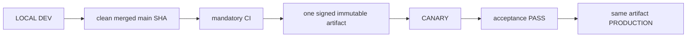

# 04. Environments, Release and Deployment

- Context Pack document: 04_ENVIRONMENTS_RELEASE_DEPLOYMENT.md
- Last verified UTC: 2026-08-30T02:05:00Z
- Verified against Git SHA: 1279645e48e32000978364b38fb20d3dcd303843
- Verified deployed artifact Git SHA: `1a1d54aa728d487203bb8342ecf142752610f4cd`
- Scope: Environment isolation, immutable release, promotion and rollback
- Status: DONE

## Only supported release model

- Build once from the exact clean merged commit.
- Canary and Production receive identical code, UI/static assets, Documents and
  backend logic. Only environment DB, secrets, sessions, cookies, origins,
  queues and runtime state/configuration differ.
- Any application change after Canary acceptance starts a new cycle.
- Production promotion is a switch to the accepted artifact, never a rebuild,
  manual copy or server hotfix.

## Environment isolation

| Environment | Origin | Isolation |
| --- | --- | --- |
| Development | `http://127.0.0.1:8765/ui/` | Development data root, loopback session and local release initiator |
| Canary | `https://canary.stratforges.com` | separate Canary DB/storage/queues/sessions/cookies |
| Production | `https://app.stratforges.com` | separate Production DB/storage/queues/sessions/cookies |

The Environment Switcher opens the selected origin and never carries session
or browser storage between origins.

## Current beta.79 release

| Field | Value |
| --- | --- |
| Candidate | recorded in Release Center ledger |
| Artifact | same immutable artifact promoted from Canary to Production |
| Version / Git SHA | `0.10.0-beta.79` / `1a1d54aa728d487203bb8342ecf142752610f4cd` |
| Build ID | `sf-0.10.0-beta.79-1a1d54aa728d-20260829T234541Z` |
| Archive SHA256 | recorded in release evidence |
| Runtime/manifest SHA256 | current runtime artifact in live release dir |
| Signature / migrations | verified production trust / pending `0` |

Canary accepted the beta.79 release and Production was promoted to the exact
same artifact without rebuild.

| Environment | Release directory | Previous / rollback | Ready |
| --- | --- | --- | --- |
| Canary | `production_data/releases/0.10.0-beta.79-1a1d54aa728d` | `0.10.0-beta.79-47207e77c31f` | PASS |
| Production | same | `0.10.0-beta.78-bb50168cbe79` | PASS |

Both live endpoints report the same Git SHA, build ID and runtime artifact
SHA256. Production readiness includes config, data root, signing key, object
storage, database, connector control, Telegram consumer and queue.

## Promotion authority

Development owns the release ledger and submits the action, but Canary or
Production must answer from authoritative environment state. Candidate,
artifact, signature, timestamp, nonce, decision TTL, running identity, CI,
migrations and acceptance all verify fail-closed. `canary_passed` is followed
by owner approval and server-authoritative promotion; it does not authorize a
different artifact.

## Verification

- beta.79 closeout through PR #230: mandatory CI GREEN;
- full regression `2327 passed`, `32 skipped`, `0 failed`;
- Canary and Production deployment evidence:
  `identity_verified`, `signature_verified`, `readiness_verified`,
  `same_immutable_artifact` all true;
- Canary and Production server surfaces display beta.79 from the same release
  directory;
- SERVER BACKTEST cancel, Connector state honesty, auth hotspot and secret
  containment closeout passed;
- no pending migration.

## Canonical evidence

- [beta.79 secret management and cancel closeout](../changelog/2026-08-29-beta79-secret-management-and-cancel-closeout.md)
- [environment and release identity ADR](../adr/0001-environments-and-release-identity.md)
- `app/runtime_env.py`
- `app/release_control.py`
- `app/release_center.py`
- `tools/stage9_remote_release.sh`
