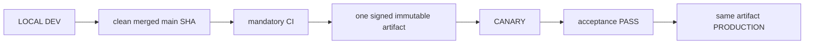

# 04. Environments, Release and Deployment

- Context Pack document: 04_ENVIRONMENTS_RELEASE_DEPLOYMENT.md
- Last verified UTC: 2026-09-28T03:06:00Z
- Verified against Git SHA: 8f42158661e8247832c90bea8fc4d9f0071e647b
- Current deployed artifact Git SHA: `68ba3a95f804800195bb6e8dff556dd843b8eb6e`
- Scope: Environment isolation, immutable release, promotion and rollback
- Status: PARTIAL

Production incident 2026-09-27: beta.97 was promoted as immutable artifact
`art_8fec9cdd6ed14dd19cb762291a2a756f`, but final closeout is blocked by a
confirmed authenticated overview full-page reload loop when runtime accounts are
already offline/unconfirmed. beta.92 contains the same trigger and is not a
reliable rollback for this state. The minimal code correction is a new beta.98
cycle; no server hotfix or artifact mutation is allowed. beta.98 is now deployed
to Canary from its own final main SHA and signed artifact. beta.98 then exposed
issue #298 in real Professional registration. beta.99 is the separate narrow
storage-routing cycle and has now passed Canary and Production on its own final
main SHA and the same immutable artifact. Production periodic delivery stays
OFF and Local `StratForge Vitek` stays ON. See the
[incident record](../changelog/2026-09-27-beta98-production-reload-loop-hotfix.md).

Historical pre-deployment contract (2026-09-26): beta.97 consolidates periodic owner reports under
the Vitek/Deputy controller and makes Production the sole default operational
owner of the shared Telegram bot. Development and Canary remain passive for
topic creation, update consumption, chat mirroring and reports while retaining
login/access callbacks. That candidate later completed its immutable promotion,
but its final closeout is superseded by the live incident above. The required
sequence for beta.98 remains merge → final-main-SHA CI → one signed immutable
artifact → Canary acceptance → separate owner approval → same artifact in
Production. [Candidate record](../changelog/2026-09-26-beta97-telegram-report-cutover-release-candidate.md).

Development supervisor origin correction (2026-09-23): default identity is the actual `http://127.0.0.1:<port>` listener, never the Production hub hostname. An explicitly configured Development HTTPS origin is supported. This prevents false gateway self-loop isolation while preserving true self-loop rejection. [Incident and verification](../changelog/2026-09-23-local-chart-gateway.md). No server release is included.

Local-only Preview change (2026-09-22): the two shared-model QA profiles may call
one authenticated parent loopback service for catalog/invoke only. Other outbound
connections remain blocked. The bridge expires after 30 minutes and allows at
most 32 calls / USD 0.25 while preserving the model's own caps. Exit removes the
child's data/process/container; minimal owner usage accounting remains. No
Canary/Production deployment or release identity changed.
Local 8765 now runs clean `c9a9d7e6a3080988af1c90ff65f2520b0e74cc70`, build
`dev-0.10.0-beta.96-c9a9d7e6a308`, Development, Preview=false. The owner Preview
launch endpoint passed real-provider acceptance and cleanup; owner access settings
matched the before snapshot exactly. This is a Local code switch, not a release artifact.
[Canonical evidence](../changelog/2026-09-22-shared-models-local-continuation.md).

## Only supported release model

- Build once from the exact clean merged commit.
- Canary and Production receive identical code, UI/static assets, Documents and
  backend logic. Only environment DB, secrets, sessions, cookies, origins,
  queues and runtime state/configuration differ.
- Any application change after Canary acceptance starts a new cycle.
- Production promotion is a switch to the accepted artifact, never a rebuild,
  manual copy or server hotfix.

Every candidate snapshots one canonical `docs/changelog/` release/change
record. The owner sees its title, summary, PRs, source SHA, version/build,
artifact, current stage/status, checks, duration and the identity reported by
DEV/Canary/Production. Approval and promotion fail closed unless title, change
summary, source SHA and final verification PASS are present.

## Environment isolation

| Environment | Origin | Isolation |
| --- | --- | --- |
| Development | `http://127.0.0.1:8765/ui/` | Development data root, loopback session and local release initiator |
| Canary | `https://canary.stratforges.com` | separate Canary DB/storage/queues/sessions/cookies |
| Production | `https://app.stratforges.com` | separate Production DB/storage/queues/sessions/cookies |

The Environment Switcher opens the selected origin and never carries session
or browser storage between origins.

## Current environments: beta.99 technical runtime PASS / beta.96 product card PARTIAL

Canary and Production now point to the same signed beta.99 technical artifact
built from the exact final `main` SHA. Canary identity/readiness, verified
backup, real separate non-owner Professional registration, personal workspace,
entitlement, session, cache-disabled cold start and restart persistence PASS.
Production identity/readiness, owner login/API, existing non-owner Professional
session/workspace/entitlement and cache-disabled cold starts also PASS. These
checks prove the scoped beta.99 correction, not full beta.96 package parity:
live Canary reports Agent World and Preview sandbox disabled, so the open
product card remains `In progress` and final product closeout is paused.

| Field | beta.99 Canary and Production |
| --- | --- |
| Version / source SHA | `0.10.0-beta.99` / `68ba3a95f804800195bb6e8dff556dd843b8eb6e` |
| Candidate / artifact | `rc_dd6b884b2bfe4f7dace6c76bb6cbf12c` / `art_3ae473a96bb24d439fd5cb6d3a1d1096` |
| Build ID | `sf-0.10.0-beta.99-68ba3a95f804-20260928T021954Z` |
| Archive SHA256 | `BD6FDEC99112154E9B0B4FBA26A2F1E257399D9B8FC15BC4500E1BD65AEBDC43` |
| Manifest SHA256 | `081C9A99480C49BFBC13C29EA061E994B8310FB6A82EE431B31A38661952A2FB` |
| Release dir | server data-root relative `releases/0.10.0-beta.99-68ba3a95f804` |
| Backups | `backups/pre-beta99-canary-peer-20260928T022038Z`; `backups/pre-beta99-production-peer-20260928T024620Z` |
| Deployment IDs | Canary `dep_d4ebf1c42c3a450f99c530ed41cd62f8`; Production `dep_48d36d71b00e480eac201c3f3a71e0f1` |
| Stage | beta.99 scoped Canary/Production PASS; beta.96 full-package Canary PARTIAL and product closeout paused |

Immediate previous Production beta.97 identity remains preserved for rollback:

| Field | Value |
| --- | --- |
| Version / source SHA | `0.10.0-beta.97` / `4f6bb0b3a0d20712f249afdc9c93538567fd6a8d` |
| Artifact | `art_8fec9cdd6ed14dd19cb762291a2a756f` |
| Build ID | `sf-0.10.0-beta.97-4f6bb0b3a0d2-20260927T060203Z` |
| Archive SHA256 | `F7B522C845D4DEA93BFB15F09C37F5B25A95A0C474052FB70F27A2F6DA6F8FF3` |
| Manifest SHA256 | `B5FC667474ED38CD5AA3600F22E4DD97495958DCC906BCEAD1CA80CF2838F9D2` |
| Previous / rollback | beta.92 / `0.10.0-beta.92-9d800770d08e` (preserved; same latent reload trigger) |

## beta.99 technical iteration inside the open beta.96 product card

Issue #298 has a narrow correction: subscriptions now use the same
authoritative server-storage predicate as accounts/workspaces for explicit
Canary and Production, while Development retains DPAPI and its fail-closed
behavior. Source checkpoint `c68b19f9fa0c3161b31f42cb994db49f2f00faa3`
merged through PR #299 as `68ba3a95f804800195bb6e8dff556dd843b8eb6e`;
focused affected regression is 37 PASS and final-main CI run `36365092457`
passed. One signed immutable beta.99 artifact was accepted for the scoped fix on
Canary and then promoted unchanged to Production after exact artifact-specific
owner approval.
Production `/live`, `/ready`, owner auth/API and real non-owner Professional
cold-start smoke PASS. Report delivery switches remain OFF and Local
`StratForge Vitek` remains ON pending the separate model/orchestrator cutover.
The beta.95 → beta.96 product card remains open: source ancestry and 327 targeted
package tests PASS, while live Canary parity is PARTIAL because Agent World and
Preview sandbox are disabled. beta.97–beta.99 retain their exact identities as
technical iterations inside that card. See the
[product-card parity and status record](../changelog/2026-09-27-beta96-product-card-parity-and-status-contract.md).

Sources: [beta.98 incident record](../changelog/2026-09-27-beta98-production-reload-loop-hotfix.md),
[beta.97 candidate record](../changelog/2026-09-26-beta97-telegram-report-cutover-release-candidate.md).

### Historical beta.86 snapshot

| Field | Value |
| --- | --- |
| Candidate | rc_049d14ab6af640758a69b00432bb6e3d |
| Artifact | art_e627d14a2dbb49fdaf98a0cc9847e8c2 |
| Version / Git SHA | 0.10.0-beta.86 / 22ed7097b4ac9e863304197e118b1d3ce5109e8a |
| Build ID | sf-0.10.0-beta.86-22ed7097b4ac-20260901T005018Z |
| Archive SHA256 | 8052B7A5FC36E1519A7AFCD3B60E5A221F744DE768585D765145245911BABE7D |
| Manifest SHA256 | 0E95CF8B879AE6D66D11F70BAD566E2658180AE432CD8EAEEE12CC50B4CFBCA4 |
| Signature / worktree | verified / clean |

Canary accepted beta.86 and Production received the exact same artifact without
rebuild. live_trading_allowed stays false. Earlier cycles are in their
changelog entries.

The beta.86 release is named `Legacy Isolation + Telegram Bot Cleanup` and
contains merged PR #254 and PR #255 plus release-record PR #256. Its terminal
state is `production_live`; `/live` and `/ready` returned 404 before this
release and 200 after, which is what proves the new artifact is serving.

### Three gates stand between a candidate and Production

Approved main asks where the code came from: branch is main, worktree clean,
HEAD equal to origin/main, the commit an ancestor of origin/main, and that exact
SHA green in CI. A squash merge creates a new SHA, so a green pull request does
not make the commit that reached main green -- both beta.84 and beta.85 were
refused on the first attempt for exactly that, and published unchanged once the
merge commit finished CI.

Forward-only asks whether publishing would move Production forward. An old
commit on main is as approved as a new one, so provenance alone let a
superseded candidate sit one click from rolling Production back. Publication now
requires the candidate to be the deployed commit or a descendant of it.

Production identity is fail-closed. "Never deployed" permits a first
publication; "deployed but the commit cannot be read" refuses until identity is
restored. Conflating the two is how a rollback gets published by accident.

Rollback is untouched by all of this: going back has its own contract.

### The shipment has its own gate

python tools/pre_release_check.py assembles the exact production file set and
runs four checks inside it: the static scan as the signer runs it, runtime
reads, Python compilation and JavaScript syntax. The selection lives in
tools/release_bundle.py and is imported by the builder, so the check and the
signer cannot disagree. A public document that no release can carry is a
contradiction to resolve, not an exemption to record.

## Promotion authority

Development owns the release ledger and submits the action, but Canary or
Production must answer from authoritative environment state. Candidate,
artifact, signature, timestamp, nonce, decision TTL, running identity, CI,
migrations and acceptance all verify fail-closed. `canary_passed` is followed
by owner approval and server-authoritative promotion; it does not authorize a
different artifact.

## Verification

- beta.79 closeout through PR #230: mandatory CI GREEN;
- full regression `2327 passed`, `32 skipped`, `0 failed`;
- Canary and Production deployment evidence:
  `identity_verified`, `signature_verified`, `readiness_verified`,
  `same_immutable_artifact` all true;
- Canary and Production server surfaces display beta.79 from the same release
  directory;
- SERVER BACKTEST cancel, Connector state honesty, auth hotspot and secret
  containment closeout passed;
- no pending migration.

## Canonical evidence

- [beta.79 secret management and cancel closeout](../changelog/2026-08-29-beta79-secret-management-and-cancel-closeout.md)
- [environment and release identity ADR](../adr/0001-environments-and-release-identity.md)
- `app/runtime_env.py`
- `app/release_control.py`
- `app/release_center.py`
- `tools/stage9_remote_release.sh`
