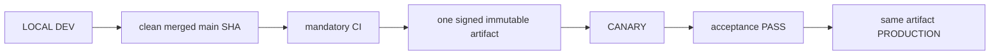

# 04. Environments, Release and Deployment

- Context Pack document: 04_ENVIRONMENTS_RELEASE_DEPLOYMENT.md
- Last verified UTC: 2026-08-30T02:05:00Z
- Verified against Git SHA: 1279645e48e32000978364b38fb20d3dcd303843
- Verified deployed artifact Git SHA: `1a1d54aa728d487203bb8342ecf142752610f4cd`
- Scope: Environment isolation, immutable release, promotion and rollback
- Status: DONE

## Only supported release model

- Build once from the exact clean merged commit.
- Canary and Production receive identical code, UI/static assets, Documents and
  backend logic. Only environment DB, secrets, sessions, cookies, origins,
  queues and runtime state/configuration differ.
- Any application change after Canary acceptance starts a new cycle.
- Production promotion is a switch to the accepted artifact, never a rebuild,
  manual copy or server hotfix.

## Environment isolation

| Environment | Origin | Isolation |
| --- | --- | --- |
| Development | `http://127.0.0.1:8765/ui/` | Development data root, loopback session and local release initiator |
| Canary | `https://canary.stratforges.com` | separate Canary DB/storage/queues/sessions/cookies |
| Production | `https://app.stratforges.com` | separate Production DB/storage/queues/sessions/cookies |

The Environment Switcher opens the selected origin and never carries session
or browser storage between origins.

## Current beta.81 release

| Field | Value |
| --- | --- |
| Candidate | `rc_b886226b4ae04a3b9cba9105a6de7c5f` |
| Artifact | `art_2a97e2ba143641afaad40b59610d3bc0` |
| Version / Git SHA | `0.10.0-beta.81` / `2f726d6b094e6a7c4248e935424e632bc7699324` |
| Build ID | `sf-0.10.0-beta.81-2f726d6b094e-20260831T030814Z` |
| Archive SHA256 | `5F546F4A97C8070509ED5BFF6478A2706D788D577E4C6FD73B259A19B84E6C39` |
| Manifest SHA256 | `3028354E1C92897B74ED1F99928C6CE8...` |
| Signature / worktree | verified / clean |

Canary accepted beta.81 and Production received the exact same artifact without
rebuild: both deployments record `art_2a97e2ba143641afaad40b59610d3bc0`, the
same archive SHA256 and the same build ID.

| Environment | State | Ready |
| --- | --- | --- |
| Canary | live | PASS |
| Production | live | PASS |

`live_trading_allowed` stays `false`. Production readiness covers config, data
root, signing key, object storage, database, connector control, Telegram
consumer and queue.

### What this release contains

- The Environment Switcher is the release control panel: three stages in order,
  one action per stage, identifiers behind a disclosure.
- One canonical environment state for the whole screen.
- «Что изменилось» read from the release's own changelog entry.
- Publication as one backend operation reporting real stages.

### Promotion was driven through the new operation

Production was promoted with `POST /api/admin/releases/<id>/publish-production`
— the same call the panel's button makes — and all five stages reported passed:
Подтверждение, Развёртывание, Readiness, Smoke, Готово.

### Control plane configuration is what enables the button

The promotion gate answers `allowed` only when the deciding peer is reachable.
A Development process started without `data/secrets/environment-registry.env`
has no peer list and no signing key, so the panel's publish button is disabled
with «Control plane не настроен». Started through `start.ps1`, which loads that
file, the gate returns `allowed` with `decided_by: canary` and the button works.

## Promotion authority

Development owns the release ledger and submits the action, but Canary or
Production must answer from authoritative environment state. Candidate,
artifact, signature, timestamp, nonce, decision TTL, running identity, CI,
migrations and acceptance all verify fail-closed. `canary_passed` is followed
by owner approval and server-authoritative promotion; it does not authorize a
different artifact.

## Verification

- beta.79 closeout through PR #230: mandatory CI GREEN;
- full regression `2327 passed`, `32 skipped`, `0 failed`;
- Canary and Production deployment evidence:
  `identity_verified`, `signature_verified`, `readiness_verified`,
  `same_immutable_artifact` all true;
- Canary and Production server surfaces display beta.79 from the same release
  directory;
- SERVER BACKTEST cancel, Connector state honesty, auth hotspot and secret
  containment closeout passed;
- no pending migration.

## Canonical evidence

- [beta.79 secret management and cancel closeout](../changelog/2026-08-29-beta79-secret-management-and-cancel-closeout.md)
- [environment and release identity ADR](../adr/0001-environments-and-release-identity.md)
- `app/runtime_env.py`
- `app/release_control.py`
- `app/release_center.py`
- `tools/stage9_remote_release.sh`
