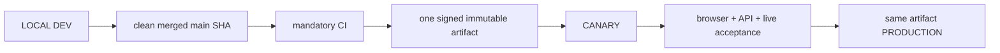

# 04. Environments, Release and Deployment

- Context Pack document: 04_ENVIRONMENTS_RELEASE_DEPLOYMENT.md
- Last verified UTC: 2026-08-21T00:53:04Z
- Verified against Git SHA: 7ebda6faf2e7c64d4a707a41062b29857882181a
- Repository baseline: main `9ffbfb933c79b7661d5d38aed55f7a776f781422` plus the scoped runtime-digest correction in this commit
- Scope: Environment isolation, immutable release, promotion and rollback
- Status: PARTIAL
- Acceptance note: beta.28 operational acceptance is in progress.

## Only supported release model

Rules:

- Build once from the exact clean merged commit.
- Canary and Production receive identical application code, UI/static assets,
  backend logic and user Documents. Only DB, secrets, sessions, cookies,
  origins, queues and runtime state/configuration differ by environment.
- Any code/UI/document change after Canary acceptance starts a new cycle.
- Production promotion is a switch to the already accepted artifact, never a
  rebuild, manual file copy or server hotfix.

## Environment identity and isolation

| Environment | Origin | Isolation |
| --- | --- | --- |
| Development | `http://127.0.0.1:8765/ui/` | local canonical owner, LOCAL data root and loopback session |
| Canary | `https://canary.stratforges.com` | separate Canary DB/storage/queues/sessions/cookies; owner/admin acceptance surface |
| Production | `https://app.stratforges.com` | separate Production DB/storage/queues/sessions/cookies; public application |

Environment Switcher opens the selected origin. It never carries a session or
browser storage across origins.

## Server-authoritative promotion

LOCAL owns the release ledger and initiates the action, but cannot attest that
Canary is live or which artifact Canary currently runs. It therefore sends a
signed server-side request to the existing control plane.

The request is accepted only when signature, timestamp and nonce verify. The
server checks its authoritative Environment Registry and returns a short-lived
decision for one exact `candidate_id` and running artifact SHA. Runtime identity
is the signed manifest SHA stored in `manifest_sha256`; the transport ZIP keeps
its separate `archive_sha256` and remains verified during build/deploy. LOCAL accepts it only
when:

- responder environment is Canary or Production;
- candidate and artifact match exactly;
- decision timestamp is within the allowed clock skew;
- expiry is in the future and its validity window is at most 120 seconds.

Unavailable control plane, invalid signature, replayed nonce, stale decision,
wrong candidate/artifact, silent Canary, wrong Canary artifact, incomplete CI,
migrations, signature or acceptance all block promotion fail-closed.

## Operational state before beta.28

| Environment | Version | Git SHA | Build ID | Runtime artifact SHA256 | Ready |
| --- | --- | --- | --- | --- | --- |
| Canary | `0.10.0-beta.27` | `1f3e2ce7198fec5a90e85d9b49e7a086103e4b62` | `sf-0.10.0-beta.27-1f3e2ce7198f-20260818T215207Z` | `A905E784BD2794F8ACC1760D1697A1B410FC96C24A5BCD25223B8D48FD2EC270` | PASS |
| Production | `0.10.0-beta.26` | `3353e3836306dca4628c759064139cdac94517e0` | `sf-0.10.0-beta.26-3353e3836306-20260817T230438Z` | `27B6316E934F0D727B9D158B34EE601A0A59EF78F0D71B484DD29ADD37617AAB` | PASS |

This is intentionally not parity. Final beta.28 values are recorded only after
real Canary acceptance and same-artifact Production promotion in
[2026-08-20-final-product-acceptance-beta28.md](../changelog/2026-08-20-final-product-acceptance-beta28.md).

The first beta.28 candidate from merge `9ffbfb933c79` was deployed only to
Canary and stopped before acceptance. A live signed control request proved the
server available and Canary live, while catching an archive SHA versus runtime
manifest SHA mismatch. Production remained beta.26. The scoped correction in
`release_control.claim_for` requires a new immutable candidate and a fresh
Canary cycle.

## Test and CI isolation

Pytest sets unique disposable roots for both Development and Production before
application imports, then a fresh pair per test. Tracked baselines are copied
into that pair; live workstation state is neither a test root nor a fixture.
The suite compares every live `data/` file before/after and fails on any change.
Workflow concurrency is not a correctness dependency.

## Canonical evidence

- [../adr/0001-environments-and-release-identity.md](../adr/0001-environments-and-release-identity.md)
- [../../README-RUN-MODES.md](../../README-RUN-MODES.md)
- `app/runtime_env.py`
- `app/environment_registry.py`
- `app/release_control.py`
- `app/release_center.py`
- `tests/test_release_control.py`
- `tests/test_data_root_isolation.py`
- [2026-08-20-final-product-acceptance-beta28.md](../changelog/2026-08-20-final-product-acceptance-beta28.md)

<!-- STRATFORGE_INTERNAL_AMENDMENT
2026-08-20T23:00:44Z | GPT-5.5 через Codex по запросу owner | Replaced obsolete beta.1 deployment snapshot with current beta.27/beta.26 identities, server-authoritative promotion and beta.28 acceptance contract.
2026-08-21T00:53:04Z | GPT-5.5 через Codex по запросу owner | Clarified archive SHA versus running manifest SHA and recorded the fail-closed first beta.28 Canary stop; Production was unchanged.
-->
