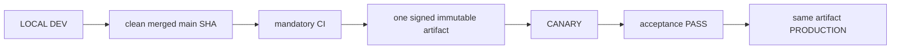

# 04. Environments, Release and Deployment

- Context Pack document: 04_ENVIRONMENTS_RELEASE_DEPLOYMENT.md
- Last verified UTC: 2026-08-30T02:05:00Z
- Verified against Git SHA: 1279645e48e32000978364b38fb20d3dcd303843
- Verified deployed artifact Git SHA: `1a1d54aa728d487203bb8342ecf142752610f4cd`
- Scope: Environment isolation, immutable release, promotion and rollback
- Status: DONE

## Only supported release model

- Build once from the exact clean merged commit.
- Canary and Production receive identical code, UI/static assets, Documents and
  backend logic. Only environment DB, secrets, sessions, cookies, origins,
  queues and runtime state/configuration differ.
- Any application change after Canary acceptance starts a new cycle.
- Production promotion is a switch to the accepted artifact, never a rebuild,
  manual copy or server hotfix.

## Environment isolation

| Environment | Origin | Isolation |
| --- | --- | --- |
| Development | `http://127.0.0.1:8765/ui/` | Development data root, loopback session and local release initiator |
| Canary | `https://canary.stratforges.com` | separate Canary DB/storage/queues/sessions/cookies |
| Production | `https://app.stratforges.com` | separate Production DB/storage/queues/sessions/cookies |

The Environment Switcher opens the selected origin and never carries session
or browser storage between origins.

## Current beta.82 release

| Field | Value |
| --- | --- |
| Candidate | rc_be264bfe71984c4995d373e63b14cbd8 |
| Artifact | art_7f7157c916654d39a1105cdf5e7e6be2 |
| Version / Git SHA | 0.10.0-beta.82 / 796ebc82c1bc7239f8a403422bd6a33aab298742 |
| Build ID | sf-0.10.0-beta.82-796ebc82c1bc-20260831T044201Z |
| Archive SHA256 | EDDB5C67428B578E07862A7466B2A96840F2F3049A7132278FF1AD09F9A30FDC |
| Signature / worktree | verified / clean |

Canary accepted beta.82 and Production received the exact same artifact without
rebuild. live_trading_allowed stays false.

| Environment | State | Ready |
| --- | --- | --- |
| Canary | live | PASS |
| Production | live | PASS |

### Driven entirely through the owner-facing scenario

Canary was reached with the deliver-canary operation the Development card
button calls, and Production with the publish-production operation the Canary
card button calls. No separate Release Center screen and no manual sequence of
backend steps was used at any point.

### Host load now reported by every environment

All three environments publish measured CPU, memory and disk on their heartbeat
and the figures survive the storage round trip: Development through kernel32,
Canary and Production through /proc. Migration 0019 added the column; without
it the values were reported on every beat and dropped on the way back, which is
the failure 0017 documents for market_data and connector.

## Promotion authority

Development owns the release ledger and submits the action, but Canary or
Production must answer from authoritative environment state. Candidate,
artifact, signature, timestamp, nonce, decision TTL, running identity, CI,
migrations and acceptance all verify fail-closed. `canary_passed` is followed
by owner approval and server-authoritative promotion; it does not authorize a
different artifact.

## Verification

- beta.79 closeout through PR #230: mandatory CI GREEN;
- full regression `2327 passed`, `32 skipped`, `0 failed`;
- Canary and Production deployment evidence:
  `identity_verified`, `signature_verified`, `readiness_verified`,
  `same_immutable_artifact` all true;
- Canary and Production server surfaces display beta.79 from the same release
  directory;
- SERVER BACKTEST cancel, Connector state honesty, auth hotspot and secret
  containment closeout passed;
- no pending migration.

## Canonical evidence

- [beta.79 secret management and cancel closeout](../changelog/2026-08-29-beta79-secret-management-and-cancel-closeout.md)
- [environment and release identity ADR](../adr/0001-environments-and-release-identity.md)
- `app/runtime_env.py`
- `app/release_control.py`
- `app/release_center.py`
- `tools/stage9_remote_release.sh`
