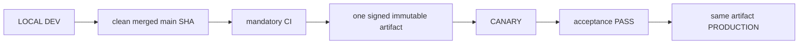

# 04. Environments, Release and Deployment

- Context Pack document: 04_ENVIRONMENTS_RELEASE_DEPLOYMENT.md
- Last verified UTC: 2026-08-30T02:05:00Z
- Verified against Git SHA: 1279645e48e32000978364b38fb20d3dcd303843
- Verified deployed artifact Git SHA: `1a1d54aa728d487203bb8342ecf142752610f4cd`
- Scope: Environment isolation, immutable release, promotion and rollback
- Status: DONE

## Only supported release model

- Build once from the exact clean merged commit.
- Canary and Production receive identical code, UI/static assets, Documents and
  backend logic. Only environment DB, secrets, sessions, cookies, origins,
  queues and runtime state/configuration differ.
- Any application change after Canary acceptance starts a new cycle.
- Production promotion is a switch to the accepted artifact, never a rebuild,
  manual copy or server hotfix.

## Environment isolation

| Environment | Origin | Isolation |
| --- | --- | --- |
| Development | `http://127.0.0.1:8765/ui/` | Development data root, loopback session and local release initiator |
| Canary | `https://canary.stratforges.com` | separate Canary DB/storage/queues/sessions/cookies |
| Production | `https://app.stratforges.com` | separate Production DB/storage/queues/sessions/cookies |

The Environment Switcher opens the selected origin and never carries session
or browser storage between origins.

## Current beta.80 release

| Field | Value |
| --- | --- |
| Candidate | `rc_9fa9fa0933dc4343b31f33a0b0df5810` |
| Artifact | `art_ddd72f5f4f7a49139b306760c86b0d34` |
| Version / Git SHA | `0.10.0-beta.80` / `36128ae4301f1d6ba17441dfbf7fba7000a49070` |
| Build ID | `sf-0.10.0-beta.80-36128ae4301f-20260831T001943Z` |
| Archive SHA256 | `B4E4E20502AA8AEA0A18C64271088C0A51563101690A957FE0CCAD957A058F10` |
| Manifest SHA256 | `DD55B6DAB9B121E58EF53CEDA13E8F961CAC08E52584442715EA3FDC63E8CBC5` |
| Signature / worktree | verified / clean |

Canary accepted the beta.80 release and Production was promoted to the exact
same artifact without rebuild: both deployments record artifact
`art_ddd72f5f4f7a49139b306760c86b0d34`, the same archive SHA256 and the same
build ID.

| Environment | State | Ready |
| --- | --- | --- |
| Canary | live | PASS |
| Production | live | PASS |

Both live endpoints report the same Git SHA and build ID. Production readiness
covers config, data root, signing key, object storage, database, connector
control, Telegram consumer and queue; `live_trading_allowed` stays `false`.

### What this release contains

- Unified legal package with the structured onboarding user agreement.
- All nine public legal documents readable before registration through a
  registry allowlist; owner-only and internal files answer `404`.
- AI Provenance Policy and Release Governance Policy, including the rule that
  repository-wide governance scans run from the repository root.
- Retired `STRATFORGE_INTERNAL_AMENDMENT` markers and manual AI self-signatures.

### Acceptance evidence

Canary acceptance was recorded check by check in the Release Center ledger:
artifact identity, readiness, pre-auth access to all nine legal documents,
resolution of every agreement link, the deployed UI using the public legal
route, and `404` for owner/internal identifiers including percent-encoded
traversal. Production smoke repeated the same probes against the live
environment.

## Promotion authority

Development owns the release ledger and submits the action, but Canary or
Production must answer from authoritative environment state. Candidate,
artifact, signature, timestamp, nonce, decision TTL, running identity, CI,
migrations and acceptance all verify fail-closed. `canary_passed` is followed
by owner approval and server-authoritative promotion; it does not authorize a
different artifact.

## Verification

- beta.79 closeout through PR #230: mandatory CI GREEN;
- full regression `2327 passed`, `32 skipped`, `0 failed`;
- Canary and Production deployment evidence:
  `identity_verified`, `signature_verified`, `readiness_verified`,
  `same_immutable_artifact` all true;
- Canary and Production server surfaces display beta.79 from the same release
  directory;
- SERVER BACKTEST cancel, Connector state honesty, auth hotspot and secret
  containment closeout passed;
- no pending migration.

## Canonical evidence

- [beta.79 secret management and cancel closeout](../changelog/2026-08-29-beta79-secret-management-and-cancel-closeout.md)
- [environment and release identity ADR](../adr/0001-environments-and-release-identity.md)
- `app/runtime_env.py`
- `app/release_control.py`
- `app/release_center.py`
- `tools/stage9_remote_release.sh`
