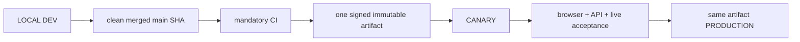

# 04. Environments, Release and Deployment

- Context Pack document: 04_ENVIRONMENTS_RELEASE_DEPLOYMENT.md
- Last verified UTC: 2026-08-21T03:50:00Z
- Verified against Git SHA: 7ebda6faf2e7c64d4a707a41062b29857882181a
- Repository baseline: main `36600dba3d739601660768db98b429b0f752ad1a` plus this operational docs-only closeout
- Scope: Environment isolation, immutable release, promotion and rollback
- Status: DONE
- Acceptance note: beta.28 immutable release is accepted in Canary and live in Production; owner Production UI login remains an explicit physical Telegram confirmation, not a deployment blocker.

## Only supported release model

Rules:

- Build once from the exact clean merged commit.
- Canary and Production receive identical application code, UI/static assets,
  backend logic and user Documents. Only DB, secrets, sessions, cookies,
  origins, queues and runtime state/configuration differ by environment.
- Any code/UI/document change after Canary acceptance starts a new cycle.
- Production promotion is a switch to the already accepted artifact, never a
  rebuild, manual file copy or server hotfix.

## Environment identity and isolation

| Environment | Origin | Isolation |
| --- | --- | --- |
| Development | `http://127.0.0.1:8765/ui/` | local canonical owner, LOCAL data root and loopback session |
| Canary | `https://canary.stratforges.com` | separate Canary DB/storage/queues/sessions/cookies; owner/admin acceptance surface |
| Production | `https://app.stratforges.com` | separate Production DB/storage/queues/sessions/cookies; public application |

Environment Switcher opens the selected origin. It never carries a session or
browser storage across origins.

## Server-authoritative promotion

LOCAL owns the release ledger and initiates the action, but cannot attest that
Canary is live or which artifact Canary currently runs. It therefore sends a
signed server-side request to the existing control plane.

The request is accepted only when signature, timestamp and nonce verify. The
server checks its authoritative Environment Registry and returns a short-lived
decision for one exact `candidate_id` and running artifact SHA. Runtime identity
is the signed manifest SHA stored in `manifest_sha256`; the transport ZIP keeps
its separate `archive_sha256` and remains verified during build/deploy. LOCAL accepts it only
when:

- responder environment is Canary or Production;
- candidate and artifact match exactly;
- decision timestamp is within the allowed clock skew;
- expiry is in the future and its validity window is at most 120 seconds.

Unavailable control plane, invalid signature, replayed nonce, stale decision,
wrong candidate/artifact, silent Canary, wrong Canary artifact, incomplete CI,
migrations, signature or acceptance all block promotion fail-closed.

`canary_passed` is an acceptance milestone, not a permanent literal state: the
normal UI advances the candidate to `approved_for_production` before requesting
the authoritative decision. Approved, scheduled, deploying and retryable
failed states retain that milestone; pre-acceptance states remain blocked.

## Accepted beta.28 operational state

| Environment | Version | Git SHA | Build ID | Runtime artifact SHA256 | Ready |
| --- | --- | --- | --- | --- | --- |
| Canary | `0.10.0-beta.28` | `36600dba3d739601660768db98b429b0f752ad1a` | `sf-0.10.0-beta.28-36600dba3d73-20260821T031309Z` | `864F7D16C03999EF2119EA13C73FBD05DD7FF160E49ADD8EA6D02E91555D916C` | PASS |
| Production | `0.10.0-beta.28` | `36600dba3d739601660768db98b429b0f752ad1a` | `sf-0.10.0-beta.28-36600dba3d73-20260821T031309Z` | `864F7D16C03999EF2119EA13C73FBD05DD7FF160E49ADD8EA6D02E91555D916C` | PASS |

Final candidate `rc_ceba7e31340d476faa79413f2c1d99d4`, artifact
`art_3537e6c88e554b0094554c75e403ce31`, archive SHA256
`A5E906D27B49118AF4E7155B4F08217E433EF03CC598BF6BFB60DBF087005D8A`.
Canary deployment `dep_460215bfd8c84d4093e3dfe65f45465e` passed first;
Production deployment `dep_030ba44c26bd4c3db40dc253adab5c42` then consumed
the same artifact without rebuild. Both deployments recorded
`same_immutable_artifact=true`, verified identity/readiness/signature and no
pending migration.

Active release-directory suffix for both environments:
`production_data/releases/0.10.0-beta.28-36600dba3d73` (the environment-owned
absolute data root is intentionally omitted from this external pack).
Rollback slots: Canary `0.10.0-beta.28-2790fb43992d`; Production
`0.10.0-beta.26-3353e3836306`.

## Test and CI isolation

Pytest sets unique disposable roots for both Development and Production before
application imports, then a fresh pair per test. Tracked baselines are copied
into that pair; live workstation state is neither a test root nor a fixture.
The suite compares every live `data/` file before/after and fails on any change.
Workflow concurrency is not a correctness dependency.

## Canonical evidence

- [../adr/0001-environments-and-release-identity.md](../adr/0001-environments-and-release-identity.md)
- [../../README-RUN-MODES.md](../../README-RUN-MODES.md)
- `app/runtime_env.py`
- `app/environment_registry.py`
- `app/release_control.py`
- `app/release_center.py`
- `tests/test_release_control.py`
- `tests/test_data_root_isolation.py`
- [2026-08-20-final-product-acceptance-beta28.md](../changelog/2026-08-20-final-product-acceptance-beta28.md)

<!-- STRATFORGE_INTERNAL_AMENDMENT
2026-08-20T23:00:44Z | GPT-5.5 через Codex по запросу owner | Replaced obsolete beta.1 deployment snapshot with current beta.27/beta.26 identities, server-authoritative promotion and beta.28 acceptance contract.
2026-08-21T00:53:04Z | GPT-5.5 через Codex по запросу owner | Clarified archive SHA versus running manifest SHA and recorded the fail-closed first beta.28 Canary stop; Production was unchanged.
2026-08-21T02:52:33Z | GPT-5.5 через Codex по запросу owner | Recorded the real approved_for_production promotion blocker and milestone-state correction; artifact 2790fb43 was not promoted and Production remained beta.26.
2026-08-21T03:50:00Z | GPT-5.5 через Codex по запросу owner | Recorded the accepted 36600dba immutable identity, Canary/Production deployment IDs, same release directory, rollback slots and no-rebuild promotion.
-->
