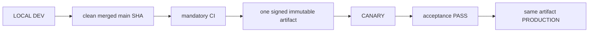

# 04. Environments, Release and Deployment

- Context Pack document: 04_ENVIRONMENTS_RELEASE_DEPLOYMENT.md
- Last verified UTC: 2026-08-30T02:05:00Z
- Verified against Git SHA: 1279645e48e32000978364b38fb20d3dcd303843
- Verified deployed artifact Git SHA: `1a1d54aa728d487203bb8342ecf142752610f4cd`
- Scope: Environment isolation, immutable release, promotion and rollback
- Status: DONE

## Only supported release model

- Build once from the exact clean merged commit.
- Canary and Production receive identical code, UI/static assets, Documents and
  backend logic. Only environment DB, secrets, sessions, cookies, origins,
  queues and runtime state/configuration differ.
- Any application change after Canary acceptance starts a new cycle.
- Production promotion is a switch to the accepted artifact, never a rebuild,
  manual copy or server hotfix.

## Environment isolation

| Environment | Origin | Isolation |
| --- | --- | --- |
| Development | `http://127.0.0.1:8765/ui/` | Development data root, loopback session and local release initiator |
| Canary | `https://canary.stratforges.com` | separate Canary DB/storage/queues/sessions/cookies |
| Production | `https://app.stratforges.com` | separate Production DB/storage/queues/sessions/cookies |

The Environment Switcher opens the selected origin and never carries session
or browser storage between origins.

## Current beta.83 release

| Field | Value |
| --- | --- |
| Candidate | rc_e35e934fc2d74aa6b8f0170d1afd7d82 |
| Artifact | art_edfeb143e27e4790bc851a0e61fe3410 |
| Version / Git SHA | 0.10.0-beta.83 / 03ddf47bb2e657d66d414985976448538ff99743 |
| Build ID | sf-0.10.0-beta.83-03ddf47bb2e6-20260831T140855Z |
| Archive SHA256 | BE8F46427C758EEDB76A1D3D8FD2F671499051DEDFE43E3424F0258F4263FF30 |
| Signature / worktree | verified / clean |

Canary accepted beta.83 and Production received the exact same artifact without
rebuild. live_trading_allowed stays false. The beta.81 and beta.82 cycles are
recorded in their changelog entries.

| Environment | State | Ready |
| --- | --- | --- |
| Canary | live | PASS |
| Production | live | PASS |

### A build reaches Production only from approved main

Promotion is gated on the provenance of the candidate commit, independently of
acceptance: the branch is main, the worktree is clean, HEAD equals origin/main
with no ahead or behind, the commit is an ancestor of origin/main, and that
exact SHA passed the required CI. The gate runs inside approve_production,
after the canary_passed check, so a healthy Canary cannot carry a build past
it. A CI status that cannot be read blocks the promotion rather than being
assumed.

Canary is not gated: a branch build can still be deployed there for diagnosis.

Proven on a real case. During beta.82 an artifact built from an unmerged branch
commit reached Canary and passed acceptance; the gate refused it for Production
on commit_on_origin_main, and a build from clean synchronised main replaced it.

### The panel is the release control

Both transitions of the beta.83 cycle were run by pressing the panel buttons,
not by backend calls: delivery to Canary named the commit it would build and
ran six stages, and publication ran five. Acceptance recorded readiness,
artifact identity and smoke as separate checks.

### Starting Local

Start through start.ps1. It loads data/secrets/environment-registry.env, which
carries the peer list and signing key the promotion gate needs, and it leaves
the worktree clean -- both conditions the panel actions require.

## Promotion authority

Development owns the release ledger and submits the action, but Canary or
Production must answer from authoritative environment state. Candidate,
artifact, signature, timestamp, nonce, decision TTL, running identity, CI,
migrations and acceptance all verify fail-closed. `canary_passed` is followed
by owner approval and server-authoritative promotion; it does not authorize a
different artifact.

## Verification

- beta.79 closeout through PR #230: mandatory CI GREEN;
- full regression `2327 passed`, `32 skipped`, `0 failed`;
- Canary and Production deployment evidence:
  `identity_verified`, `signature_verified`, `readiness_verified`,
  `same_immutable_artifact` all true;
- Canary and Production server surfaces display beta.79 from the same release
  directory;
- SERVER BACKTEST cancel, Connector state honesty, auth hotspot and secret
  containment closeout passed;
- no pending migration.

## Canonical evidence

- [beta.79 secret management and cancel closeout](../changelog/2026-08-29-beta79-secret-management-and-cancel-closeout.md)
- [environment and release identity ADR](../adr/0001-environments-and-release-identity.md)
- `app/runtime_env.py`
- `app/release_control.py`
- `app/release_center.py`
- `tools/stage9_remote_release.sh`
