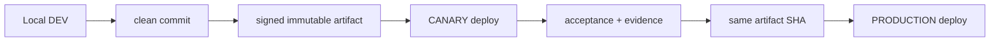

# 04. Environments, Release and Deployment

- Context Pack document: 04_ENVIRONMENTS_RELEASE_DEPLOYMENT.md
- Last verified UTC: 2026-08-13T02:25:57Z
- Verified against Git SHA: c4711ae3f876966f6bedcba8fc3b4ad9c309c836
- Scope: Deployment environments, release channels, immutable promotion and rollback boundaries
- Status: DONE

## Canonical promotion model

## Two separate axes

| Axis | Current meaning |
| --- | --- |
| `DEPLOYMENT_ENV` | where the software runs: `development`, `canary`, `production` |
| `RELEASE_CHANNEL` | maturity of the build: `dev`, `beta`, `stable` |

Git branch, deployment environment and release channel are not synonyms.

## Environment identities

| Environment | Origin / opening mode | Isolation contract | Current evidence status |
| --- | --- | --- | --- |
| DEV | local loopback / local owner URL, typically started from `NT-Analyzer/` | dirty checkout allowed, separate local data roots, local secrets, local browser storage | current and directly evidenced by code, scripts and repo workflow |
| CANARY | `https://canary.stratforges.com` | separate DB/queues/storage/bot/Connector sessions; owner/admin/developer only | architecture and handoff evidence exist; current live deployed build is not provable from repo alone |
| PRODUCTION | `https://app.stratforges.com` | separate DB/queues/storage/bot/Connector sessions; public app | canonical origin is documented; current live deployed build is not provable from repo alone |

## Current release/build identity

- Public version file: `0.10.0-beta.1`.
- Build timestamp in `VERSION.json`: `2026-08-11T18:35:00Z`.
- Current repo HEAD verified for this pack: `c4711ae3f876966f6bedcba8fc3b4ad9c309c836`.
- Current deployed Canary/Production artifact SHA, slot and approval record are
  **unknown from repository evidence alone**.

## Release Center and signing

| Area | Current state |
| --- | --- |
| Artifact creation | `tools/build_server_release.py` and `tools/build_connector_release.py` produce manifest, checksum and signature metadata |
| Release ledger | `app/release_center.py` plus `sf_release_*` tables model candidates, artifacts, deployments, checks, approvals, notifications and rollbacks |
| Blue-green | `app/blue_green.py` and `0010_blue_green_deploy_steps.sql` model slot switching and maintenance windows |
| Exact-artifact promotion | same artifact fingerprint is stored and compared in schema/contracts |
| Live execution proof | not present in repo as a current deployed record |

## Environment Switcher

- Environment Switcher is a product/admin surface, not a way to reuse the same
  cookies or browser storage across origins.
- The contract is separate-origin open in a new tab; current tab backend does
  not silently switch under the user.
- Local DEV access requires loopback identity probing rather than production-like
  trust assumptions.

## Git / PR / CI model visible from repo

- Main CI runs on push and pull request to `main`.
- Next Architecture CI adds static gates and cross-platform pytest.
- Root workflow explicitly disallows direct `main` closeout without owner
  confirmation; current pull-request template checks `No direct main changes`.

## Readiness and rollback limitations

- Migrations in Phases 3-11 are additive-first; rollback is expected to disable
  newer surfaces rather than drop identity links or release evidence.
- Promotion from Canary to Production is designed for the **same artifact**.
- No current repo evidence proves that a specific Canary deployment was already
  promoted to Production.
- This Context Pack task itself should never trigger runtime deployment.

## What to treat as historical only

- Sibling `StratForge Releases/server-0.9.0-dev.*` bundles are useful evidence of
  artifact naming, but they are not current source of truth for the live app.
- Stage handoff notes are useful operational history, not proof of current live
  deployment state.

## Canonical evidence

- [../adr/0001-environments-and-release-identity.md](../adr/0001-environments-and-release-identity.md)
- [../../README-RUN-MODES.md](../../README-RUN-MODES.md)
- `app/runtime_env.py`
- `app/release_center.py`
- `app/blue_green.py`
- [../../../.github/workflows/ci.yml](../../../.github/workflows/ci.yml)
- [../../../.github/workflows/next-architecture-ci.yml](../../../.github/workflows/next-architecture-ci.yml)