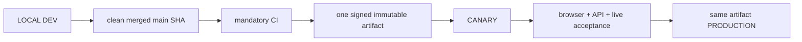

# 04. Environments, Release and Deployment

- Context Pack document: 04_ENVIRONMENTS_RELEASE_DEPLOYMENT.md
- Last verified UTC: 2026-08-24T16:33:38Z
- Verified against Git SHA: 7ebda6faf2e7c64d4a707a41062b29857882181a
- Repository baseline: main `8e83d4ccbad9d9fadf10109f0afdd6b3ce9fe6eb`; beta.31 Canary is non-accepted and Production remains beta.29
- Scope: Environment isolation, immutable release, promotion and rollback
- Status: PARTIAL
- Acceptance note: beta.29 remains the accepted Production release. Beta.31 was built once and deployed to Canary; its 13m26s two-client chart soak and 20/20 readiness passed, but an additional 15m load exposed the read-only chart batch in the write rate bucket and returned HTTP 429. No acceptance or Production promotion occurred. Beta.32 must complete a fresh clean PR/CI/artifact/Canary cycle.

## Only supported release model

Rules:

- Build once from the exact clean merged commit.
- Canary and Production receive identical application code, UI/static assets,
  backend logic and user Documents. Only DB, secrets, sessions, cookies,
  origins, queues and runtime state/configuration differ by environment.
- Any code/UI/document change after Canary acceptance starts a new cycle.
- Production promotion is a switch to the already accepted artifact, never a
  rebuild, manual file copy or server hotfix.

## Environment identity and isolation

| Environment | Origin | Isolation |
| --- | --- | --- |
| Development | `http://127.0.0.1:8765/ui/` | local canonical owner, LOCAL data root and loopback session |
| Canary | `https://canary.stratforges.com` | separate Canary DB/storage/queues/sessions/cookies; owner/admin acceptance surface |
| Production | `https://app.stratforges.com` | separate Production DB/storage/queues/sessions/cookies; public application |

Environment Switcher opens the selected origin. It never carries a session or
browser storage across origins.

## Server-authoritative promotion

LOCAL owns the release ledger and initiates the action, but cannot attest that
Canary is live or which artifact Canary currently runs. It therefore sends a
signed server-side request to the existing control plane.

The request is accepted only when signature, timestamp and nonce verify. The
server checks its authoritative Environment Registry and returns a short-lived
decision for one exact `candidate_id` and running artifact SHA. Runtime identity
is the signed manifest SHA stored in `manifest_sha256`; the transport ZIP keeps
its separate `archive_sha256` and remains verified during build/deploy. LOCAL accepts it only
when:

- responder environment is Canary or Production;
- candidate and artifact match exactly;
- decision timestamp is within the allowed clock skew;
- expiry is in the future and its validity window is at most 120 seconds.

Unavailable control plane, invalid signature, replayed nonce, stale decision,
wrong candidate/artifact, silent Canary, wrong Canary artifact, incomplete CI,
migrations, signature or acceptance all block promotion fail-closed.

`canary_passed` is an acceptance milestone, not a permanent literal state: the
normal UI advances the candidate to `approved_for_production` before requesting
the authoritative decision. Approved, scheduled, deploying and retryable
failed states retain that milestone; pre-acceptance states remain blocked.

## Non-accepted beta.30 Canary attempt

PR #145 merged as `27184197ea5d495b8e0d90d0cc5c06d6539f7ab9` with all
five mandatory CI jobs green. Candidate `rc_3be5871e0bde48b392f5055e7c6dde2b`,
artifact `art_6ae472715d594d99a55a0c0efbb1ebf6`, build
`sf-0.10.0-beta.30-27184197ea5d-20260824T035054Z`, archive SHA256
`7A4B23D15BCF2DBCFA95CD2E9C091D59857BDFC60D45A56B84FA1E7A74779BF3`
and runtime/manifest SHA256
`B958DE90A2211B84C5F38D87BE202392A300D4482F0C8F6EDDAF443E59227F98`
were deployed only to Canary as `dep_dd7c5ac3c9d94f6f9c85baa8616a16ff`.

Two 36-chart clients retained live chart WebSockets, but deep-history requests
eventually occupied all 24 bounded HTTP slots and readiness/Admin returned 503.
The candidate stayed `canary_checking`; acceptance was not recorded. It was not
promoted or rebuilt. Production remained on accepted beta.29.

## Non-accepted beta.31 Canary attempt

Clean SHA `8e83d4ccbad9d9fadf10109f0afdd6b3ce9fe6eb` produced candidate
`rc_ff501b06706b430d953a08d41b83b573`, artifact
`art_a519c4cf670c4d4c95b4e7d243bab330`, build
`sf-0.10.0-beta.31-8e83d4ccbad9-20260824T155841Z`, archive SHA256
`EC5F730C730BB764A7A4F4F98E756678A9086A6316C1BCAA7DEBB9ECCEA15EFF`
and runtime/manifest SHA256
`826625D73702EB8D63E5EF2ABE0F2B291AB1FB8616B3E3C52D4AA70E48B8E7EE`.
Canary deployment `dep_89b9dde9b15e492ba177e33f8af7ffaf` verified this exact identity.

Two authenticated 36-chart clients stayed live for `13m26s`; exact MNQ/MES
WebSocket price, last close and colored marker matched in both clients, and
readiness passed `20/20`. Acceptance remained open for extra timeframe smoke.
Changing MNQ through 1m and 15m exposed HTTP 429. PostgreSQL rate evidence
showed read-only `POST /api/ops/runtime/bars/batch` consuming the mutation
bucket above its 120/min ceiling. Beta.32 moves only this endpoint to the read
bucket and keeps the external `/api/diagnostics` deny intact while disabling
that local-only control in remote Admin. Production remained beta.29.

## Accepted beta.29 operational state

| Environment | Version | Git SHA | Build ID | Runtime artifact SHA256 | Ready |
| --- | --- | --- | --- | --- | --- |
| Canary | `0.10.0-beta.29` | `4d15f1d2250e2c52bde02b902d88ec7aad043543` | `sf-0.10.0-beta.29-4d15f1d2250e-20260823T020155Z` | `CBA4FA70BD3868CBB80A8E8A42FE807B5401969CE09E1314671A73F51D132379` | PASS |
| Production | `0.10.0-beta.29` | `4d15f1d2250e2c52bde02b902d88ec7aad043543` | `sf-0.10.0-beta.29-4d15f1d2250e-20260823T020155Z` | `CBA4FA70BD3868CBB80A8E8A42FE807B5401969CE09E1314671A73F51D132379` | PASS |

Final candidate `rc_a7c6c0afb95d410f92474614efeb1b35`, artifact
`art_ccaadc3a536e4272809d32073f072918`, archive SHA256
`882FF3520DDD43BF65925F3DFA5AA95DA56107336DA98EFDC64146A81981195B`.
Canary deployment `dep_de061542f96641e1a10b7bb4456c2df0` passed first;
Production deployment `dep_8716b7cf463f4cf8af092ba6a4e5bdae` then consumed
the same artifact without rebuild. Both deployments recorded
`same_immutable_artifact=true`, verified identity/readiness/signature and no
pending migration.

Active release-directory suffix for both environments:
`production_data/releases/0.10.0-beta.29-4d15f1d2250e` (the environment-owned
absolute data root is intentionally omitted from this external pack).
Rollback slots: Canary and Production `0.10.0-beta.28-36600dba3d73`.

## Test and CI isolation

Pytest sets unique disposable roots for both Development and Production before
application imports, then a fresh pair per test. Tracked baselines are copied
into that pair; live workstation state is neither a test root nor a fixture.
The suite compares every live `data/` file before/after and fails on any change.
Workflow concurrency is not a correctness dependency.

## Canonical evidence

- [../adr/0001-environments-and-release-identity.md](../adr/0001-environments-and-release-identity.md)
- [../../README-RUN-MODES.md](../../README-RUN-MODES.md)
- `app/runtime_env.py`
- `app/environment_registry.py`
- `app/release_control.py`
- `app/release_center.py`
- `tests/test_release_control.py`
- `tests/test_data_root_isolation.py`
- [2026-08-22-market-data-responsive-release-beta29.md](../changelog/2026-08-22-market-data-responsive-release-beta29.md)
- [2026-08-24-beta30-canary-history-range-regression.md](../changelog/2026-08-24-beta30-canary-history-range-regression.md)
- [2026-08-24-beta31-canary-batch-rate-regression.md](../changelog/2026-08-24-beta31-canary-batch-rate-regression.md)

<!-- STRATFORGE_INTERNAL_AMENDMENT
2026-08-20T23:00:44Z | GPT-5.5 через Codex по запросу owner | Replaced obsolete beta.1 deployment snapshot with current beta.27/beta.26 identities, server-authoritative promotion and beta.28 acceptance contract.
2026-08-21T00:53:04Z | GPT-5.5 через Codex по запросу owner | Clarified archive SHA versus running manifest SHA and recorded the fail-closed first beta.28 Canary stop; Production was unchanged.
2026-08-21T02:52:33Z | GPT-5.5 через Codex по запросу owner | Recorded the real approved_for_production promotion blocker and milestone-state correction; artifact 2790fb43 was not promoted and Production remained beta.26.
2026-08-21T03:50:00Z | GPT-5.5 через Codex по запросу owner | Recorded the accepted 36600dba immutable identity, Canary/Production deployment IDs, same release directory, rollback slots and no-rebuild promotion.
2026-08-23T02:27:02Z | GPT-5.5 через Codex по запросу owner | Recorded the accepted beta.29 identity, PR #142 merge, Canary/Production deployment IDs, same release directory, rollback slot and no-rebuild promotion.
2026-08-24T04:22:21Z | GPT-5.5 через Codex по запросу owner | Recorded beta.30 Canary as non-accepted after reproduced capacity saturation, confirmed no Production promotion and opened a fresh beta.31 immutable cycle.
2026-08-24T16:33:38Z | GPT-5.5 через Codex по запросу owner | Recorded beta.31 Canary as non-accepted after the real 15m chart-batch 429, kept Production beta.29 and opened the fresh beta.32 immutable cycle.
-->
